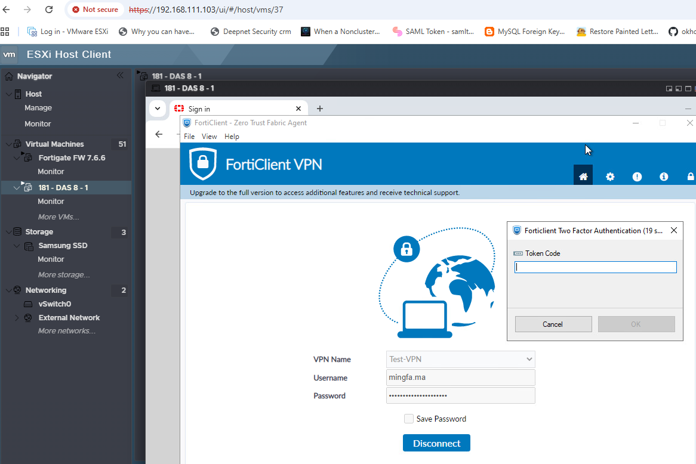

When FortiGate integrates with FortiAuthenticator for IKEv2 RADIUS authentication, FortiClient presents an OTP prompt after password verification. See [Technical Tip: Overview of compatible IKE versions, user authentication methods, and FortiGate/FortiClient firmware versions](https://community.fortinet.com/fortigate-3/technical-tip-overview-of-compatible-ike-versions-user-authentication-methods-and-fortigate-forticlient-firmware-versions-218991) for supported configurations.

This lab uses trial virtual appliances.

## FortiAuthenticator

Admin UI: `https://192.168.103.99/`

RADIUS must be enabled under **System > Network > Interfaces** — see the [administration guide](https://docs.fortinet.com/document/fortiauthenticator/8.0.3/administration-guide/558775/interfaces).

FortiAuthenticator v8.0.3 build0099 (GA) ships with `freeradius-3.2.8`.

## FortiGate

Admin UI: `http://192.168.100.177`

## JRADIUS

JRADIUS client was used to test RADIUS authentication across several protocols.

### PAP

When a test user is assigned a FortiToken Mobile and OTP authentication is enabled, FortiAuthenticator responds with an `Access-Challenge`:

```
Attribute Value Pairs
    AVP: t=Message-Authenticator(80) l=18 val=d0e9b98b261e1d1d6a2d16123042781e
    AVP: t=Reply-Message(18) l=79 val=+Enter token code or no code to send a notification to your FortiToken Mobile
        Type: 18
        Length: 79
        Reply-Message: +Enter token code or no code to send a notification to your FortiToken Mobile
    AVP: t=Vendor-Specific(26) l=11 vnd=Fortinet, Inc.(12356)
        Type: 26
        Length: 11
        Vendor ID: Fortinet, Inc. (12356)
        VSA: t=Fortinet-FAC-Challenge-Code(15) l=5 val=001
            Type: 15
            Length: 5
            Fortinet-FAC-Challenge-Code: 001
    AVP: t=State(24) l=12 val=30303030303030303032
```

### MSCHAPv2

After successful password authentication, FortiAuthenticator issues the same OTP challenge:

```
Attribute Value Pairs
    AVP: t=Message-Authenticator(80) l=18 val=7f9a10f23f64585091028466b289e89c
    AVP: t=Reply-Message(18) l=79 val=+Enter token code or no code to send a notification to your FortiToken Mobile
        Type: 18
        Length: 79
        Reply-Message: +Enter token code or no code to send a notification to your FortiToken Mobile
    AVP: t=Vendor-Specific(26) l=11 vnd=Fortinet, Inc.(12356)
        Type: 26
        Length: 11
        Vendor ID: Fortinet, Inc. (12356)
        VSA: t=Fortinet-FAC-Challenge-Code(15) l=5 val=001
            Type: 15
            Length: 5
            Fortinet-FAC-Challenge-Code: 001
    AVP: t=State(24) l=12 val=30303030303030303034
```

### EAP-MSCHAPv2

Authentication succeeded, but FortiAuthenticator does not include a `Reply-Message` in the challenge:

```
RADIUS Protocol
    Code: Access-Challenge (11)
    Packet identifier: 0x6 (6)
    Length: 86
    Authenticator: facea79fa41fdba6626687a21270a77a
    [This is a response to a request in frame 5]
    [Time from request: 11.869900 milliseconds]
    Attribute Value Pairs
        AVP: t=Message-Authenticator(80) l=18 val=db98f3ee3554c9466aa05b6f4938a5e4
        AVP: t=EAP-Message(79) l=8 Last Segment[1]
            Type: 79
            Length: 8
            EAP fragment: 030200060601
            Extensible Authentication Protocol
                Code: Success (3)
                Id: 2
                Length: 6
        AVP: t=State(24) l=18 val=35ba3bf537b8219e33c639b53871c2ec
        AVP: t=User-Name(1) l=11 val=mingfa.ma
        AVP: t=Vendor-Specific(26) l=11 vnd=Fortinet, Inc.(12356)
            Type: 26
            Length: 11
            Vendor ID: Fortinet, Inc. (12356)
            VSA: t=Fortinet-FAC-Challenge-Code(15) l=5 val=001
                Type: 15
                Length: 5
                Fortinet-FAC-Challenge-Code: 001
```

Full packet capture: [jradius_fortiauth-eap-mschapv2-2fa.pcapng](doc/jradius_fortiauth-eap-mschapv2-2fa.pcapng)

## FortiClient

FortiClient was installed on Windows Server 2022 Standard (`192.168.103.181`). End-to-end testing confirmed that the OTP prompt appears as expected.



RADIUS traffic was captured at the FortiGate side via **Network > Diagnostics > New Packet Capture** (filter: `host:port`).

The capture shows that FortiGate and FortiAuthenticator negotiated **EAP-GTC** for the OTP phase.

Full packet capture: [fortigate_fortiauth-eap-mschapv2-ikev2.pcap](doc/fortigate_fortiauth-eap-mschapv2-ikev2.pcap)

## Debug

Debug information is available at `https://192.168.103.99/debug` on the FortiAuthenticator.

## References

[Technical Tip: Overview of compatible IKE versions, user authentication methods, and FortiGate/FortiClient firmware versions](https://community.fortinet.com/fortigate-3/technical-tip-overview-of-compatible-ike-versions-user-authentication-methods-and-fortigate-forticlient-firmware-versions-218991)
