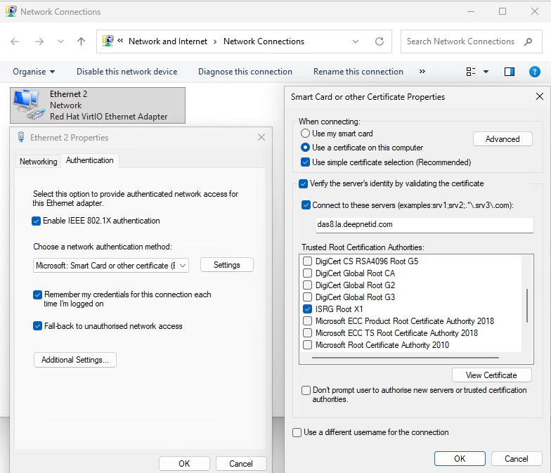

# Virtual Access Point - Wired EAP Lab
In order to test RADIUS authentication with EAP-PEAP, generally a physical WIFI access point is needed.  
**Note:** If you are only interested in testing EAP-PEAP/EAP-TLS on RADIUS protocol level, you can skip the hostapd setup and use FreeRADIUS (or any alternative RADIUS server) with eapol_test as RADIUS client.
## Lab

| Machine | Roles |
| ----    | ----  |
| 192.168.190.62 (Ubuntu 24.04) | Access Point hostapd (the wired authenticator) |
| 192.168.190.37 (Ubuntu 24.04) | Supplicant wpa_supplicant, radius |

## hostapd Installation

The Ubuntu package already includes the wired driver (`CONFIG_DRIVER_WIRED=y`). No need to compile from source for the authenticator role:

```bash
sudo apt install hostapd
```

Verify the wired driver is present:

```bash
strings /usr/sbin/hostapd | grep -i wired
```

## Building from Source (optional)

Only needed if you require features not in the package (e.g. custom EAP-TLS 1.3 flags) or to build `wpa_supplicant`/`eapol_test` on Windows.

https://github.com/openssl/openssl

`git clone https://w1.fi/hostap.git`

```
cd hostap/hostapd
cp defconfig .config
```

Modify the `.config` file to enable the wired driver:

```
# Driver interface for Host AP driver
#CONFIG_DRIVER_HOSTAP=y

# Driver interface for wired authenticator
CONFIG_DRIVER_WIRED=y

# Driver interface for drivers using the nl80211 kernel interface
#CONFIG_DRIVER_NL80211=y
```

### wpa_suplicant

```
sudo apt-get install -y libdbus-1-dev
sudo apt-get install -y libnl-3-dev
sudo apt-get install libnl-genl-3-dev
sudo apt-get install libnl-route-3-dev
```

```
CONFIG_EAP_TLSV1_3=y
CONFIG_TLSV12=y
```
# Authentication Only

#define wpa_dbg wpa_msg

add `#include <in6addr.h>` in `D:\github\hostap\wpa_supplicant\wpa_supplicant_i.h`
Cannot open source file: '..\..\..\src\rsn_supp\peerkey.c': No such file or directory
D:\github\hostap\src\l2_packet\l2_packet_pcap.c

error C2037: left of 'meth' specifies undefined struct/union 'rsa_st'

//#include <net/if.h>
#include <WinSock2.h>

CONFIG_NATIVE_WINDOWS=y
#CONFIG_IPV6=y

`eapol_test.exe -c nanoart.conf -a 192.168.190.13 -p1812 -stesting123`

## Test

`sudo ./hostapd doc/wired.conf -dd`

`./wpa_supplicant -Dwired -iens192 -c./nanoart.conf -dd -K`

# EAP-TLS with Windows 11 VM

Replace or add the Linux supplicant with a Windows 11 VM presenting a client certificate over EAP-TLS. The hostapd wired authenticator and RADIUS server remain unchanged.

## Updated Lab

| Machine | Roles |
| ----    | ----  |
| 192.168.190.62 (Ubuntu 22.04.4) | Access Point hostapd (wired authenticator) |
| 192.168.190.37 (Ubuntu 22.04.4) | RADIUS server (FreeRADIUS) |
| 192.168.190.25 (Windows 11 VM)  | Supplicant — presents client certificate via EAP-TLS |

Connect the Windows 11 VM's NIC to the same switch/bridge as hostapd's authenticator interface (`ens18` on .62).

## Proxmox: Allow EAPOL Forwarding

EAPOL uses destination MAC `01:80:c2:00:00:03` (IEEE-reserved multicast). Linux bridges block this by default, so frames from the Windows 11 VM never reach hostapd.

Proxmox adds a per-VM firewall bridge (`fwbr<vmid>i<nic>`) for each VM with firewall enabled, so the frame path is:

```
tap(win11) → fwbr(win11) → vmbr0 → fwbr(hostapd) → tap(hostapd)
```

Set `group_fwd_mask=8` (bit 3 = address `:03`) on every bridge in that path — on the **Proxmox host**:

```bash
for br in vmbr0 fwbr111i0 fwbr113i0 fwbr162i0; do
    echo 8 > /sys/class/net/$br/bridge/group_fwd_mask
done
```

Verify:

```bash
grep . /sys/class/net/fwbr*/bridge/group_fwd_mask \
       /sys/class/net/vmbr0/bridge/group_fwd_mask
```

### Persist across reboots

In `/etc/network/interfaces`, add a `post-up` to the `vmbr0` stanza:

```
post-up echo 8 > /sys/class/net/vmbr0/bridge/group_fwd_mask
```

For the `fwbr*` bridges (created dynamically at VM start), add to `/etc/rc.local`:

```bash
for br in /sys/class/net/fwbr*/bridge/group_fwd_mask; do echo 8 > $br; done
```

## Certificate Generation

Run on the RADIUS server (192.168.190.37). The CA signs both the RADIUS server certificate and the client certificate.

```bash
mkdir -p ~/eaptls-ca && cd ~/eaptls-ca

# CA
openssl genrsa -out ca.key 4096
openssl req -x509 -new -nodes -key ca.key -sha256 -days 3650 \
    -subj "/CN=EAP-TLS Lab CA" -out ca.crt

# RADIUS server certificate
openssl genrsa -out server.key 2048
openssl req -new -key server.key \
    -subj "/CN=radius.lab" -out server.csr
openssl x509 -req -in server.csr -CA ca.crt -CAkey ca.key \
    -CAcreateserial -days 825 -sha256 \
    -extfile <(printf "subjectAltName=DNS:radius.lab\nextendedKeyUsage=serverAuth") \
    -out server.crt

# Client certificate for Windows 11 VM
openssl genrsa -out client.key 2048
openssl req -new -key client.key \
    -subj "/CN=win11-client" -out client.csr
openssl x509 -req -in client.csr -CA ca.crt -CAkey ca.key \
    -CAcreateserial -days 825 -sha256 \
    -extfile <(printf "extendedKeyUsage=clientAuth") \
    -out client.crt

# Bundle into PFX for Windows import (set a passphrase)
openssl pkcs12 -export -out client.pfx \
    -inkey client.key -in client.crt -certfile ca.crt \
    -passout pass:YourPfxPassword
```

Copy `ca.crt` and `client.pfx` to the Windows 11 VM (e.g. via shared folder or SCP).

## FreeRADIUS EAP-TLS Configuration

In `/etc/freeradius/3.0/mods-enabled/eap` (or `mods-available/eap`), add or modify the `tls` section inside `eap {}`:

```
eap {
    default_eap_type = tls

    tls-config tls-common {
        private_key_file     = /home/user/eaptls-ca/server.key
        certificate_file     = /home/user/eaptls-ca/server.crt
        ca_file              = /home/user/eaptls-ca/ca.crt
        ca_path              = ${cadir}
        dh_file              = ${certdir}/dh
        cipher_list          = "DEFAULT"
        tls_min_version      = "1.2"
    }

    tls {
        tls = tls-common
    }
}
```

In `/etc/freeradius/3.0/users`, ensure the client CN is authorised:

```
win11-client    Cleartext-Password := "unused"
```

Restart FreeRADIUS:

```bash
sudo systemctl restart freeradius
sudo freeradius -X   # foreground debug to watch EAP-TLS handshake
```

## Windows 11 Setup

### 1. Import Certificates

Open PowerShell as Administrator:

```powershell
# Import CA into Trusted Root CAs (machine store — required for server cert validation)
Import-Certificate -FilePath "C:\certs\ca.crt" `
    -CertStoreLocation Cert:\LocalMachine\Root

# Import client certificate + private key into Personal store
$pfxPwd = ConvertTo-SecureString "YourPfxPassword" -AsPlainText -Force
Import-PfxCertificate -FilePath "C:\certs\client.pfx" `
    -CertStoreLocation Cert:\CurrentUser\My `
    -Password $pfxPwd
```

Verify the client cert is present:

```powershell
Get-ChildItem Cert:\CurrentUser\My | Where-Object { $_.Subject -like "*win11-client*" }
```

### 2. Enable Wired AutoConfig Service

```powershell
Set-Service -Name dot3svc -StartupType Automatic
Start-Service dot3svc
```

### 3. Apply 802.1X Profile

One the service `dot3svc` is started, we can enable/edit EAP-TLS authentication on Wired NIC card.



You can show and export the configuration by using `netsh` command,
```
PS C:\temp> netsh lan show profiles

Profile on interface Ethernet 2
=======================================================================
Applied: User Profile

    Profile Version        : 1
    Type                   : Wired LAN
    AutoConfig Version     : 1
    802.1x                 : Enabled
    802.1x                 : Not Enforced
    EAP type               : Microsoft: Smart Card or other certificate (EAP-TLS)
    802.1X auth credential : Machine or user credential
    Cache user information : Yes

Machine profile is not installed on this device.


PS C:\temp> netsh lan export profile folder=. interface="Ethernet 2"

Interface: Ethernet 2
Profile File Name: .\Ethernet 2.xml

1 profile(s) were exported successfully.
```

Here is the example,
```xml
<?xml version="1.0"?>
<LANProfile xmlns="http://www.microsoft.com/networking/LAN/profile/v1">
	<MSM>
		<security>
			<OneXEnforced>false</OneXEnforced>
			<OneXEnabled>true</OneXEnabled>
			<OneX xmlns="http://www.microsoft.com/networking/OneX/v1">
				<cacheUserData>true</cacheUserData>
				<authMode>machineOrUser</authMode>
				<EAPConfig><EapHostConfig xmlns="http://www.microsoft.com/provisioning/EapHostConfig"><EapMethod><Type xmlns="http://www.microsoft.com/provisioning/EapCommon">13</Type><VendorId xmlns="http://www.microsoft.com/provisioning/EapCommon">0</VendorId><VendorType xmlns="http://www.microsoft.com/provisioning/EapCommon">0</VendorType><AuthorId xmlns="http://www.microsoft.com/provisioning/EapCommon">0</AuthorId></EapMethod><Config xmlns="http://www.microsoft.com/provisioning/EapHostConfig"><Eap xmlns="http://www.microsoft.com/provisioning/BaseEapConnectionPropertiesV1"><Type>13</Type><EapType xmlns="http://www.microsoft.com/provisioning/EapTlsConnectionPropertiesV1"><CredentialsSource><CertificateStore><SimpleCertSelection>true</SimpleCertSelection></CertificateStore></CredentialsSource><ServerValidation><DisableUserPromptForServerValidation>false</DisableUserPromptForServerValidation><ServerNames>das8.la.deepnetid.com</ServerNames><TrustedRootCA>ca bd 2a 79 a1 07 6a 31 f2 1d 25 36 35 cb 03 9d 43 29 a5 e8 </TrustedRootCA></ServerValidation><DifferentUsername>false</DifferentUsername><PerformServerValidation xmlns="http://www.microsoft.com/provisioning/EapTlsConnectionPropertiesV2">true</PerformServerValidation><AcceptServerName xmlns="http://www.microsoft.com/provisioning/EapTlsConnectionPropertiesV2">true</AcceptServerName></EapType></Eap></Config></EapHostConfig></EAPConfig>
			</OneX>
		</security>
	</MSM>
</LANProfile>

```

Get the CA thumbprint to paste into `<TrustedRootCA>`:

```powershell
(Get-ChildItem Cert:\LocalMachine\Root | Where-Object { $_.Subject -like "*EAP-TLS Lab CA*" }).Thumbprint
```

Trigger authentication:

```powershell
# netsh lan add profile filename="eap-tls.xml" interface="Ethernet 2"
netsh lan set autoconfig enabled=yes interface="Ethernet 2"
netsh lan connect interface="Ethernet 2"
```

Or use `reconnect`

`netsh lan reconnect interface="Ethernet 2"`

### 4. Verify

```powershell
# Check 802.1X state
netsh lan show interfaces

# Event log for 802.1X outcomes
Get-WinEvent -LogName "Microsoft-Windows-Wired-AutoConfig/Operational" -MaxEvents 20 |
    Select-Object TimeCreated, Id, Message | Format-List
```

On the RADIUS server, the `freeradius -X` output should show the full TLS handshake and `Access-Accept`.

## EAP-TLS Test Results

I captured the RADIUS traffic, see the attached [EAP-TLS RADIUS capture](./doc/good.pcapng).

# True Wireless EAP Lab (AR9271 USB dongles over Proxmox passthrough)

Everything above uses hostapd's *wired* driver (`CONFIG_DRIVER_WIRED`) — there's no actual over-the-air 802.11 involved. This section replaces the wired link with real Wi-Fi using two Qualcomm Atheros AR9271 USB dongles (USB ID `0cf3:9271`, `ath9k_htc` driver), each passed through to a different Proxmox VM: one becomes the hostapd SoftAP, the other becomes the wireless NIC of the Windows 11 client. The RADIUS server and certificates from the EAP-TLS section above are reused unchanged — only the transport between authenticator and supplicant becomes wireless.

## Updated Lab

| Machine | Roles |
| ---- | ---- |
| Linux VM (Proxmox) | hostapd SoftAP, AR9271 dongle #1 passed through |
| 192.168.190.37 (Ubuntu) | RADIUS server (FreeRADIUS) — unchanged |
| Windows 11 VM (Proxmox) | Wireless supplicant, AR9271 dongle #2 passed through |

## 1. Identify the dongles on the Proxmox host

```bash
lsusb | grep -i atheros
# Bus 003 Device 004: ID 0cf3:9271 Qualcomm Atheros Communications AR9271 802.11n
```

Both dongles report the **same** vendor:product ID (`0cf3:9271`), so tell them apart by USB bus/port, not by ID:

```bash
lsusb -t
```

**Do not let the Proxmox host itself bind `ath9k_htc` to either dongle.** Passthrough hands the raw USB device to the guest, which loads its own driver/firmware; if the host claims it first you'll see contention in `dmesg` and the guest may fail to init the radio. Blacklist it on the host:

```bash
echo "blacklist ath9k_htc" | sudo tee /etc/modprobe.d/blacklist-ath9k-htc.conf
sudo rmmod ath9k_htc 2>/dev/null  # if already loaded
```

## 2. Map the USB devices in Proxmox (survive reboot/replug)

Raw `bus-port` passthrough shifts if a dongle is unplugged/replugged or the host reboots and re-enumerates USB. Use a persistent **Resource Mapping** instead, pinned to the physical port so the two identical-ID dongles don't get swapped:

Datacenter → Resource Mappings → USB Devices → Add, once per dongle, selecting the specific bus/port. Or via CLI:

```bash
pvesh create /cluster/mapping/usb --id wlan-ap     --map node=<node>,path=<bus>-<port>,id=0cf3:9271
pvesh create /cluster/mapping/usb --id wlan-client --map node=<node>,path=<bus>-<port>,id=0cf3:9271
```

## 3. Attach to the VMs

```bash
qm set <ap-vmid>  -usb0 mapping=wlan-ap
qm set <win-vmid> -usb0 mapping=wlan-client
```

(GUI equivalent: VM → Hardware → Add → USB Device → Use USB Mapping → `wlan-ap` / `wlan-client`.) Start both VMs after attaching.

## 4. Linux AP VM: bring up the wireless interface

```bash
lsusb                 # dongle visible inside the guest
dmesg | grep -i ath9k  # ath9k_htc probes, firmware htc_9271.fw loads
ip link                # new wlan interface, e.g. wlan0 or wlxXXXXXXXXXXXX
rfkill unblock all
iw list | grep -A10 "Supported interface modes"   # confirm AP is listed
```

Stop NetworkManager/wpa_supplicant from managing the AP radio so hostapd can bind it exclusively:

```bash
sudo nmcli device set wlan0 managed no
```

## 5. hostapd config for wireless EAP

New sample: [`doc/wlan-ap.conf`](./doc/wlan-ap.conf) — same RADIUS backend as `wired.conf`, but `driver=nl80211` over the real radio, WPA2-Enterprise instead of plain `ieee8021x=1`:

```bash
sudo hostapd doc/wlan-ap.conf -dd
```

## 6. Windows 11 VM: driver + wireless client

1. **Driver**: Windows Update usually auto-detects "Qualcomm Atheros AR9271 802.11n". If not, install the vendor driver (e.g. TP-Link TL-WN722N v1 / Netis WF2120 use the same AR9271 chipset and driver package). Confirm in Device Manager → Network adapters, and:
   ```powershell
   netsh wlan show interfaces
   ```
2. **WLAN AutoConfig service** (`wlansvc`) is Automatic by default (unlike the wired `dot3svc` used earlier) — verify it's running:
   ```powershell
   Get-Service wlansvc
   ```
3. **Certificates**: import `ca.crt` and `client.pfx` exactly as in the [Windows 11 Setup](#windows-11-setup) section above — same CA, same client cert, only the transport changed.
4. **Wi-Fi profile**: same `EapHostConfig` block as the wired `LANProfile` XML, but wrapped in a `WLANProfile` with SSID and WPA2-Enterprise/AES framing:
   ```xml
   <?xml version="1.0"?>
   <WLANProfile xmlns="http://www.microsoft.com/networking/WLAN/profile/v1">
       <name>nanoart-eap</name>
       <SSIDConfig>
           <SSID><name>nanoart</name></SSID>
       </SSIDConfig>
       <connectionType>ESS</connectionType>
       <connectionMode>manual</connectionMode>
       <MSM>
           <security>
               <authEncryption>
                   <authentication>WPA2</authentication>
                   <encryption>AES</encryption>
                   <useOneX>true</useOneX>
               </authEncryption>
               <OneX xmlns="http://www.microsoft.com/networking/OneX/v1">
                   <cacheUserData>true</cacheUserData>
                   <authMode>machineOrUser</authMode>
                   <!-- same <EAPConfig><EapHostConfig>...</EapHostConfig></EAPConfig> block as the wired LANProfile above -->
               </OneX>
           </security>
       </MSM>
   </WLANProfile>
   ```
   ```powershell
   netsh wlan add profile filename="nanoart-eap.xml"
   netsh wlan connect name="nanoart-eap" ssid="nanoart"
   ```

## 7. Verify

```powershell
netsh wlan show interfaces   # State: connected, Authentication: WPA2-Enterprise
```

On the RADIUS server, `freeradius -X` should show the same TLS handshake and `Access-Accept` as the wired test. On the AP VM, `hostapd -dd` shows the STA associating and completing EAPOL before `AP-STA-CONNECTED`.

## Caveats specific to AR9271

- 2.4 GHz only, single spatial stream, HT20 max (no HT40, no 5 GHz) — plan channel/SSID accordingly.
- One interface mode at a time per dongle (can't run AP and monitor concurrently on the same radio) — not an issue here since each dongle is dedicated to one role.
- USB passthrough (not PCIe): if a guest crashes or is force-stopped while holding the radio, the host may need `qm stop`/`qm start` or a physical replug before the next guest can claim it cleanly.

# References
[eapol_test FreeRADIUS](https://openwrt.org/docs/guide-user/network/wifi/freeradius)  
[Testing RADIUS from CLI](https://www.securityccie.net/2023/02/04/testing-radius-from-cli/)  
[Testing with eapol_test](https://wiki.geant.org/display/H2eduroam/Testing+with+eapol_test)  
[How to Set up an Access Point with Hostapd](https://fastskill.net/blog/articles/how-to-set-up-an-access-point-with-hostapd)
