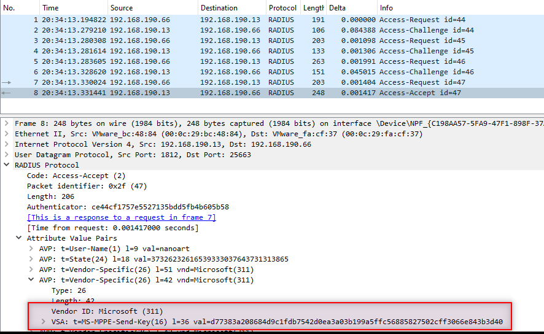
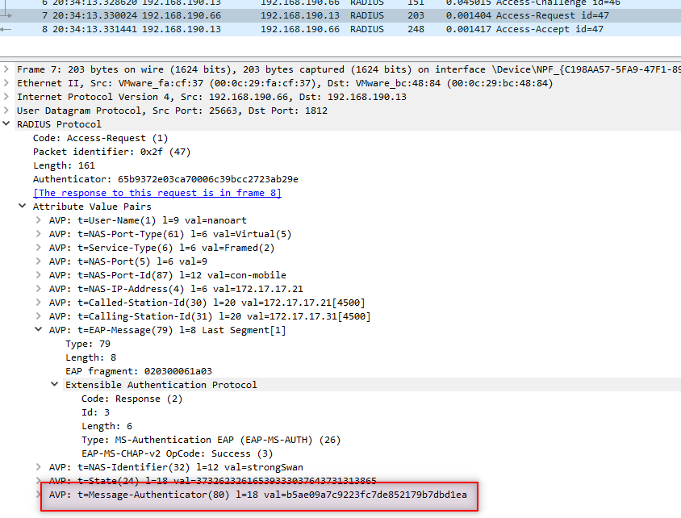
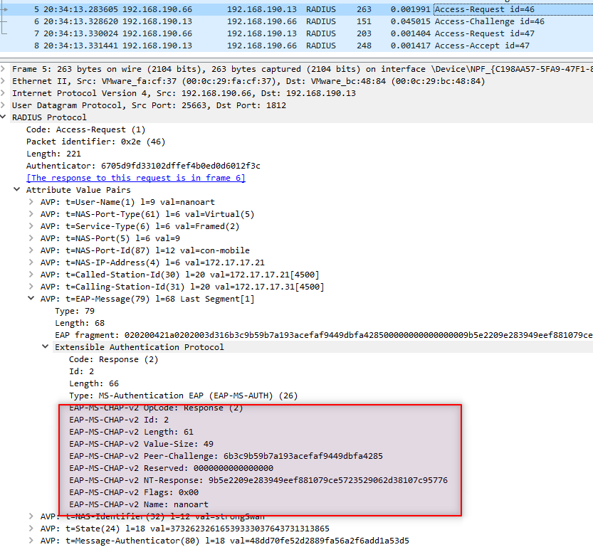
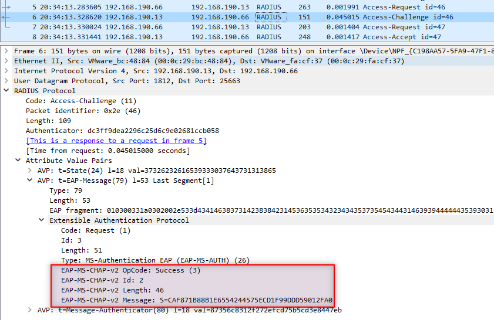
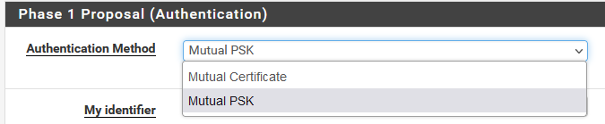
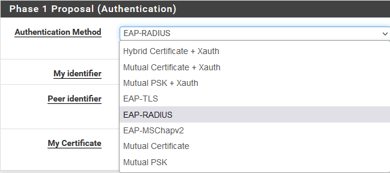
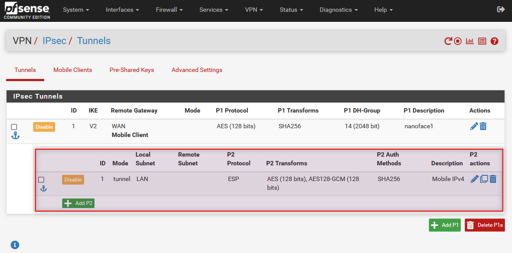

# IKEv2 with EAP-RADIUS (EAP-MSCHAPv2)

I was presented another problem. RADIUS authentication through our RADIUS server (dualradius) was fine, but [FortiClient](https://community.fortinet.com/t5/FortiGate/Technical-Tip-IKEv2-dialup-IPsec-tunnel-with-Radius-server/ta-p/191040) could not establish IKEv2 VPN connection.

I was also told it worked with MS NPS. 

Then I asked to collect RADIUS traffic captured with Wireshark, but I could not see much difference.

Before getting a trial virtual appliance of FortiGate, I decided to build my own lab to investigate this problem.

# Lab

It is about IKEv2 and IPsec. I tried Windows RRAS as IPSec VPN server in the very beginning, but gave it up later. 
[pfsense](https://www.pfsense.org/download/) turned to be a good candidate. 

For IKEv2 VPN client,I stick with the Windows 10 built-in one.

Installing FreeRadius is much easier than NPS, so the final machines are,

| Machine       | Network       | IP  |
| ------------- | ------------- | --- |
| pfsense  | WAN, LAN  | 172.17.17.21,  192.168.190.66|
| Windows client  | WAN  | 172.17.17.31  |
| freeradius  | LAN  | 192.168.190.37  |
| dualradius  | LAN  | 92.168.190.13  |

They are all hosted on VMWare ESXi server.

# Problem

Luckily I reproduced the problem, then I checked the IPSec log on pfsense `Status | System Logs | IPsec`. Here are the key lines,

```
Nov 14 22:41:46	charon	49780	06[CFG] <con-mobile|11> received RADIUS Access-Accept from server '19013'
Nov 14 22:41:46	charon	49780	06[IKE] <con-mobile|11> RADIUS authentication of 'nanoart' successful
Nov 14 22:41:46	charon	49780	06[IKE] <con-mobile|11> EAP method EAP_MSCHAPV2 succeeded, no MSK established
Nov 14 22:41:46	charon	49780	06[ENC] <con-mobile|11> generating IKE_AUTH response 5 [ EAP/SUCC ]
Nov 14 22:41:46	charon	49780	06[NET] <con-mobile|11> sending packet: from 172.17.17.21[4500] to 172.17.17.31[4500] (80 bytes)
Nov 14 22:41:46	charon	49780	06[NET] <con-mobile|11> received packet: from 172.17.17.31[4500] to 172.17.17.21[4500] (112 bytes)
Nov 14 22:41:46	charon	49780	06[ENC] <con-mobile|11> parsed IKE_AUTH request 6 [ AUTH ]
Nov 14 22:41:46	charon	49780	06[IKE] <con-mobile|11> verification of AUTH payload without EAP MSK failed
Nov 14 22:41:46	charon	49780	06[ENC] <con-mobile|11> generating IKE_AUTH response 6 [ N(AUTH_FAILED) ]
Nov 14 22:41:46	charon	49780	06[NET] <con-mobile|11> sending packet: from 172.17.17.21[4500] to 172.17.17.31[4500] (80 bytes)
Nov 14 22:41:46	charon	49780	06[IKE] <con-mobile|11> IKE_SA con-mobile[11] state change: CONNECTING => DESTROYING
```

# Investigation

I googled on both `EAP method EAP_MSCHAPV2 succeeded, no MSK established` and `verification of AUTH payload without EAP MSK failed`. The results didn't help much.

Reading the source code may help. I managed to located it, the error happened at [libcharon](https://github.com/strongswan/strongswan/blob/74ae71d2b8a53ad41f810cd14baca929a0af747d/src/libcharon/sa/ikev2/authenticators/eap_authenticator.c#L503) inside [strongswan](https://github.com/strongswan/strongswan). Surprised? yes, you are right, the IPSec VPN in pfsense is built on strongswan. 

```
	if (!auth_data.len || !chunk_equals_const(auth_data, recv_auth_data))
	{
		DBG1(DBG_IKE, "verification of AUTH payload with%s EAP MSK failed",
			 this->msk.ptr ? "" : "out");
		chunk_free(&auth_data);
		return FALSE;
	}
```

Is `msk` important here? In theory, MSK(master session key) is a combination of `MS-MPPE-Send-Key` and `MS-MPPE-Recv-Key` when using EAP-MSCHAPv2. We did  provide these two attributes in `Access-Accept`.

To be honest, I have little knowledge on [Internet Key Exchange Protocol Version 2 (IKEv2)](https://www.rfc-editor.org/rfc/rfc5996), but I guess we should see `MSK established`, instead of `no MSK established`.

In order to confirm my suspicion, I switched to use FreeRadius server, and it worked. The IPSec log said,

```
EAP method EAP_MSCHAPV2 succeeded, MSK established
```

It seems we generated wrong MPPE Keys. 

I revisited [Microsoft Vendor-specific RADIUS Attributes](https://datatracker.ietf.org/doc/html/rfc2548), especially this part [MS-MPPE-Send-Key](https://datatracker.ietf.org/doc/html/rfc2548#section-2.4.2).

FreeRadius implemented the encryption at [encode_tunnel_password](https://github.com/FreeRADIUS/freeradius-server/blob/372d3ceb4630ba7f84948924184db7c1016fd0c3/src/protocols/radius/encode.c#L101).

I reviewed our source code and didn't find any problem on function level.

**I started to think we might call the function with wrong inputs.**

Let me extract this part from [RFC 2548](https://datatracker.ietf.org/doc/html/rfc2548),

> Call the shared secret S, the pseudo-random 128-bit Request Authenticator (from the corresponding Access-Request packet) R,
and the contents of the Salt field A.  Break P into 16 octet chunks p(1), p(2)...p(i), where i = len(P)/16.  Call the
ciphertext blocks c(1), c(2)...c(i) and the final ciphertext C. Intermediate values b(1), b(2)...c(i) are required.  Encryption
is performed in the following manner ('+' indicates concatenation):

```
    b(1) = MD5(S + R + A)    c(1) = p(1) xor b(1)   C = c(1)
    b(2) = MD5(S + c(1))     c(2) = p(2) xor b(2)   C = C + c(2)
                  .                      .
                  .                      .
                  .                      .
    b(i) = MD5(S + c(i-1))   c(i) = p(i) xor b(i)   C = C + c(i)
```

> The resulting encrypted String field will contain `c(1)+c(2)+...+c(i)`.

As you can see, the Request Authenticator (from the corresponding Access-Request packet) **R** is involved.

**We might do the encryption with a WRONG Request Authenticator!**

The vendor-specific attributes were added in `Access-Accept` of Packet `8`,    
  
The correct Request Authenticator used for encryption should come from Packet `7`,  
  
The authentication happened at Packet `5`, when we received `NT-Response` and `Peer-Challenge`. We immediately generated the MPPE keys in this stage. In EAP-MSCHAPv2, it is wrong!      
  
Please note the subsequent packet `6` is `Access-Challenge` instead of `Access-Accept` in this situation (EAP protocol),  
  

You can see the example Wireshark capture file in [Attachments](#Attachments).  

# Tips

In order to avoid any unnecessary trouble, I just followed the links in [References](#References) to setup server and client. Used FQDN instead of IP, and installed CA certificate on the client machine.  

If you don't see any RADIUS traffic, then the connection between the Windows client and pfsense server may have problem. Check Event Viewer on the client to see the error code.

I hit this one,

> CoId={B46DAC17-165F-0000-43FD-70B45F16DA01}: The user NANO190059\nanoart dialed a connection named IKEv2 Test which has failed. The error code returned on failure is 13868.

Fixed the problem by running the following powershell commands on the client machine.

```
Get-VpnConnection -Name "IKEv2 Test" | Select-Object -ExpandProperty IPsecCustomPolicy

Set-VpnConnectionIPsecConfiguration -ConnectionName "IKEv2 Test" -AuthenticationTransformConstants SHA256128 -CipherTransformConstants AES128 -DHGroup Group14 -EncryptionMethod AES128 -IntegrityCheckMethod SHA256 -PFSgroup PFS2048 -Force
```

Don't worry the Pre-shared key field sometimes appears when you edit VPN settings on client, we don't use it actually as we are testing EAP-MSCHAPv2, and the authentication credential is username and password.

You need to configure Mobile Client first, otherwise the Authentication Method in IPSec Tunnel may only show 2 options, `Mutual Certificate` and `Mutual PSK`. They are mainly used for Site-to-Site VPN.  

  

From Mobile Client, set up its tunnel, then you should see more options,

  
Please select `EAP-RADIUS`, as we are handling MSCHAPv2 via RADIUS.  

The user authentication happened in `Phase 1`. It is enough for investigating the authentication problem. If you want to make the VPN fully working, don't forget to add `Phase 2`,



# Attachments

-  The Wireshark capture file [eap-radius-success.pcapng](./doc/eap-radius-success.pcapng).
-  The IPSec Log [ipsec-ikev2-success.txt](./doc/ipsec-ikev2-success.txt) logged on a successful connection.  

# References

[Technical Tip: IKEv2 dialup IPsec tunnel with Radius server authentication and FortiClient](https://community.fortinet.com/t5/FortiGate/Technical-Tip-IKEv2-dialup-IPsec-tunnel-with-Radius-server/ta-p/191040)  
[IPsec Remote Access VPN Example Using IKEv2 with EAP-MSCHAPv2](https://docs.netgate.com/pfsense/en/latest/recipes/ipsec-mobile-ikev2-eap-mschapv2.html)  

[How the MSK is generated from the EAP process?](https://community.arubanetworks.com/discussion/how-the-msk-is-generated-from-the-eap-process)  

[IPSec with IKEv2 setup guide for Windows 10](https://www.ivpn.net/setup/windows-10-ipsec-with-ikev2/)  
[How to set up IKEv2 VPN connection on Windows 10](https://thesafety.us/vpn-setup-ikev2-windows10)  
[Always On VPN – Troubleshooting](https://www.configjon.com/always-on-vpn-troubleshooting/)  

[MikroTik IPSec ike2 VPN server](https://mum.mikrotik.com/presentations/MY19/presentation_7008_1560543676.pdf)  
