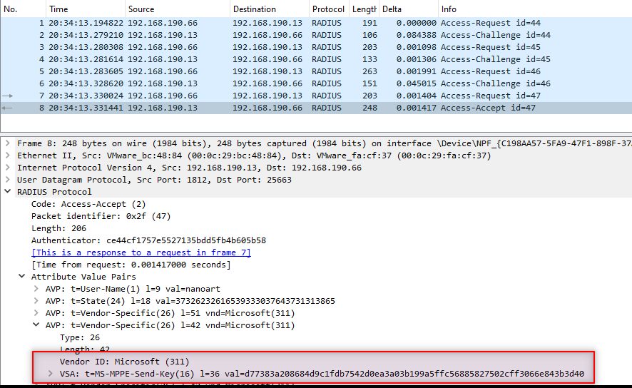
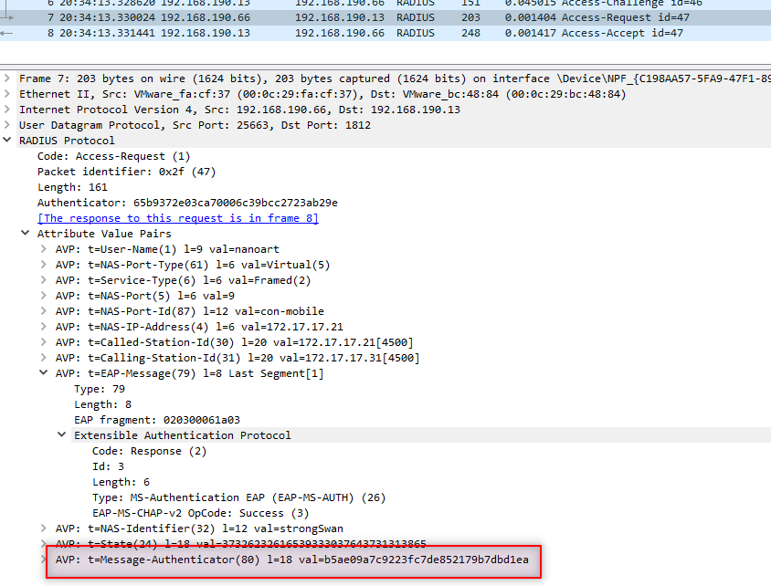
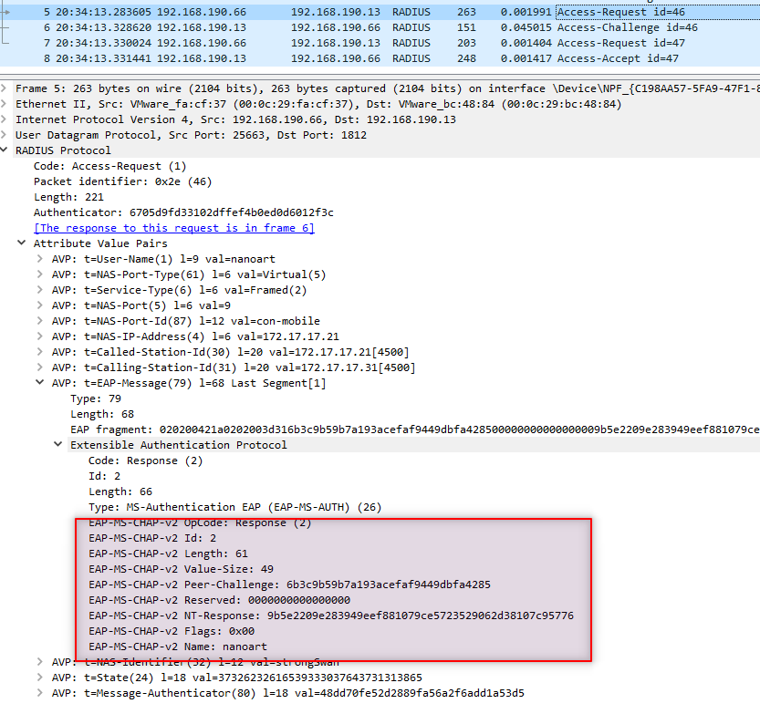
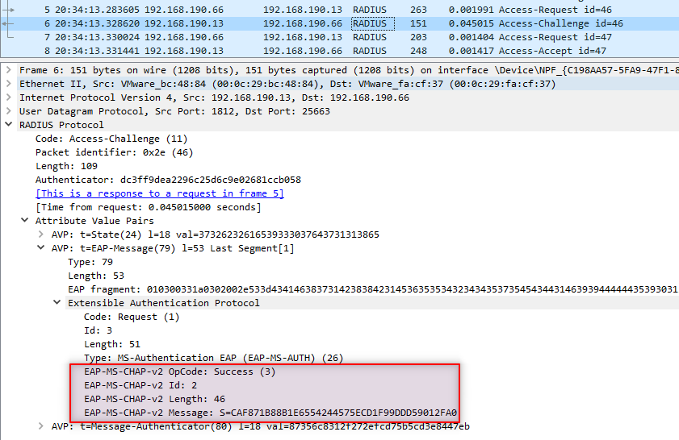
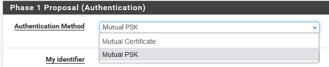
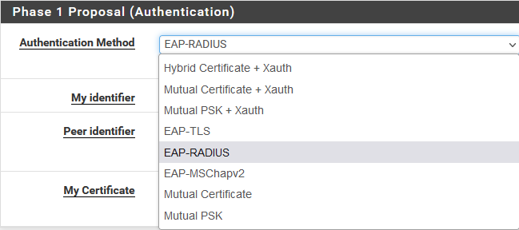
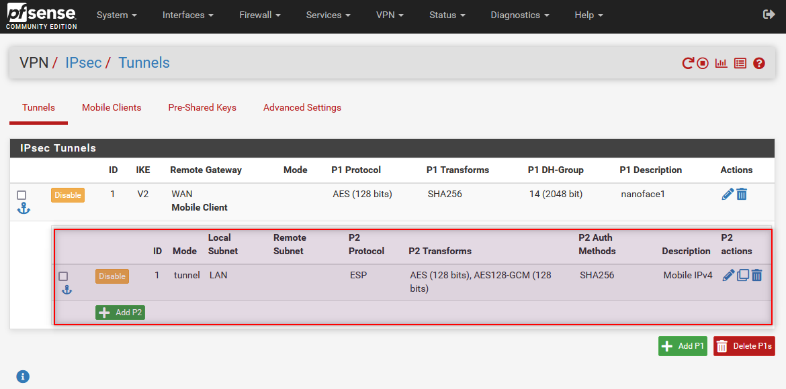

# IKEv2 with EAP-RADIUS (EAP-MSCHAPv2)

I was brought in to investigate a problem: RADIUS authentication through our RADIUS server (dualradius) was working correctly, but [FortiClient](https://community.fortinet.com/t5/FortiGate/Technical-Tip-IKEv2-dialup-IPsec-tunnel-with-Radius-server/ta-p/191040) could not establish an IKEv2 VPN connection.

I was also told it worked with MS NPS.

I asked for RADIUS traffic captured with Wireshark, but could not spot any obvious difference.

Before obtaining a trial virtual appliance of FortiGate, I decided to build my own lab to investigate the problem.

# Lab

This involves IKEv2 and IPsec. I initially tried Windows RRAS as the IPsec VPN server but abandoned it.
[pfSense](https://www.pfsense.org/download/) proved to be a much better option.

For the IKEv2 VPN client, I used the Windows 10 built-in client.

FreeRADIUS is considerably easier to set up than NPS, so the final lab machines are:

| Machine       | Network       | IP  |
| ------------- | ------------- | --- |
| pfsense  | WAN, LAN  | 172.17.17.21,  192.168.190.66|
| Windows client  | WAN  | 172.17.17.31  |
| freeradius  | LAN  | 192.168.190.37  |
| dualradius  | LAN  | 192.168.190.13  |

All machines are hosted on a VMware ESXi server.

# Problem

I was able to reproduce the problem. Checking the IPsec log on pfSense at `Status | System Logs | IPsec`, the key lines were:

```
Nov 14 22:41:46	charon	49780	06[CFG] <con-mobile|11> received RADIUS Access-Accept from server '19013'
Nov 14 22:41:46	charon	49780	06[IKE] <con-mobile|11> RADIUS authentication of 'nanoart' successful
Nov 14 22:41:46	charon	49780	06[IKE] <con-mobile|11> EAP method EAP_MSCHAPV2 succeeded, no MSK established
Nov 14 22:41:46	charon	49780	06[ENC] <con-mobile|11> generating IKE_AUTH response 5 [ EAP/SUCC ]
Nov 14 22:41:46	charon	49780	06[NET] <con-mobile|11> sending packet: from 172.17.17.21[4500] to 172.17.17.31[4500] (80 bytes)
Nov 14 22:41:46	charon	49780	06[NET] <con-mobile|11> received packet: from 172.17.17.31[4500] to 172.17.17.21[4500] (112 bytes)
Nov 14 22:41:46	charon	49780	06[ENC] <con-mobile|11> parsed IKE_AUTH request 6 [ AUTH ]
Nov 14 22:41:46	charon	49780	06[IKE] <con-mobile|11> verification of AUTH payload without EAP MSK failed
Nov 14 22:41:46	charon	49780	06[ENC] <con-mobile|11> generating IKE_AUTH response 6 [ N(AUTH_FAILED) ]
Nov 14 22:41:46	charon	49780	06[NET] <con-mobile|11> sending packet: from 172.17.17.21[4500] to 172.17.17.31[4500] (80 bytes)
Nov 14 22:41:46	charon	49780	06[IKE] <con-mobile|11> IKE_SA con-mobile[11] state change: CONNECTING => DESTROYING
```

# Investigation

Searching for both `EAP method EAP_MSCHAPV2 succeeded, no MSK established` and `verification of AUTH payload without EAP MSK failed` did not yield useful results.

Reading the source code proved more helpful. I traced the error to [libcharon](https://github.com/strongswan/strongswan/blob/74ae71d2b8a53ad41f810cd14baca929a0af747d/src/libcharon/sa/ikev2/authenticators/eap_authenticator.c#L503) inside [strongswan](https://github.com/strongswan/strongswan). The IPsec implementation in pfSense is built on strongswan.

```
	if (!auth_data.len || !chunk_equals_const(auth_data, recv_auth_data))
	{
		DBG1(DBG_IKE, "verification of AUTH payload with%s EAP MSK failed",
			 this->msk.ptr ? "" : "out");
		chunk_free(&auth_data);
		return FALSE;
	}
```

Is `msk` significant here? In EAP-MSCHAPv2, the MSK (Master Session Key) is derived from `MS-MPPE-Send-Key` and `MS-MPPE-Recv-Key`. Both attributes were present in our `Access-Accept` response.

I have limited knowledge of [Internet Key Exchange Protocol Version 2 (IKEv2)](https://www.rfc-editor.org/rfc/rfc5996), but the log should say `MSK established`, not `no MSK established`.

To confirm this suspicion, I switched to FreeRADIUS, and the connection succeeded. The IPsec log then showed:

```
EAP method EAP_MSCHAPV2 succeeded, MSK established
```

This pointed to incorrect MPPE key generation on our side.

I re-read [Microsoft Vendor-specific RADIUS Attributes](https://datatracker.ietf.org/doc/html/rfc2548), specifically [MS-MPPE-Send-Key](https://datatracker.ietf.org/doc/html/rfc2548#section-2.4.2).

FreeRADIUS implements the encryption at [encode_tunnel_password](https://github.com/FreeRADIUS/freeradius-server/blob/372d3ceb4630ba7f84948924184db7c1016fd0c3/src/protocols/radius/encode.c#L101).

Reviewing our source code revealed no problem at the function level.

**I began to suspect we were calling the function with the wrong inputs.**

The relevant section from [RFC 2548](https://datatracker.ietf.org/doc/html/rfc2548):

> Call the shared secret S, the pseudo-random 128-bit Request Authenticator (from the corresponding Access-Request packet) R,
and the contents of the Salt field A.  Break P into 16 octet chunks p(1), p(2)...p(i), where i = len(P)/16.  Call the
ciphertext blocks c(1), c(2)...c(i) and the final ciphertext C. Intermediate values b(1), b(2)...c(i) are required.  Encryption
is performed in the following manner ('+' indicates concatenation):

```
    b(1) = MD5(S + R + A)    c(1) = p(1) xor b(1)   C = c(1)
    b(2) = MD5(S + c(1))     c(2) = p(2) xor b(2)   C = C + c(2)
                  .                      .
                  .                      .
                  .                      .
    b(i) = MD5(S + c(i-1))   c(i) = p(i) xor b(i)   C = C + c(i)
```

> The resulting encrypted String field will contain `c(1)+c(2)+...+c(i)`.

The Request Authenticator **R** (from the corresponding Access-Request packet) is a required input to the encryption.

**We were encrypting the MPPE keys using the wrong Request Authenticator.**

The vendor-specific attributes were added in the `Access-Accept` of Packet `8`:

The correct Request Authenticator for encryption must come from Packet `7`:  
  
The actual authentication occurred at Packet `5`, when `NT-Response` and `Peer-Challenge` were received. We were generating the MPPE keys at that point — which is incorrect in EAP-MSCHAPv2.  
  
Note that the subsequent Packet `6` is an `Access-Challenge`, not an `Access-Accept`, in this EAP flow:  


A sample Wireshark capture is available in [Attachments](#Attachments).

# Tips

To avoid unnecessary complications, I followed the links in [References](#References) when setting up the server and client. I used an FQDN instead of an IP address, and installed the CA certificate on the client machine.

If no RADIUS traffic appears, the connection between the Windows client and the pfSense server may be failing. Check Event Viewer on the client for the error code.

I encountered this error:

> CoId={B46DAC17-165F-0000-43FD-70B45F16DA01}: The user NANO190059\nanoart dialed a connection named IKEv2 Test which has failed. The error code returned on failure is 13868.

It was resolved by running the following PowerShell commands on the client machine:

```
Get-VpnConnection -Name "IKEv2 Test" | Select-Object -ExpandProperty IPsecCustomPolicy

Set-VpnConnectionIPsecConfiguration -ConnectionName "IKEv2 Test" -AuthenticationTransformConstants SHA256128 -CipherTransformConstants AES128 -DHGroup Group14 -EncryptionMethod AES128 -IntegrityCheckMethod SHA256 -PFSgroup PFS2048 -Force
```

The Pre-shared key field may appear when editing VPN settings on the client — this can be ignored, as EAP-MSCHAPv2 uses username and password credentials, not a pre-shared key.

You must configure the Mobile Client first. Without it, the Authentication Method in IPsec Tunnel will only show two options: `Mutual Certificate` and `Mutual PSK`, which are intended for Site-to-Site VPN.



After setting up the Mobile Client tunnel, additional options become available:

  
Select `EAP-RADIUS`, since MSCHAPv2 is being handled via RADIUS.

User authentication takes place in `Phase 1`, which is sufficient for testing the authentication flow. To make the VPN fully operational, also configure `Phase 2`:



# Attachments

- The Wireshark capture file [eap-radius-success.pcapng](./doc/eap-radius-success.pcapng).
- The IPsec log [ipsec-ikev2-success.txt](./doc/ipsec-ikev2-success.txt) from a successful connection.

# References

[Technical Tip: IKEv2 dialup IPsec tunnel with Radius server authentication and FortiClient](https://community.fortinet.com/t5/FortiGate/Technical-Tip-IKEv2-dialup-IPsec-tunnel-with-Radius-server/ta-p/191040)
[IPsec Remote Access VPN Example Using IKEv2 with EAP-MSCHAPv2](https://docs.netgate.com/pfsense/en/latest/recipes/ipsec-mobile-ikev2-eap-mschapv2.html)

[How the MSK is generated from the EAP process?](https://community.arubanetworks.com/discussion/how-the-msk-is-generated-from-the-eap-process)

[IPSec with IKEv2 setup guide for Windows 10](https://www.ivpn.net/setup/windows-10-ipsec-with-ikev2/)
[How to set up IKEv2 VPN connection on Windows 10](https://thesafety.us/vpn-setup-ikev2-windows10)
[Always On VPN – Troubleshooting](https://www.configjon.com/always-on-vpn-troubleshooting/)

[MikroTik IPSec ike2 VPN server](https://mum.mikrotik.com/presentations/MY19/presentation_7008_1560543676.pdf)
