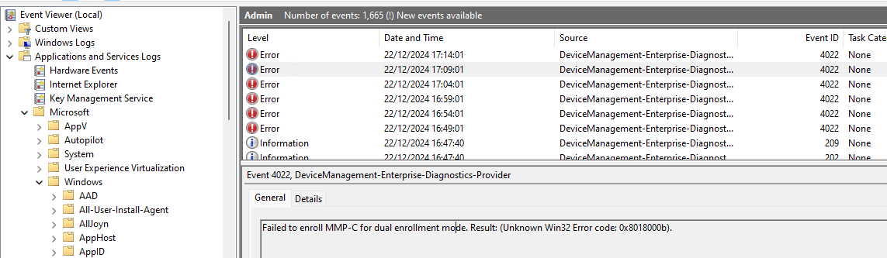

# Intune Deployment

This is my first time to try **Intune** to deploy some packages to Windows Desktop.

The first question I asked myself is, the client (Windows Desktop) must need to have some *Agent* to contact **Intune** web service. Yes AI told me it was built-in in latest Windows 10/11.

It also told me **IME(Intune Management Extension)** needed to be installed additionally if the deployment package is a **Windows app (Win32)**, but IME will be automatically deployed before a Win32 app is ready to be out.

MSI deployment is much simpler, and it doesn't need IME, however MSI is not enough for my case which needs to add a configuration file. Please see the details in [Deploy.ps1](./Deploy.ps1)

## Prepare `.intunewin` File

This part is relatively easy.

Use the **Microsoft Win32 Content Prep Tool** (`intunewinapputil.exe`) to package the files into a `.intunewin` file for Intune deployment.  
- Download the tool: [Win32 Content Prep Tool](https://github.com/Microsoft/Microsoft-Win32-Content-Prep-Tool).
- Prepare the `Source` Folder:

Include all necessary files:

```
IntuneWinAppUtil.exe
Source:
├── Deploy.ps1          # The PowerShell script
├── computer-logon-for-entra-id-win64.msi  # The MSI file
├── config.json         # The configuration file
Output
```

Execute the following command to create the `.intunewin` file:

```
IntuneWinAppUtil.exe -c "Source" -s "Deploy.ps1" -o "Output"
```
The `.intunewin` file will be generated in the `Output` folder.


## Deploy the App in Intune

### Upload the `.intunewin` File:

On https://intune.microsoft.com/, go to `Apps > Add > Windows app (Win32)` and upload the `.intunewin` package.

For `Install Command:` 

`%systemroot%\SysNative\WindowsPowershell\v1.0\PowerShell.exe -ExecutionPolicy Bypass -File Deploy.ps1`

For `Uninstall command`, 

`%systemroot%\SysNative\WindowsPowershell\v1.0\PowerShell.exe -ExecutionPolicy Bypass -File Remove.ps1`


### Detection Rule:

For simplicity, the rule type `File` is used,


You can also try [detection_rule.ps1](./detection_rule.ps1), it should work too.

### Assign the app to a user or device group.


### Other settings

A compliance policy may be needed,


I didn't mention others as I used the default ones.

## Result

Actually the very first deployment was not straightforward. 

The first problem I came across was, IME was not installed, let alone my package.

Checked the test device on Intune web site, and found there was an error `65001`, 


With this clue, I noticed,


Switch it off to `Not compliant` at,
`Home > Endpoint security > Device compliance > Compliance policies > Compliance policy settings`


Then I got this on the desktop machine (actually a VM)


IME was finally installed.

End of the story? No, I hit another problem, my package failed to be deployed.

The log files under `C:\ProgramData\Microsoft\IntuneManagementExtension\Logs` didn't help. I also check Event Viewer.

`Applications and Services  Logs > Microsoft > Windows > Microsoft-Windows-DeviceManagement-Enterprise-Diagnostics-Provider/Admin`

which didn't help either, as it had a lot of unrelated errors, like this one,


My second problem seemed that running `msi` inside `ps1` failed. In order to troubleshoot, I added the log and tried it again.

This was the related msi installation log detail,

```
=== Verbose logging started: 20/12/2024  16:50:49  Build type: SHIP UNICODE 5.00.10011.00  Calling process: C:\Windows\SysWOW64\msiexec.exe ===
MSI (c) (D8:F0) [16:50:49:780]: Resetting cached policy values
MSI (c) (D8:F0) [16:50:49:780]: Machine policy value 'Debug' is 0
MSI (c) (D8:F0) [16:50:49:780]: ******* RunEngine:
           ******* Product: .\computer-logon-for-entra-id-win64.msi
           ******* Action: 
           ******* CommandLine: **********
MSI (c) (D8:F0) [16:50:49:780]: Client-side and UI is none or basic: Running entire install on the server.
MSI (c) (D8:F0) [16:50:49:780]: Grabbed execution mutex.
MSI (c) (D8:F0) [16:50:49:827]: Cloaking enabled.
MSI (c) (D8:F0) [16:50:49:827]: Attempting to enable all disabled privileges before calling Install on Server
MSI (c) (D8:F0) [16:50:49:827]: Incrementing counter to disable shutdown. Counter after increment: 0
MSI (s) (B4:7C) [16:50:49:842]: Running installation inside multi-package transaction C:\Windows\IMECache\699e7330-a304-4b3b-a2d1-db4cd58900bb_1\.\computer-logon-for-entra-id-win64.msi
MSI (s) (B4:7C) [16:50:49:842]: Grabbed execution mutex.
MSI (s) (B4:9C) [16:50:49:842]: Resetting cached policy values
MSI (s) (B4:9C) [16:50:49:842]: Machine policy value 'Debug' is 0
MSI (s) (B4:9C) [16:50:49:842]: ******* RunEngine:
           ******* Product: C:\Windows\IMECache\699e7330-a304-4b3b-a2d1-db4cd58900bb_1\.\computer-logon-for-entra-id-win64.msi
           ******* Action: 
           ******* CommandLine: **********
MSI (s) (B4:9C) [16:50:49:842]: Machine policy value 'DisableUserInstalls' is 0
MSI (s) (B4:9C) [16:50:49:842]: Note: 1: 2203 2: C:\Windows\Installer\inprogressinstallinfo.ipi 3: -2147287038 
MSI (s) (B4:9C) [16:50:49:842]: SRSetRestorePoint skipped for this transaction.
MSI (s) (B4:9C) [16:50:49:842]: Note: 1: 1402 2: HKEY_CURRENT_USER\Software\Microsoft\Windows\CurrentVersion\Policies\Explorer 3: 2 
MSI (s) (B4:9C) [16:50:49:842]: Note: 1: 1324 2: . 3: 1 
MSI (s) (B4:9C) [16:50:49:842]: MainEngineThread is returning 2
MSI (s) (B4:7C) [16:50:49:842]: No System Restore sequence number for this installation.
MSI (s) (B4:7C) [16:50:49:842]: User policy value 'DisableRollback' is 0
MSI (s) (B4:7C) [16:50:49:842]: Machine policy value 'DisableRollback' is 0
MSI (s) (B4:7C) [16:50:49:842]: Incrementing counter to disable shutdown. Counter after increment: 0
MSI (s) (B4:7C) [16:50:49:842]: Note: 1: 1402 2: HKEY_LOCAL_MACHINE\Software\Microsoft\Windows\CurrentVersion\Installer\Rollback\Scripts 3: 2 
MSI (s) (B4:7C) [16:50:49:842]: Note: 1: 1402 2: HKEY_LOCAL_MACHINE\Software\Microsoft\Windows\CurrentVersion\Installer\Rollback\Scripts 3: 2 
MSI (s) (B4:7C) [16:50:49:842]: Decrementing counter to disable shutdown. If counter >= 0, shutdown will be denied.  Counter after decrement: -1
MSI (c) (D8:F0) [16:50:49:858]: Decrementing counter to disable shutdown. If counter >= 0, shutdown will be denied.  Counter after decrement: -1
MSI (c) (D8:F0) [16:50:49:858]: MainEngineThread is returning 2
=== Verbose logging stopped: 20/12/2024  16:50:49 ===

```

It confirmed msi installation rolled back due to some errors, but I didn't have much knowledge on MSI logs, so sought an advice from AI,  

I was told to pay attention to **Error 1324 - Invalid Character in Path**

`Note: 1: 1324 2: . 3: 1`

At that time I realized I made a mistake in `ps1` file,

`Start-Process -FilePath "C:\Windows\System32\msiexec.exe" -Wait -ArgumentList '/i .\computer-logon-for-entra-id-win64.msi /qn /norestart /L*vx "C:\Windows\Logs\nano_Install.log"'`

It should be,

`Start-Process -FilePath "C:\Windows\System32\msiexec.exe" -Wait -ArgumentList '/i computer-logon-for-entra-id-win64.msi /qn /norestart /L*vx "C:\Windows\Logs\nano_Install.log"'`

ChatGPT also gave me a revised version, please see [Deploy2.ps1](./Deploy2.ps1).


# References

[IMECache: Attack of the Cleaner](https://call4cloud.nl/win32app-ime-installation-phases-intune-troubleshoot/)

[Blood, Sweat, and built-in compliance policy](https://call4cloud.nl/built-in-compliance-policy-default/#13_Has_Compliance_policy_assigned)