# How to Renew a Certificate with KeyStore Explorer

Online security depends on certificates, yet certificate renewal remains a challenge for many people — including IT administrators at some organizations.
There are many tools available for this task. This guide uses [KeyStore Explorer](https://keystore-explorer.org/downloads.html).

## Quick Summary

- Generate a Key Pair  
  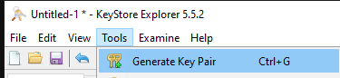  
  Default options are fine, except you must specify the web server's FQDN.  
  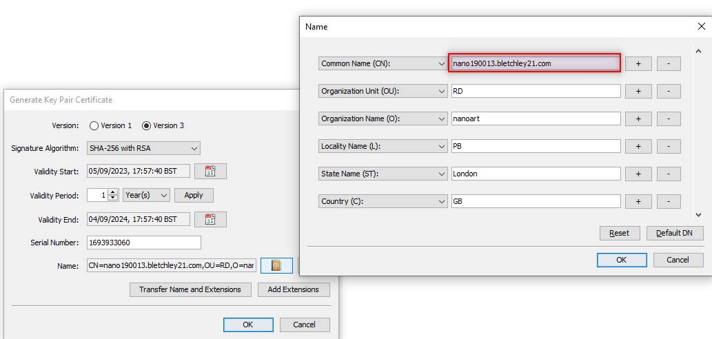
  When adding the extension, use the **Standard Server Template**.  
  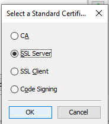
- Generate a CSR  
  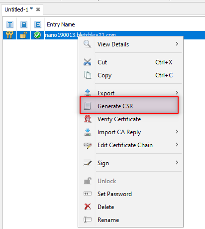
- Submit the CSR file (or its contents) to a public CA such as `GeoTrust`, `Comodo`, `DigiCert`, `Thawte`, `GoDaddy`, or `SSL.com` to purchase a certificate.
- Import the CA Reply  
  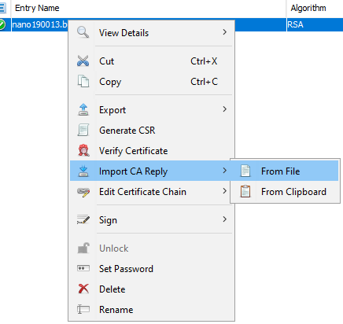
- Save the entry as a PFX file.

## Advanced

Let's walk through the details.

A digital certificate is a component of PKI ([Public Key Infrastructure](https://en.wikipedia.org/wiki/Public_key_infrastructure)).

Mathematically, the keys are tied to prime numbers. The following explanation is quoted from [Why are primes important in cryptography?](https://stackoverflow.com/questions/439870/why-are-primes-important-in-cryptography):

> Most basic and general explanation: cryptography is all about number theory, and all integer numbers (except 0 and 1) are made up of primes, so you deal with primes a lot in number theory.

> More specifically, some important cryptographic algorithms such as RSA critically depend on the fact that prime factorization of large numbers takes a long time. Basically you have a "public key" consisting of a product of two large primes used to encrypt a message, and a "secret key" consisting of those two primes used to decrypt the message. You can make the public key public, and everyone can use it to encrypt messages to you, but only you know the prime factors and can decrypt the messages. Everyone else would have to factor the number, which takes too long to be practical, given the current state of the art of number theory.

Looking at the flow chart above, you might notice it only shows private and public keys — no certificate. So where does the certificate fit in?

As the name implies, a public key is meant to be shared publicly. But simply publishing it raises a question: how can others be sure they can trust it?

That is where certificates come in.

We need a trusted authority — a CA (**Certificate Authority**) — that both you and the public recognize. The CA creates a signature over your public key and associated information (such as your CN), making that data tamper-evident.

`signature = encryption with CA's private key on the hash of (your public key + CN + other info)`

**A certificate is your public key combined with your identifying information, signed by a trusted authority.**

Anyone can use the CA's public key to verify that your certificate has not been altered.

There are several types of certificates. This guide uses a web server certificate as the example. If you own a website and want to secure it with HTTPS, you need one.

### Generate a Key Pair

As shown in [Quick Summary](#quick-summary), this is the first step.

For convenience, KeyStore Explorer also generates a self-signed certificate (Issuer == Subject) during this step.

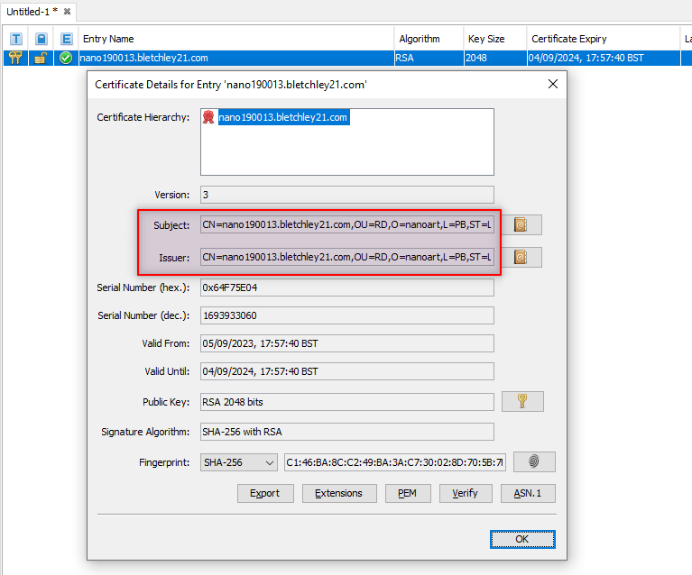

This is why you fill in information such as the CN — that information is for the certificate, not for the key pair itself. Technically, the private/public key pair can be generated without it.

You also need to define the certificate's intended usage by adding extensions.

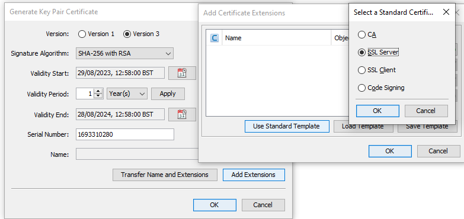

### Generate a CSR

Once you have the key pair, generating a CSR (Certificate Signing Request) is straightforward, as shown in the Quick Summary.

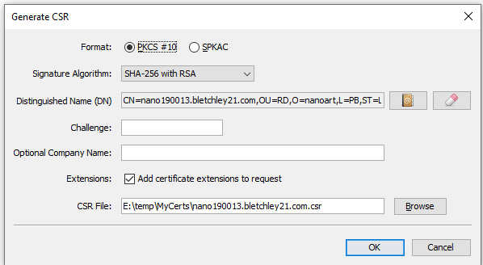

You might wonder what a CSR actually contains:

`CSR = your public key + your identifying information + a signature made with your private key`

You can inspect the contents using a [CSR Decoder And Certificate Decoder](https://certlogik.com/decoder/).

Submit the CSR to a public CA or an internal CA (such as a Microsoft CA). In return, you will receive a signed certificate.

`Certificate = your public key + your identifying information + a signature made with the CA's private key`

The key difference between a CSR and a certificate is the signature: the CSR is self-signed with your private key, while the certificate is signed by the CA.

### Sign a CSR
Signing is the CA's responsibility — feel free to skip this section if you are not interested. The CA issues a certificate based on your CSR.

KeyStore Explorer can simulate this process if you have a test CA key pair.  
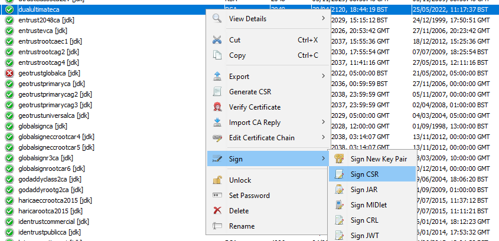
Provide the CSR file or paste its contents:  
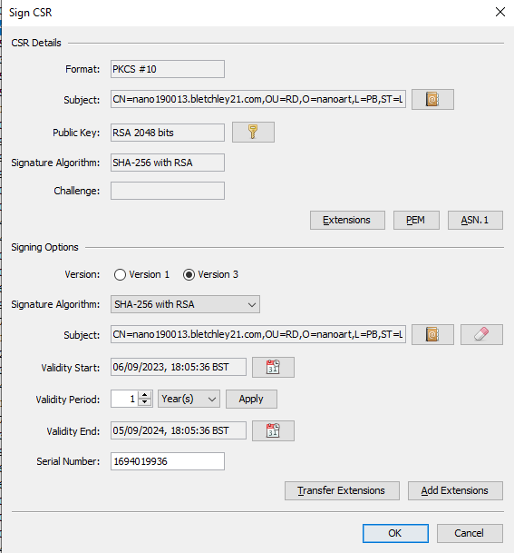  
Save the generated certificate:  
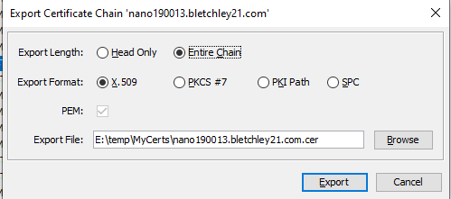

### Completing the Certificate
Can you use the `.cer` file issued by the CA directly on your web server? Not yet — it contains only the public key, not the private key.

You need to combine it with the private key that was generated on your side.
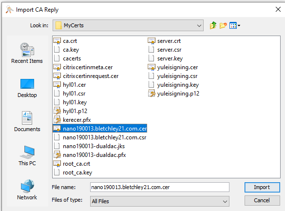

Now inspect the certificate chain — it is no longer self-signed. The CA appears at the top of the chain.
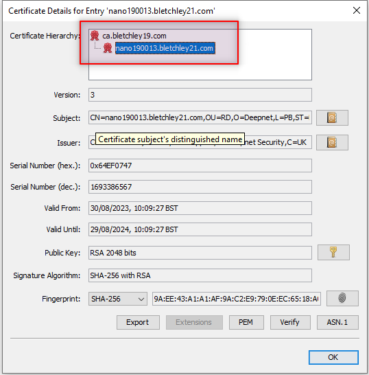

You now have a complete certificate entry containing the private key, the public key, and the CA-signed certificate.

This can be deployed directly to your web server.

## References

[What Is Asymmetric Encryption & How Does It Work?](https://sectigostore.com/blog/what-is-asymmetric-encryption-how-does-it-work/)
[Asymmetric Encryption: Definition, Architecture, Usage](https://www.okta.com/uk/identity-101/asymmetric-encryption/)

[CSR Decoder And Certificate Decoder](https://certlogik.com/decoder/)
[Certificate Signing Requests: Explained](https://www.securew2.com/blog/certificate-signing-requests-explained)

[CSR Decoder and Certificate Decoder](https://redkestrel.co.uk/tools/decoder)
