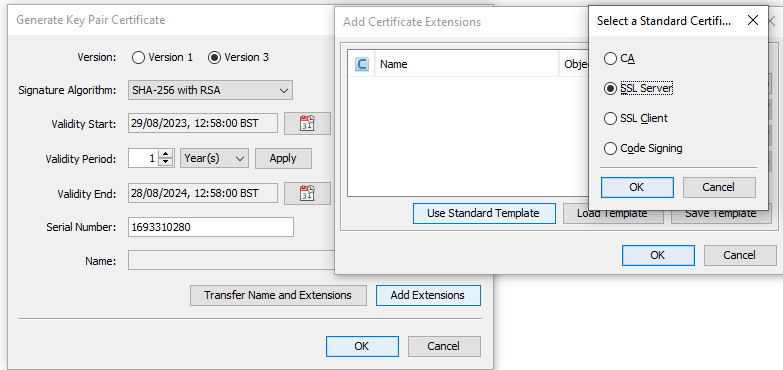

# How to renew certificate with KeyStore Explorer

Online security relies on certificate.
Certificate renewal is still a challenge for many people, even for the IT admin in some companies.
There are a lot of tools you can use. Here I am going to use [KeyStore Explorer](https://keystore-explorer.org/downloads.html).

## Nutshell

- Generate Key Pair  
    
  You can use default options, apart from specifying the web server FQDN.
    
  Also, use the **Standard Sever Template** when adding the extension.  
  
- Generate CSR  
    
- Send the *csr* file or its content to public CA, like `GeoTrust, Comodo, DigiCert, Thawte, GoDaddy, SSL.com`. You can buy  a certificate from them.
- Import CA Reply  
    
- Save the entry as a PFX file.

## Advanced

Let us talk about the details.  
The certificate (here I am talking about digital certificate), is a part of PKI, [Public key infrastructure](https://en.wikipedia.org/wiki/Public_key_infrastructure).

Mathematically, the keys are related to the prime numbers. I copied the following from [Why are primes important in cryptography?](https://stackoverflow.com/questions/439870/why-are-primes-important-in-cryptography)  
> Most basic and general explanation: cryptography is all about number theory, and all integer numbers (except 0 and 1) are made up of primes, so you deal with primes a lot in number theory.

> More specifically, some important cryptographic algorithms such as RSA critically depend on the fact that prime factorization of large numbers takes a long time. Basically you have a "public key" consisting of a product of two large primes used to encrypt a message, and a "secret key" consisting of those two primes used to decrypt the message. You can make the public key public, and everyone can use it to encrypt messages to you, but only you know the prime factors and can decrypt the messages. Everyone else would have to factor the number, which takes too long to be practical, given the current state of the art of number theory.

Where is the certificate? You may argue there is no certificate in the above flow chart where only the private and public keys are involved.

As the name suggests, the public key is for public, so you need to publish it. You have many ways to do that, but how can you convince other people to trust it?

The certificate comes to rescue.

Here we need an authority, CA (**Certificate Authority**), whom you and the public all trust on. CA creates a signature on your public key and the related information, like your CN, make them unalterable.

`signature = encryption with CA's private key on the hash of your public key plus CN etc`

**A certificate is a combination of your public key and your additional information and the signature issued from the authority.**

Everyone can use CA's public key to verify if your certificate is tampered.

There are a few types of certificate. In this article I use web server certificate as an example. If you are an owner of web site, and you want to make it secure, then you need a certificate.

### Generate key pair

Now you know this is the first thing we need to do, which we saw in [Nutshell](#nutshell).  
For your convenience, KeyStore Explorer also generates a self-sign certificate (Issuer == Subject) in this step. 

This is why you need to fill in the information like CN etc, which is for certificate only. In theory you don't need it for generating the private/public key pair. 

You also need to specify the certificate usage by adding the extensions. 

### Generate CSR

Once we have got the key pair, we can generate CSR (Certificate Signing Request), it is very easy as you have seen in Nutshell part.

You may wonder what information the CSR contains? 

`CSR = the combination of your public key and your additional information and the signature issued with your private key.`

You can decode it with [CSR Decoder And Certificate Decoder](https://certlogik.com/decoder/).

Now you can submit the CSR to CA, or your organization CA server, like Microsoft CA. You will be issued a certificate.

`Certificate = the combination of your public key and your additional information and the signature issued with CA private key.`

You should be able to tell the difference between the certificate and the CSR.

### Sign CSR
This is purely a job of CA, you can skip this part if you are not interested in. CA will issue you a certificate based on your CSR.  
KeyStore Explorer can simulate this job, if you have a dummy CA key pair.  
  
Provide the CSR file or its content  
  
Save the generated certificate  

### Completion
Are we able to use the certificate (`.cer`) issued by CA on your web server? Unfortunately not. Remember? it doesn't contain the private key!  
We need to combine it with the original private key at your side.  
  
Now check the certificate chain, it is not self-signed anymore. the CA is on the top of the tree.  

You have a full certificate now, containing private key and public key and also a certificate issued by a CA.

This certificate can be used on your web server.

## References

[What Is Asymmetric Encryption & How Does It Work?](https://sectigostore.com/blog/what-is-asymmetric-encryption-how-does-it-work/)
[Asymmetric Encryption: Definition, Architecture, Usage](https://www.okta.com/uk/identity-101/asymmetric-encryption/)

[CSR Decoder And Certificate Decoder](https://certlogik.com/decoder/)
[Certificate Signing Requests: Explained](https://www.securew2.com/blog/certificate-signing-requests-explained)

[CSR Decoder and Certificate Decoder](https://redkestrel.co.uk/tools/decoder)
