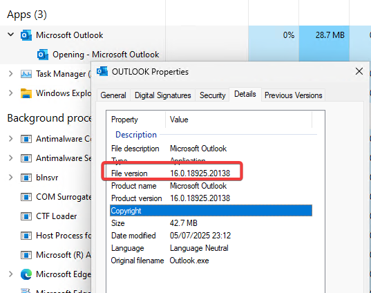
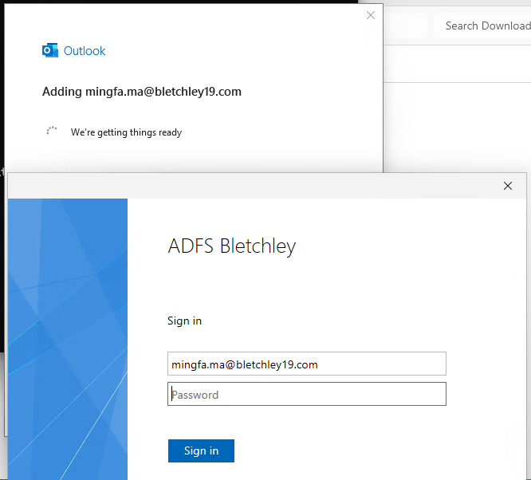
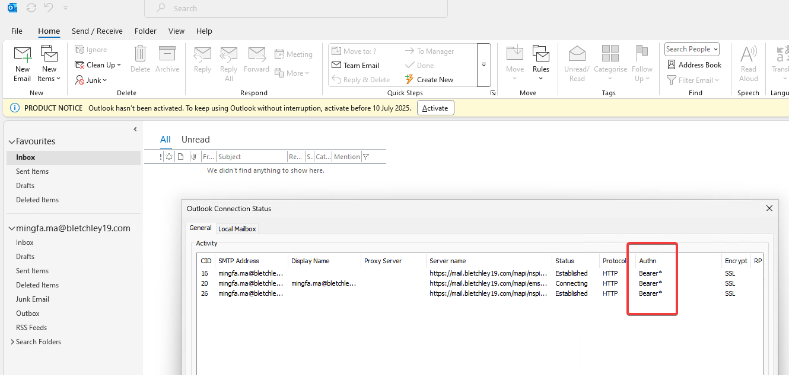
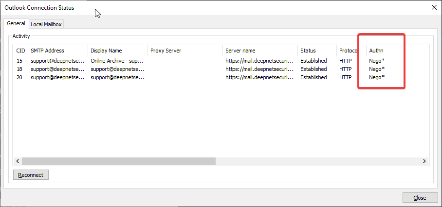

# Modern Authentication with On-Premises Exchange Server
I was recently asked to experiment with enabling Modern Authentication in Exchange Server on-premises.

The steps involving **Exchange Server** and **AD FS** are quite clear and straightforward.

## Outlook
I encountered some challenges with the Outlook client version. Initially, I assumed the latest version from the Microsoft Store would suffice. However, it consistently attempted to connect to an Office 365 account—even though it claims to support both Office 365 and Exchange, which I believe refers more to Hybrid Exchange environments.

Additionally, the Outlook 2024 edition available in my Visual Studio subscription was labeled as type `OTH`, and there was no standard `ISO` provided for download.

Ultimately, I opted to install Outlook 2021 and then applied updates to bring it to a compatible state.

Since certain registry keys need to be added for Modern Authentication to work properly, I’ve included the [client.reg](./doc/client.reg) file for convenience.

## Confirmation
How can you confirm Modern Authentication is in use?

You’ll be presented with the AD FS login form:  

In Outlook’s Connection Status, the authentication method will show as `Bearer*`:  

If Modern Authentication is not enabled, the auth method will be shown as `Nego*`:  

## References
[Enabling Modern Auth in Exchange on-premises](https://learn.microsoft.com/en-us/exchange/plan-and-deploy/post-installation-tasks/enable-modern-auth-in-exchange-server-on-premises)

[Exchange mit ADFS](https://www.msxfaq.de/exchange/admin/exchange_adfs.htm)

[Client configuration](https://documentation.kopano.cloud/administrator/modern-auth/#client_configuration)

[How to secure Microsoft Outlook Desktop Applications using MFA](https://download.manageengine.com/products/self-service-password/how-to-secure-microsoft-outlook-desktop-applications-using-mfa.pdf)

https://manual.myexchange.rocks/downloads/EnableModernAuth.reg
