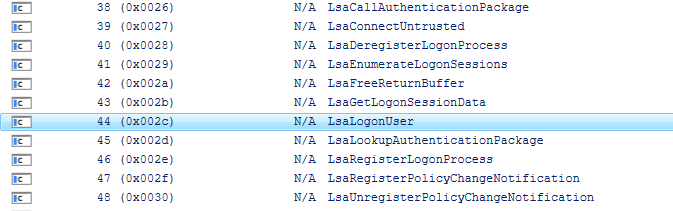

# NTLMv2 and MSCHAPv2

In Active Directory, you can change [Network security: LAN Manager authentication level](https://learn.microsoft.com/en-us/windows/security/threat-protection/security-policy-settings/network-security-lan-manager-authentication-level).

For instance, if we set the registry `HKLM\System\CurrentControlSet\Control\Lsa\LmCompatibilityLevel` to `5`, the domain controller will refuse to accept LM and NTLM authentication.

If we follow the NTLMv2 algorithm at [NTLM v2 Authentication](https://learn.microsoft.com/en-us/openspecs/windows_protocols/ms-nlmp/5e550938-91d4-459f-b67d-75d70009e3f3), [C++ implementation](https://github.com/hamstergene/ntlm), populate the structure [MSV1_0_LM20_LOGON](https://learn.microsoft.com/en-us/windows/win32/api/ntsecapi/ns-ntsecapi-msv1_0_lm20_logon), The Windows API [LsaLogonUser](https://learn.microsoft.com/en-us/windows/win32/api/ntsecapi/nf-ntsecapi-lsalogonuser) can be used to verify the user.

We noticed `MS-CHAP2-Response` in [MSCHAPv2](https://freeradius.org/rfc/rfc2548.html) still uses NTLMv1. Surprisingly, NPS still worked, How?

I checked some dlls loaded by NPS server. The DLL, `sspicli.dll`, exported a function, which is also called `LsaLogonUser`!



MS invented another `LsaLogonUser` With `SSPI`(Security Support Provider Interface). Obviously it is undocumented.

Before I stopped my investigation on that, I was also interested in the parameters passed into this function.

Set up a breakpoint `SspiCli!LsaLogonUser` in WinDbg, I got the following call stack,

```
 # RetAddr               : Args to Child                                                           : Call Site
00 00007ffb`b76f762c     : 0000019f`e0d58ab0 00000000`00000000 0000019f`e0d58a80 00007ffb`c918d168 : SspiCli!LsaLogonUser
01 00007ffb`b76f56d8     : 0000019f`e5199ee0 0000019f`e4cf1ec0 0000019f`e4cf1f5a 00000000`00000000 : iassam!IASLogonUser+0x9c
02 00007ffb`b76f5bda     : 0000002e`0207f3e0 0000002e`0207f2f1 00000000`00000000 00000000`00000000 : iassam!IASLogonMSCHAPWithParameterControl+0x144
03 00007ffb`b76d9656     : 0000002e`0207f398 0000002e`0207f538 0000002e`0207f36c 00007ffb`b76d9592 : iassam!IASLogonMSCHAPv2+0x192
04 00007ffb`b76da7f5     : 0000019f`e7e2af10 0000019f`e7e2ac28 0000019f`e7e2b480 0000019f`e7e2af10 : iassam!NTSamAuthentication::doMsChap2Authentication+0x1ca
05 00007ffb`b76d9a2b     : 0000019f`e7e2af10 0000019f`e7e2ac10 00000000`00000000 00007ffb`bc3c45b4 : iassam!NTSamAuthentication::tryMsChap2+0xf1
06 00007ffb`b76d5f2c     : 00007ffb`c4e98190 0000019f`e46b7270 0000019f`e46b5130 0000019f`e46b7270 : iassam!NTSamAuthentication::onSyncRequest+0x30b
07 00007ffb`b76d5e98     : 0000019f`e46b7270 0000019f`e0a694d0 0000019f`e8195800 00000000`00000001 : iassam!IASTL::IASRequestHandlerSync::onAsyncRequest+0x7c
08 00007ffb`c4e9328e     : 0000019f`e46b7270 0000019f`e0a694d0 0000019f`e0a694d0 0000019f`e0a70000 : iassam!IASTL::IASRequestHandler::OnRequest+0xa8
09 00007ffb`c4e92f98     : 0000019f`e46b7270 0000019f`e46ba650 0000019f`e46ba640 00007ffb`00000000 : iaspolcy!Pipeline::executeNext+0x15a
0a 00007ffb`b6c1e8a5     : 00000000`00000000 0000002e`0207f9d0 01da310b`ccf28032 0000019f`e46ba648 : iaspolcy!Pipeline::OnRequest+0x158
0b 00007ffb`b6c1c1b2     : 0000019f`e46b7278 0000019f`e0a50004 0000019f`e46b7270 0000019f`e46ba648 : iasrad!CSendToPipe::Process+0x2cd
0c 00007ffb`b6c1f3b1     : 0000019f`e0a1a920 00007ffb`b6c450e0 0000019f`e0a58240 00007ffb`b6c182a5 : iasrad!CPreProcessor::StartInProcessing+0x52
0d 00007ffb`b6c1c6bd     : 00000000`00000001 0000019f`e0aaab70 00000000`000000b0 0000019f`e0a58240 : iasrad!CValAccess::ValidateInPacket+0x31
0e 00007ffb`b6c1af90     : 0000019f`e0a7aec0 0000019f`e0a58240 0000002e`0207f948 00000000`00000000 : iasrad!CPreValidator::StartInValidation+0x91
0f 00007ffb`b6c1b76b     : 0000019f`e3a250a0 00000000`00000187 0000019f`e46cc720 0000019f`e3a20000 : iasrad!CPacketReceiver::ReceivePacket+0x388
10 00007ffb`b6c1b81f     : ffffffff`4d2fa200 0000019f`e5277d60 0000019f`e5277d60 00000000`00000001 : iasrad!CPacketReceiver::WorkerRoutine+0x6eb
11 00007ffb`c1574089     : 00007ffb`c157fd80 00000000`00000001 000017e3`16e20041 00000000`00000000 : iasrad!CPacketReceiver::CallbackRoutine+0x6f
12 00007ffb`c15743c5     : 00007ffb`00000000 0000019f`e5277d60 00000000`00000000 00000000`00000000 : iassvcs!Dispatcher::fillRequests+0x49
13 00007ffb`caa2b0ea     : 0000019f`e09c25e0 00000000`00000000 00000000`00000000 00000000`00000000 : iassvcs!Dispatcher::startRoutine+0x25
14 00007ffb`caa2b1bc     : 00007ffb`caa806d0 0000019f`e09c25e0 00000000`00000000 00000000`00000000 : msvcrt!_callthreadstartex+0x1e
15 00007ffb`cb0e7974     : 00000000`00000000 00000000`00000000 00000000`00000000 00000000`00000000 : msvcrt!_threadstartex+0x7c
16 00007ffb`cd07a271     : 00000000`00000000 00000000`00000000 00000000`00000000 00000000`00000000 : KERNEL32!BaseThreadInitThunk+0x14
17 00000000`00000000     : 00000000`00000000 00000000`00000000 00000000`00000000 00000000`00000000 : ntdll!RtlUserThreadStart+0x21

```

It still used `MSV1_0_LM20_LOGON`. In my test, `Workstation` was NULL, `CaseSensitiveChallengeResponse.Buffer` was still 24 bytes, copied from `Response` part of `MS-CHAP2-Response`. However `ChallengeToClient` was something special. It is the SHA1 hash of `Peer-Challenge` and `Challenge` and username.

You can take a look the function `IASLogonMSCHAPv2` in `iassam.dll` with IDA.

```
  v4 = a1;
  v5 = (wchar_t *)vars38;
  v6 = a4;
  v7 = a3;
  v8 = 5136;
  *(_QWORD *)pbInput = v27;
  if ( isNTLMv2CompatibilityEnabled )
    v8 = 70672;
  v16[0] = a2;
  if ( BCryptCreateHash((BCRYPT_ALG_HANDLE)0x31, &phHash[1], 0i64, 0, 0i64, 0, 0) < 0 )
    __fastfail(7u);
  if ( BCryptHashData(phHash[1], retaddr, 0x10u, 0) < 0 )
    __fastfail(7u);
  if ( BCryptHashData(phHash[1], v6, cbInput, 0) < 0 )
    __fastfail(7u);
  v9 = -1i64;
  do
    ++v9;
  while ( v7[v9] );
  if ( BCryptHashData(phHash[1], v7, v9, 0) < 0 )
    __fastfail(7u);
  if ( BCryptFinishHash(phHash[1], &pbOutput[8], 0x14u, 0) < 0 )
    __fastfail(7u);
  BCryptDestroyHash(phHash[1]);
  *(_QWORD *)v19 = *(_QWORD *)&pbOutput[8];
  phHash[1] = 0i64;
  result = IASLogonMSCHAPWithParameterControl(
             v4,
             v16[0],
             (__int64)v19,
             v5,
             0i64,
             v8,
             (wchar_t *)pbOutput,
             *(__int64 *)pbInput);
```

