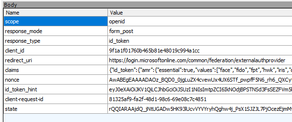

# DualShield OpenID Connect

Configuring OIDC can be complex, and DualShield offers a comprehensive set of options for fine-tuning your setup. While the flexibility is powerful, it can seem overwhelming at first. This guide covers the essential configurations needed for most standard applications.

## Redirect URI

The Redirect URI is provided by the Service Provider (SP), known as the Relying Party (RP) in OIDC terminology. As the Identity Provider (IDP), DualShield requires this URI. For example:

`https://login.microsoftonline.com/common/federation/externalauthprovider`

## Client ID and Secret

The Client ID and Secret function similarly to shared secrets in RADIUS. You can define these yourself or use the strong credentials generated by the DualShield Admin Console. Note: For JavaScript or mobile applications, a client secret is not required.

## Scopes

Scopes represent groups of claims. OIDC defines several standard scopes—see [OIDC Scope Claims](https://openid.net/specs/openid-connect-core-1_0.html#ScopeClaims) for details. The SP can request specific claims from the IDP by specifying scope values during authentication.

## OIDC Metadata URL

The SP expects a Discovery Endpoint from the OIDC IDP. DualShield provides this at:

`/sso/v1/authc/oauth/.well-known/openid-configuration`

## Username Passover

Some SPs process the username before passing it to the IDP for further authentication. For example, Entra ID uses the `id_token_hint` parameter, as described [here](https://openid.net/specs/openid-connect-core-1_0.html#AuthRequest). Alternatively, `login_hint` can be used. DualShield can extract the username from `id_token_hint`.

## Flows

The most common flow is the Authorization Code Flow. For more information on other flows, see [Authorization Code Flow](https://auth0.com/docs/get-started/authentication-and-authorization-flow#authorization-code-flow).

## Playground

### Username Passover Example

When Entra EAM redirects to the IDP, it posts values to `sso/v1/authc/oauth/connect/authorize`. The username is included in the `id_token_hint` form field.

For Entra EAM, DualShield uses the `oid` claim. For details on extracting the username, see [Create a SSO service provider in DualShield for EAM integration](https://wiki.deepnetsecurity.com/display/DualShield6/Create+a+SSO+service+provider+in+DualShield+for+EAM+integration).

> The `oid` is the immutable identifier for a user in Microsoft’s identity system. It uniquely identifies the user across applications. Note: If a user exists in multiple tenants, each tenant will have a different `oid` for that user.

### Discovery Endpoint

A compliant OIDC provider should offer a Discovery URL. DualShield’s endpoint is:

`/sso/v1/authc/oauth/.well-known/openid-configuration`

Accessing this URL returns a JSON object with important values such as `issuer`, `authorization_endpoint`, and `token_endpoint`.

[OpenID Connect Debugger](https://oidcdebugger.com/) is a useful tool for testing the Authorization Code Flow. It requires the `authorization_endpoint`.

## References

- [What is OIDC?](https://www.microsoft.com/en-gb/security/business/security-101/what-is-openid-connect-oidc)
- [Diagrams of All The OpenID Connect Flows](https://darutk.medium.com/diagrams-of-all-the-openid-connect-flows-6968e3990660)
- [Authorization Code Flow](https://auth0.com/docs/get-started/authentication-and-authorization-flow#authorization-code-flow)
- [OAuth Client Secret Authentication](https://docs.secureauth.com/ciam/en/oauth-client-secret-authentication.html)

