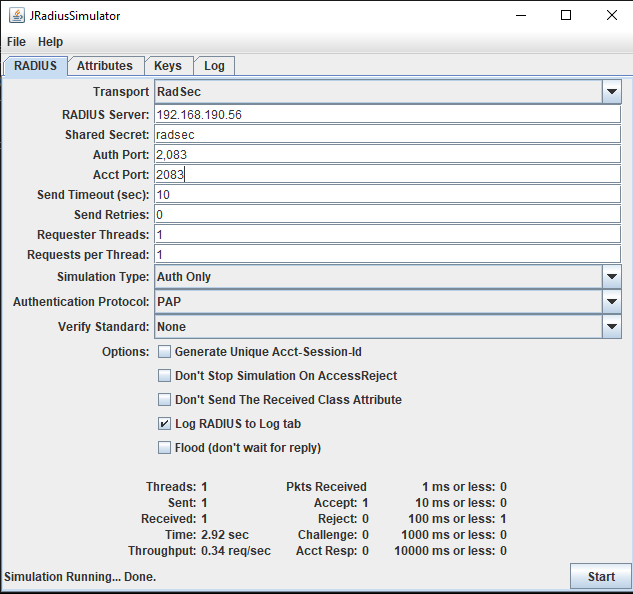
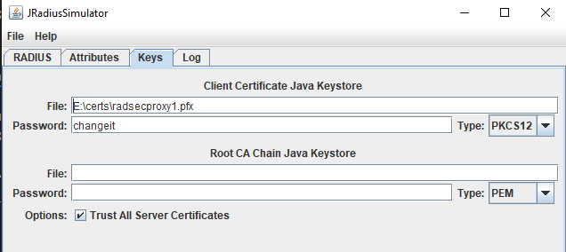

# Sample Configuration

RADIUS Client (using UDP) → radsecproxy1 (UDP to TLS) → radsecproxy2 (TLS to UDP) → RADIUS Server (using UDP)

| Machine | IP |  
| -------- | ------- |  
| RADIUS Client JRADIUS| 10.8.1.10 |  
| radsecproxy1 | 192.168.190.62 |  
| radsecproxy2 | 192.168.190.56 |  
| RADIUS Server | 192.168.190.13 |  

Both radsecproxy1 and radsecproxy2 are installed on Ubuntu 20.04 LTS.
You can install it by the command `apt-get install radsecproxy`, but some configuration directive like `TlsVersion` may need latest version.

I cloned the source code from https://github.com/radsecproxy/radsecproxy, and built it myself.

`radsecproxy.conf` on `radsecproxy1`
```
ListenUDP               *:1812
ListenUDP               *:1813
LogLevel                3
#LogDestination  file:///var/log/radsecproxy.log
LoopPrevention on
tls default {
        CACertificateFile /home/radsecproxy1/certs/certificate2.crt
        CertificateFile /home/radsecproxy1/certs/certificate1.crt
        CertificateKeyFile /home/radsecproxy1/certs/certificate1.key
        TlsVersion TLS1:TLS1_2
#       DtlsVersion TLS1:TLS1_2
#       CertificateKeyPassword "123456"
}
client jradius {
        host 10.8.1.10
        type udp
        secret testing123
}
server radsecproxy2.bletchley19.com {
        host 192.168.190.56:2083
        type tls
        certificatenamecheck off
        StatusServer off
}

realm * {
        server radsecproxy2.bletchley19.com
}
```


`radsecproxy.conf` on `radsecproxy2`
```

ListenUDP               *:1812
ListenUDP               *:1813
LogLevel                3
#LogDestination  file:///var/log/radsecproxy.log
LoopPrevention on
tls default {
        CACertificateFile /home/radsecproxy2/certs/certificate1.crt
        CertificateFile /home/radsecproxy2/certs/certificate2.crt
        CertificateKeyFile /home/radsecproxy2/certs/certificate2.key
#       TlsVersion TLS1:TLS1_2
#       DtlsVersion TLS1:TLS1_2
#       CertificateKeyPassword "123456"
}
client radsecproxy1.bletchley19.com {
        host 192.168.190.62
        type tls
        certificatenamecheck off
}
server dualradius_auth {
        host 192.168.190.13:1812
        type udp
        StatusServer off
        secret testing123
}

realm * {
        server dualradius_auth
}

```

If you prefer `dtls`, you can simply change `type tls` to `type dtls`.

You can run it in foregroud to make sure everything works before put it into a service mode.

`./radsecproxy -f -d 5 -c ./radsecproxy.conf`

If your RADIUS client supports `RADSEC`, then the server  `radsecproxy1` can be omitted. JRADIUS is supposed to support `RADSEC` on `TLSv1`, Unfortunately I got the same error `SSL_accept failed` which is described in https://github.com/radsecproxy/radsecproxy/issues/99.

After reviewing the corresponding code, I realized it missed one line code,

`socket.startHandshake();`

You can try my build at https://github.com/omnine/jradius/releases/tag/1.1.6.3.

The new conf on `radsecproxy2` becomes, 

```
ListenUDP               *:1812
ListenUDP               *:1813
LogLevel                3
#LogDestination  file:///var/log/radsecproxy.log
LoopPrevention on
tls default {
        CACertificateFile /home/radsecproxy2/certs/ca.omnine.com.cer
        CertificateFile /home/radsecproxy2/certs/radsecproxy2.bletchley19.com.cer
        CertificateKeyFile /home/radsecproxy2/certs/radsecproxy2.bletchley19.com.pem
        TlsVersion TLS1:TLS1_2
#       DtlsVersion TLS1:TLS1_2
}
client radsecproxy1.bletchley19.com {
#       host 192.168.190.62
        host 10.8.1.10
        type tls
        certificatenamecheck off
}
server dualradius_auth {
        host 192.168.190.13:1812
        type udp
        StatusServer off
        secret testing123
}

realm * {
        server dualradius_auth
}
```

This time I used **KeyStore Explorer** to generate a CA and a server and a client certificate. If you are not familiar with OpenSSL command line, you can take a look of [my instruction](https://github.com/omnine/kbs/tree/main/kerecer) to use **KeyStore Explorer**.

On JRadius side,






In its log panel, 

```
Sending RADIUS Packet:
----------------------------------------------------------
Class: class net.jradius.packet.AccessRequest
Attributes:
User-Name := nanoart
User-Password := [Encrypted String]
Message-Authenticator := [Binary Data (length=16)]

Received RADIUS Packet:
----------------------------------------------------------
Class: class net.jradius.packet.AccessAccept
Attributes:
Message-Authenticator = [Binary Data (length=16)]
```