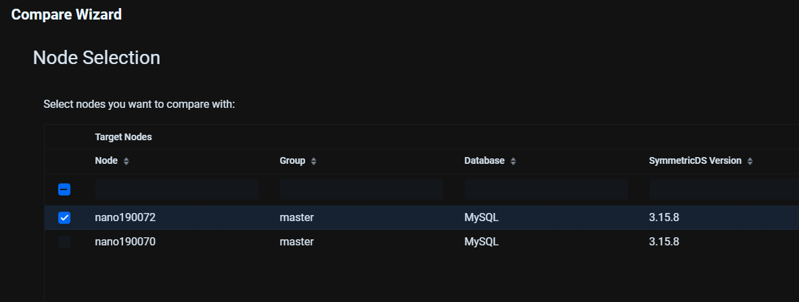
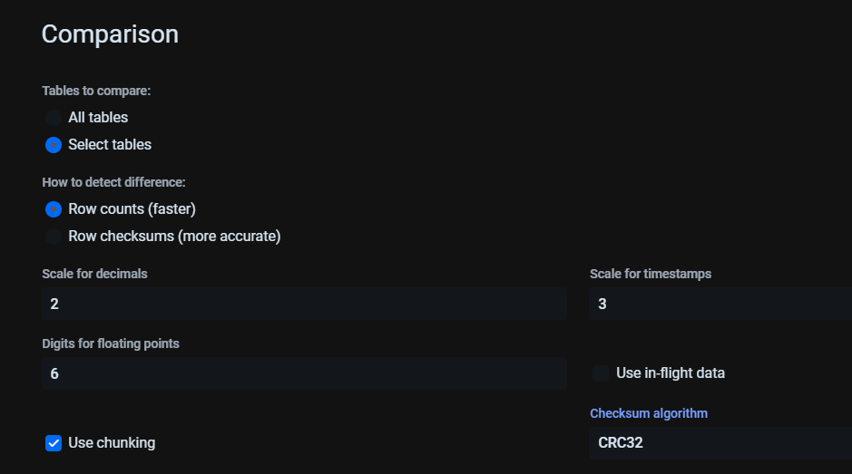
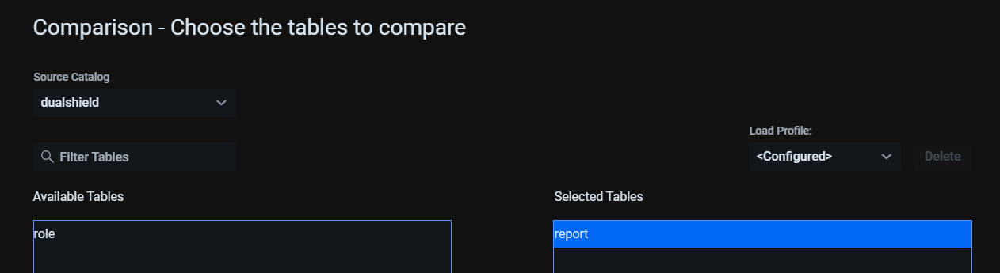
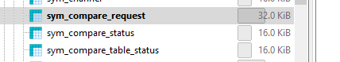
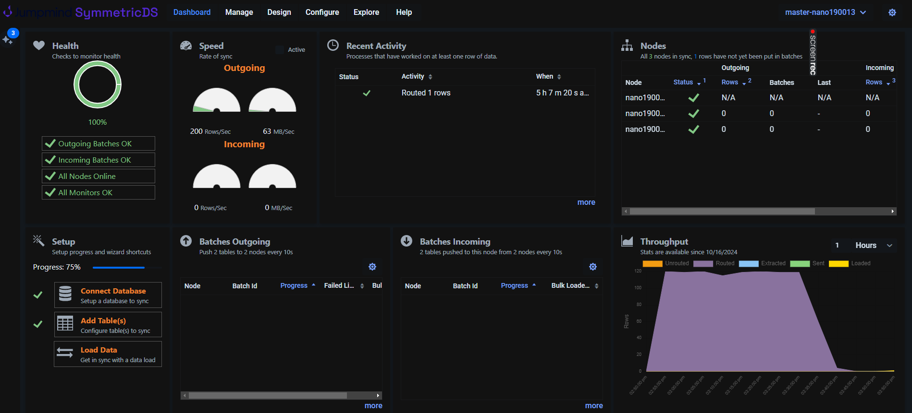
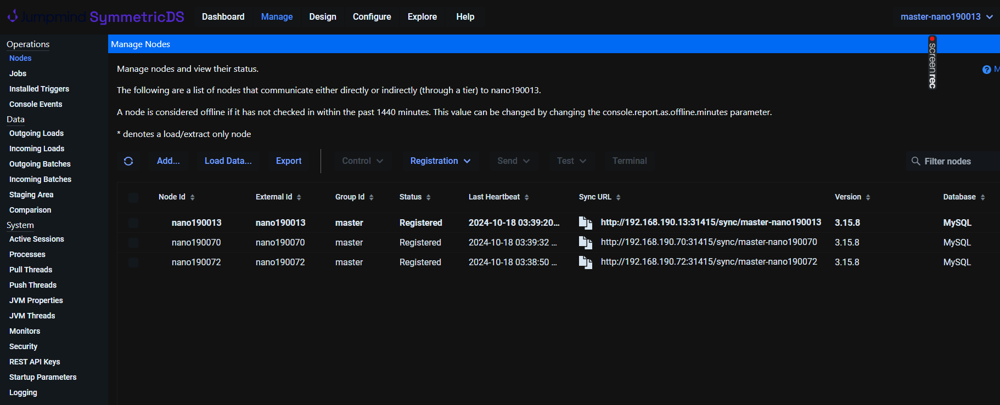
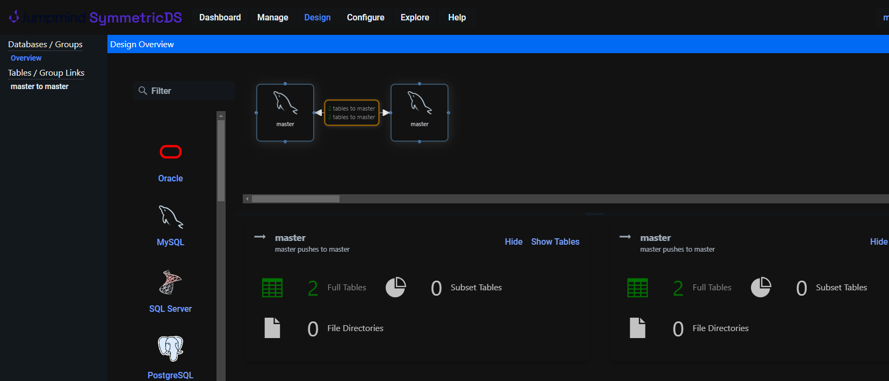
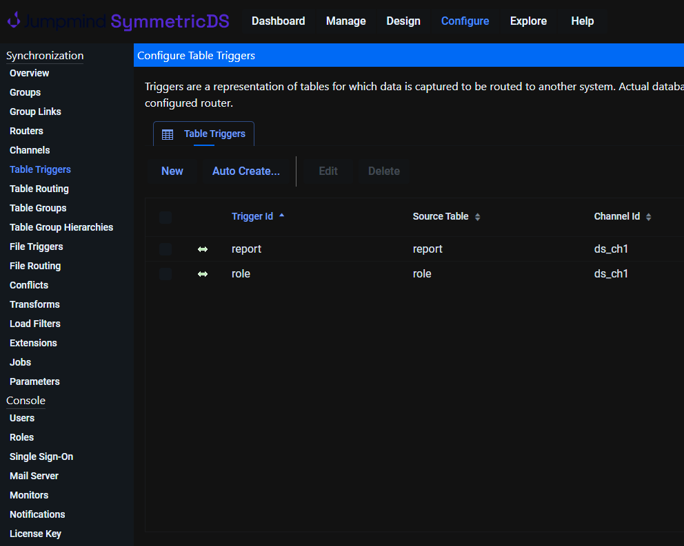
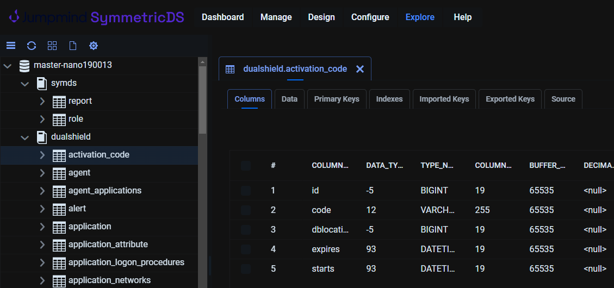

# Use SymmetricDS to do master-master replication on MySQL database

## Lab


---
| node_id | symmetric_version | database_type | database_version | os_version | engine properties|
| --- | --- | --- | --- |  --- | --- |
| nano190013 (1) | 3.15.8 | MySQL | 5.7 | Windows 2019 | [nano190013.properties](doc/master-nano190013.properties) |
| nano190070 (2) | 3.15.8 | MySQL | 8.0 | Ubuntu 24.04 | [nano190070.properties](doc/master-nano190070.properties) |
| nano190072 (3) | 3.15.8 | MySQL | 8.0 | Ubuntu 24.04 | [nano190072.properties](doc/master-nano190072.properties) |


In this lab, `nano190013(192.168.190.13)` is also a node for registration. 

### Flexibility with registration.url:
- The registration.url can point to any node for the initial registration. After registration, the node topology and synchronization mechanism are established, and they can communicate with each other through the individual sync.url values.
- If one of the nodes (like Node 1) goes down temporarily, the system will still function because synchronization happens over the sync.url, not the registration.url. The registration.url is only used once during the initial registration phase.
### What Happens When a New Node Joins Later?
- If you add a fourth node, it can register using the same registration.url, which would again point to Node 1. Once it registers, Node 1 will propagate the new node's details to the other nodes, and synchronization will begin.
- The new node will become aware of all other nodes (Nodes 1, 2, and 3), and it will be included in the multi-master replication group.
### Summary 
- The `registration.url` is crucial for initial registration and for making nodes aware of each other.
- Once registration is complete, the nodes communicate and synchronize directly using their own `sync.url`.
- Even though all nodes register through one node (`nano190013` in this case), they will start synchronizing data directly between them after registration.

## Configuration
- Stop service on each node, the command below is for Linux    
  `sudo ../bin/sym_service stop`

- Compose engine `properties` file for each node, you can use the sample ones as the templates.

- Create the `SymmetricDS` tables. Replace the engine name with the actual one on the node  
`../bin/symadmin --engine master-nano190013 create-sym-tables`

- Copy [insert_dualshield_replic.sql](doc/insert_dualshield_replic.sql) to each node. Please modify it to satisfy your replication database / tables.  
- Load the `SymmetricDS` configuration to apply to the database for replication. Replace the engine name with the actual one on the node  
`..\bin\dbimport --engine master-nano190013 insert_dualshield_replic.sql`

- Start service on each node,  
`sudo ../bin/sym_service start`

## Common MySQL Replication Issues

Error `1032` – Missing Records
The error indicates that the master deletes a row but when the slave tries to do the same, it cannot find it in its database.

Error `1062` – Duplicate Records
Slave fails to replicate because of duplicate entry for the primary of the table.

Error `1452` - trying to add or update a child row with a reference that doesn’t exist in the parent table. 

## Scenarios
### Node temporarily down

Node 1 (even it is a registration node) is down. The changes on Node 2 can be still replicated to Node 3. Once Node 1 is back online, the changes will be also replicated to it.

### Delete a row which doesn't exist on target node
Error `1032`. The behavior: Target just ignored the query. No corresponding row in the table `sym_incoming_error`.

###  Update a row which doesn't exist on target node
The behavior: A new row was inserted on the target node.

The corresponding `status` in the table `sym_incoming_batch` is `OK`,
---
| batch_id | node_id | channel_id | status | error_flag | sql_state | sql_code | sql_message | last_update_hostname | last_update_time | create_time | summary | ignore_count | byte_count | load_flag | extract_count | sent_count | load_count | reload_row_count | other_row_count | data_row_count | extract_row_count | load_row_count | data_insert_row_count | data_update_row_count | data_delete_row_count | extract_insert_row_count | extract_update_row_count | extract_delete_row_count | load_insert_row_count | load_update_row_count | load_delete_row_count | network_millis | filter_millis | load_millis | router_millis | extract_millis | transform_extract_millis | transform_load_millis | load_id | common_flag | fallback_insert_count | fallback_update_count | conflict_win_count | conflict_lose_count | ignore_row_count | missing_delete_count | skip_count | failed_row_number | failed_line_number | failed_data_id | bulk_loader_flag | 
| ---: | --- | --- | --- | ---: | --- | ---: | --- | --- | --- | --- | --- | ---: | ---: | ---: | ---: | ---: | ---: | ---: | ---: | ---: | ---: | ---: | ---: | ---: | ---: | ---: | ---: | ---: | ---: | ---: | ---: | ---: | ---: | ---: | ---: | ---: | ---: | ---: | ---: | ---: | ---: | ---: | ---: | ---: | ---: | ---: | ---: | ---: | ---: | ---: | ---: | 
| 1040 | nano190013 | ds_ch1 | OK | 0 | \N | 0 | \N | nanoart-nan0190072 | 2024-10-19 10:30:43 | 2024-10-19 10:30:43 | role | 0 | 249 | 0 | 1 | 1 | 0 | 0 | 0 | 1 | 1 | 1 | 0 | 0 | 1 | 0 | 0 | 1 | 0 | 0 | 0 | 0 | 0 | 1 | 0 | 8 | 0 | 0 | -1 | 1 | 0 | 0 | 1 | 0 | 0 | 1 | 0 | 0 | 0 | 0 | 0 | 

### Insert a row which its foreign key does exist on target node.
The behavior: Handled as an `update` on target node.

Error `1452` can be simulated with the following query if the `author_id` `1` didn't exist on target node,

`INSERT INTO book (name, author_id) VALUES ('Prompt Engineer 2', 1);`

In the table `sym_incoming_error`
---
| batch_id | node_id | failed_row_number | failed_line_number | target_catalog_name | target_schema_name | target_table_name | event_type | binary_encoding | column_names | pk_column_names | row_data | old_data | cur_data | resolve_data | resolve_ignore | conflict_id | create_time | last_update_by | last_update_time | 
| ---: | --- | ---: | ---: | --- | --- | --- | --- | --- | --- | --- | --- | --- | --- | --- | ---: | --- | --- | --- | --- | 
| 1645 | nano190013 | 1 | 1 | dualshield | \N | book | I | HEX | id,name,author_id | id | "4","Prompt Engineer 2","1" | \N | \N | \N | 0 | \N | 2024-10-20 06:26:36 | symmetricds | 2024-10-20 06:26:36 | 

In the table `sym_incoming_batch`
---
| batch_id | node_id | channel_id | status | error_flag | sql_state | sql_code | sql_message | last_update_hostname | last_update_time | create_time | summary | ignore_count | byte_count | load_flag | extract_count | sent_count | load_count | reload_row_count | other_row_count | data_row_count | extract_row_count | load_row_count | data_insert_row_count | data_update_row_count | data_delete_row_count | extract_insert_row_count | extract_update_row_count | extract_delete_row_count | load_insert_row_count | load_update_row_count | load_delete_row_count | network_millis | filter_millis | load_millis | router_millis | extract_millis | transform_extract_millis | transform_load_millis | load_id | common_flag | fallback_insert_count | fallback_update_count | conflict_win_count | conflict_lose_count | ignore_row_count | missing_delete_count | skip_count | failed_row_number | failed_line_number | failed_data_id | bulk_loader_flag | 
| ---: | --- | --- | --- | ---: | --- | ---: | --- | --- | --- | --- | --- | ---: | ---: | ---: | ---: | ---: | ---: | ---: | ---: | ---: | ---: | ---: | ---: | ---: | ---: | ---: | ---: | ---: | ---: | ---: | ---: | ---: | ---: | ---: | ---: | ---: | ---: | ---: | ---: | ---: | ---: | ---: | ---: | ---: | ---: | ---: | ---: | ---: | ---: | ---: | ---: | 
| 1645 | nano190013 | daisy | OK | 0 | \N | 0 | \N | nanoart-nan0190072 | 2024-10-20 06:26:46 | 2024-10-20 06:26:36 | book | 0 | 137 | 0 | 1 | 2 | 1 | 0 | 0 | 1 | 1 | 1 | 1 | 0 | 0 | 1 | 0 | 0 | 1 | 0 | 0 | 0 | 0 | 3 | 173 | 0 | 0 | 0 | -1 | 1 | 0 | 0 | 0 | 0 | 0 | 0 | 0 | 0 | 0 | 0 | 0 | 
| 1646 | nano190013 | reload | OK | 0 | \N | 0 | \N | nanoart-nan0190072 | 2024-10-20 06:26:46 | 2024-10-20 06:26:46 | author | 0 | 89 | 0 | 1 | 1 | 0 | 1 | 0 | 1 | 1 | 1 | 1 | 0 | 0 | 1 | 0 | 0 | 1 | 0 | 0 | 0 | 0 | 4 | 0 | 7 | 0 | 0 | -1 | 0 | 0 | 0 | 0 | 0 | 0 | 0 | 0 | 0 | 0 | 0 | 0 | 

This is expected as we have the default parameter on,

`auto.resolve.foreign.key.violation`
>If this is true, when a batch receives a foreign key violation, the missing data will be automatically sent to resolve it. The resolution is done at the source node by sending reload batches when it receives the acknowledgement of the batch error.
Default: `true`

In this case, the log file provided more information.

```
2024-10-20 11:39:28,438 INFO [master-nano190072] [DefaultDatabaseWriter] [master-nano190072-dataloader-8] Failed to process insert event in batch nano190013-1950 on channel 'daisy'.
Failed sql was: insert into `dualshield`.`book` (`id`, `name`, `author_id`) values (5,'Badminton Courses',2)
Failed raw sql was: insert into `dualshield`.`book` (`id`, `name`, `author_id`) values (?,?,?)
Failed sql parameters: [5, 'Badminton Courses', 2]
Failed sql parameters types: [BIGINT, VARCHAR, BIGINT]
Failed sql state and code: 23000 (1452)
Failed row data was: "5","Badminton Courses","2"
 StackTraceKey.init [SqlException:492417562] org.jumpmind.db.sql.SqlException: Cannot add or update a child row: a foreign key constraint fails (`dualshield`.`book`, CONSTRAINT `books_ibfk_1` FOREIGN KEY (`author_id`) REFERENCES `author` (`id`) ON DELETE RESTRICT ON UPDATE RESTRICT)
        at org.jumpmind.db.sql.AbstractSqlTemplate.translate(AbstractSqlTemplate.java:308)
        at org.jumpmind.db.sql.AbstractSqlTemplate.translate(AbstractSqlTemplate.java:297)
        at org.jumpmind.db.sql.JdbcSqlTransaction.addRow(JdbcSqlTransaction.java:443)
        at org.jumpmind.symmetric.io.data.writer.DefaultDatabaseWriter.execute(DefaultDatabaseWriter.java:1191)
        at org.jumpmind.symmetric.io.data.writer.DefaultDatabaseWriter.insert(DefaultDatabaseWriter.java:268)
        at org.jumpmind.symmetric.io.data.writer.AbstractDatabaseWriter.write(AbstractDatabaseWriter.java:185)
        at org.jumpmind.symmetric.io.data.writer.NestedDataWriter.write(NestedDataWriter.java:62)
        at org.jumpmind.symmetric.model.ProcessInfoDataWriter.write(ProcessInfoDataWriter.java:98)
        at org.jumpmind.symmetric.io.data.writer.NestedDataWriter.write(NestedDataWriter.java:62)
        at org.jumpmind.symmetric.io.data.writer.TransformWriter.write(TransformWriter.java:187)
        at org.jumpmind.symmetric.io.data.DataProcessor.forEachDataInTable(DataProcessor.java:194)
        at org.jumpmind.symmetric.io.data.DataProcessor.forEachTableInBatch(DataProcessor.java:160)
        at org.jumpmind.symmetric.io.data.DataProcessor.process(DataProcessor.java:108)
        at org.jumpmind.symmetric.service.impl.DataLoaderService$LoadIntoDatabaseOnArrivalListener$2.call(DataLoaderService.java:1076)
        at org.jumpmind.symmetric.service.impl.DataLoaderService$LoadIntoDatabaseOnArrivalListener$2.call(DataLoaderService.java:1052)
        at java.base/java.util.concurrent.FutureTask.run(FutureTask.java:264)
        at java.base/java.util.concurrent.ThreadPoolExecutor.runWorker(ThreadPoolExecutor.java:1136)
        at java.base/java.util.concurrent.ThreadPoolExecutor$Worker.run(ThreadPoolExecutor.java:635)
        at java.base/java.lang.Thread.run(Thread.java:840)
Caused by: java.sql.SQLIntegrityConstraintViolationException: Cannot add or update a child row: a foreign key constraint fails (`dualshield`.`book`, CONSTRAINT `books_ibfk_1` FOREIGN KEY (`author_id`) REFERENCES `author` (`id`) ON DELETE RESTRICT ON UPDATE RESTRICT)
        at com.mysql.cj.jdbc.exceptions.SQLError.createSQLException(SQLError.java:118)
        at com.mysql.cj.jdbc.exceptions.SQLExceptionsMapping.translateException(SQLExceptionsMapping.java:122)
        at com.mysql.cj.jdbc.ClientPreparedStatement.executeInternal(ClientPreparedStatement.java:912)
        at com.mysql.cj.jdbc.ClientPreparedStatement.executeUpdateInternal(ClientPreparedStatement.java:1054)
        at com.mysql.cj.jdbc.ClientPreparedStatement.executeUpdateInternal(ClientPreparedStatement.java:1003)
        at com.mysql.cj.jdbc.ClientPreparedStatement.executeLargeUpdate(ClientPreparedStatement.java:1312)
        at com.mysql.cj.jdbc.ClientPreparedStatement.executeUpdate(ClientPreparedStatement.java:988)
        at org.apache.commons.dbcp2.DelegatingPreparedStatement.executeUpdate(DelegatingPreparedStatement.java:136)
        at org.apache.commons.dbcp2.DelegatingPreparedStatement.executeUpdate(DelegatingPreparedStatement.java:136)
        at org.jumpmind.db.sql.JdbcSqlTransaction.executePreparedUpdate(JdbcSqlTransaction.java:462)
        at org.jumpmind.db.sql.JdbcSqlTransaction.addRow(JdbcSqlTransaction.java:440)
        ... 16 more
```

Please note, the table definition is identical on each node, otherwise you may get this error (I had `id BIGINT(20) NOT NULL AUTO_INCREMENT` on MySQL 5.7, but it was changed to `id BIGINT(19) NOT NULL AUTO_INCREMENT` on MySQL 8. Yes, in my lab, MySQL version is different, and hosted on different OS).

```
2024-10-20 11:39:34,352 INFO [master-nano190072] [RouterService] [master-nano190072-job-3] Routed 1 data events in 25 ms
2024-10-20 11:39:38,393 INFO [master-nano190072] [DataLoaderService] [qtp1046211253-19] 1 data and 1 batches loaded during push request from master:nano190070:nano190070
2024-10-20 11:39:38,486 INFO [master-nano190072] [IncomingBatchService] [master-nano190072-dataloader-10] Retrying batch nano190013-1950
2024-10-20 11:39:38,499 INFO [master-nano190072] [DataLoaderService] [qtp1046211253-19] 2 data and 2 batches loaded during push request from master:nano190013:nano190013
2024-10-20 11:39:38,728 INFO [master-nano190072] [PushService] [master-nano190072-push-default-13] Push data sent to master:nano190070:nano190070
2024-10-20 11:39:38,729 INFO [master-nano190072] [PushService] [master-nano190072-push-default-1] Push data sent to master:nano190013:nano190013
2024-10-20 11:39:38,750 ERROR [master-nano190072] [AcknowledgeService] [master-nano190072-push-default-1] The outgoing batch nano190013-385 failed: Odd number of characters.
2024-10-20 11:39:38,769 INFO [master-nano190072] [PushService] [master-nano190072-push-default-13] Pushed data to node master:nano190070:nano190070. 1 data and 1 batches were processed. (sym_incoming_error)
2024-10-20 11:39:48,453 INFO [master-nano190072] [DataLoaderService] [qtp1046211253-19] 2 data and 1 batches loaded during push request from master:nano190013:nano190013
2024-10-20 11:39:48,720 INFO [master-nano190072] [PushService] [master-nano190072-push-default-4] Push data sent to master:nano190013:nano190013
2024-10-20 11:39:48,732 ERROR [master-nano190072] [AcknowledgeService] [master-nano190072-push-default-4] The outgoing batch nano190013-385 failed: Odd number of characters.
```
## auto.resolve
Please check the default settings for the following violations,  
```
auto.resolve.foreign.key.violation
auto.resolve.foreign.key.violation.delete
auto.resolve.foreign.key.violation.reverse
auto.resolve.primary.key.violation
auto.resolve.unique.index.violation
```

## The last resort for conflict
In worst scenario, truncate your `sym_data`, `sym_data_event`, and `sym_outgoing_batch` tables. See the details in [How to Migrate a Busy Database](https://www.jumpmind.com/blog/blog/how-to/how-to-migrate-a-busy-database/)


## Integration with DualShield

- Clone **DS** (DualShield)  
  Follow [How to clone a DualShield server onto a secondary machine for redundancy](https://wiki.deepnetsecurity.com/display/DualShield6/How+to+clone+a+DualShield+server+onto+a+secondary+machine+for+redundancy). 

  Modify the `ini` file by adding the following, See the details at [Setting up a MySQL Replication Master](https://wiki.deepnetsecurity.com/display/DualShield6/Setting+up+a+MySQL+Replication+Master).   
  ```
  server-id=DS_1/DS_2/.../DS_N
  auto_increment_increment=N
  auto_increment_offset=1/2/.../N
  ```  
    
  Make sure **DS** works on P<sub>1</sub> (Primary One) and C<sub>2-n</sub> (Cloned) individually. Don't worry the replication at this stage.

- Install **SDS** (SymmetricDS)  
  Follow the procedure above to configure it. Customize `sym_trigger` in [insert_dualshield_replic.sql](doc/insert_dualshield_replic.sql) on the interested tables you are going to replicate.  but do not enable the triggers on the replication channels (`rose` and `daisy` in the example).
  ```
  insert into sym_trigger_router 
        (trigger_id,router_id, enabled, initial_load_order,last_update_time,create_time)
        values('rose','master_2_master', 0, 100, current_timestamp, current_timestamp);
  ```
  
  Check the field `enabled` with,

  `select trigger_id, router_id, enabled from sym_trigger_router;`

- Stop **DS** service on C<sub>2-n</sub> machines.  
  `net stop dualshield`

- Export the database on P<sub>1</sub>  
  `mysqldump -u root -p --single-transaction --opt DualShield > DualShield.sql`  
  Follow the instruction at [Rebuild Replication](https://wiki.deepnetsecurity.com/display/DualShield6/Rebuild+Replication).

- Enable triggers on P<sub>1</sub>,   
  `update sym_trigger_router set enabled=1;`  
  Then start **DS** service to make it back to work.  
  `net start dualshield`

- Import the database to C<sub>2-n</sub> machines,  
  ```
  mysql> drop database dualshield;
  mysql> create database dualshield CHARACTER SET utf8 COLLATE utf8_general_ci;
  ```
  Enable the triggers on them, then start **DS** service.


The replication among them should work. If not, find the root cause and repeat the stages above.


## Performance Tuning

You can adjust the following parameters for the performance.

```
# Batch size for data transfer
transport.max.batch.size=5000

# Commit rows in a single transaction
commit.txn.count=500

# Increase loader threads for parallel loading
data.loader.thread.count=4

# Frequency of data pushes to other nodes, Default 10 seconds
job.push.period.time.ms=5000

# Enable data compression during transfer
transport.compression.enabled=true

# Reduce network timeout
http.read.timeout.ms=15000
http.connect.timeout.ms=15000

# Use multiple threads for push, pull, and routing
job.push.thread.count=4
job.pull.thread.count=4
routing.job.thread.count=4

# Enable connection pooling
http.connection.pool.enabled=true

```

## Questions

What these system channels do, `config, default,  dynamic,  heartbeat, monitor,  reload`, especially `config`?


## PRO Features
The following are only available in Pro version,

### Utility `dbcompare`

It may not work between instances, as it need to specify the source and target engine properties file. However in Pro UI, I can select the remote node, but the comparison always in pending.

 









### Pro WEB screenshots
  
  
  
  
  

## References

[Pausing Replication In SymmetricDS](https://www.jumpmind.com/blog/blog/how-to/pausing-replication-symmetricds/)  
[Using Wildcards to Sync Database Tables](https://www.jumpmind.com/blog/blog/how-to/using-wildcards-sync-database/)  
[Stop Guessing if Your Data is Correct](https://www.jumpmind.com/blog/blog/how-to/stop-guessing-if-your-data-is-correct/)  
[Disabling Sync Triggers for Session](https://support.jumpmind.com/kb/article/23-Disabling_Sync_Triggers_for_Session)  
https://stackoverflow.com/questions/78041207/how-to-change-locate-service-sym-tables-to-another-database 