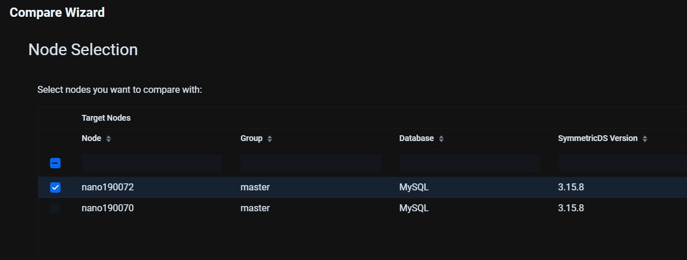
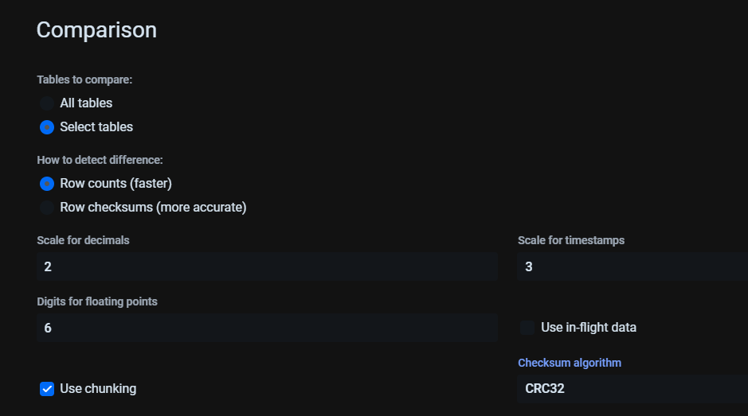
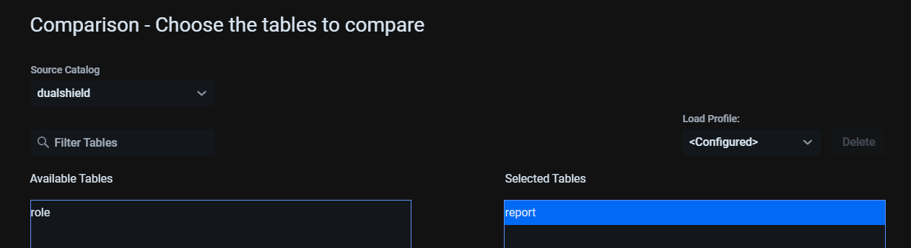
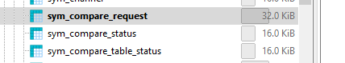
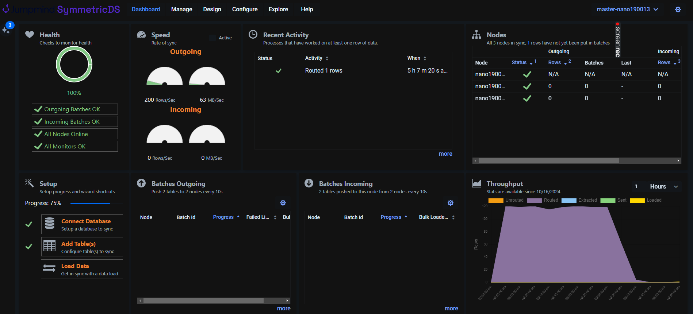
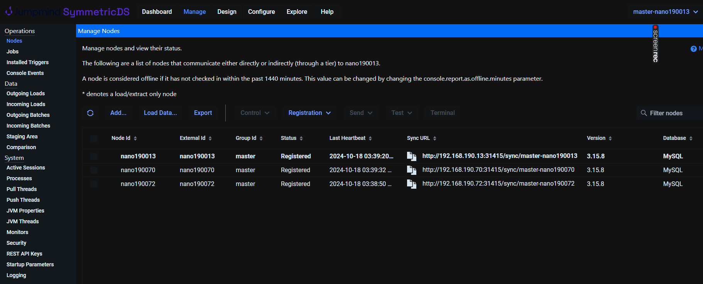
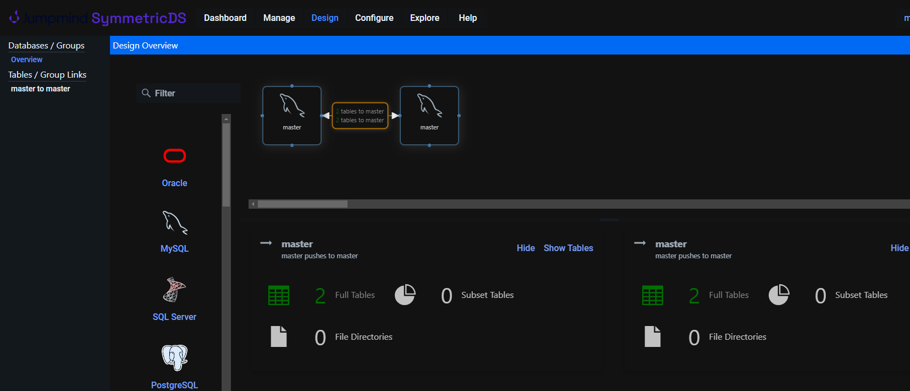
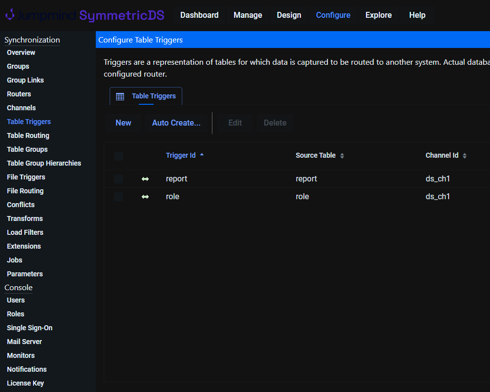
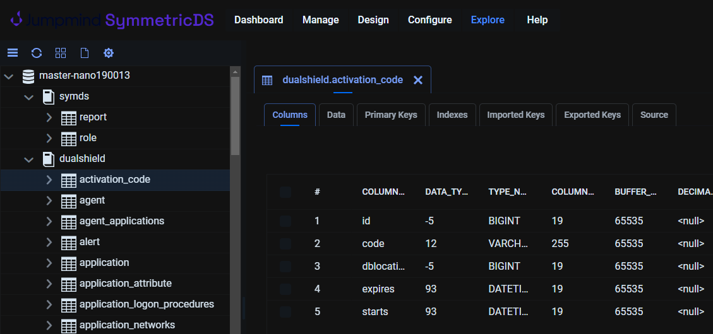

# Master-Master MySQL Replication with SymmetricDS

## Lab


---
| node_id | symmetric_version | database_type | database_version | os_version | engine properties|
| --- | --- | --- | --- |  --- | --- |
| nano190013 (1) | 3.15.8 | MySQL | 5.7 | Windows 2019 | [nano190013.properties](doc/master-nano190013.properties) |
| nano190070 (2) | 3.15.8 | MySQL | 8.0 | Ubuntu 24.04 | [nano190070.properties](doc/master-nano190070.properties) |
| nano190072 (3) | 3.15.8 | MySQL | 8.0 | Ubuntu 24.04 | [nano190072.properties](doc/master-nano190072.properties) |


In this lab, `nano190013` (`192.168.190.13`) also serves as the registration node.

### Flexibility of registration.url
- The `registration.url` can point to any node for initial registration. Once registration is complete, the node topology and synchronization are established, and nodes communicate with each other directly via their individual `sync.url` values.
- If one node (such as Node 1) goes down temporarily, the system continues to function because synchronization uses `sync.url`, not `registration.url`. The `registration.url` is only needed once, during the initial registration phase.

### What Happens When a New Node Joins Later?
- A new node can register using the same `registration.url`, pointing to Node 1. After registration, Node 1 propagates the new node's details to all other nodes, and synchronization begins.
- The new node becomes aware of all existing nodes (Nodes 1, 2, and 3) and is included in the multi-master replication group.

### Summary
- The `registration.url` is only used for initial registration and for making nodes aware of each other.
- After registration, nodes communicate and synchronize directly using their own `sync.url`.
- Although all nodes register through a single node (`nano190013` in this case), they synchronize data directly with each other once registration is complete.

## Configuration
- Stop the service on each node. The command below is for Linux:
  `sudo ../bin/sym_service stop`

- Create an engine `properties` file for each node. The sample files in this repository can be used as templates.

- Create the `SymmetricDS` tables. Replace the engine name with the actual name for the node:
  `../bin/symadmin --engine master-nano190013 create-sym-tables`

- Copy [insert_dualshield_replic.sql](doc/insert_dualshield_replic.sql) to each node and modify it to match your replication database and tables.

- Load the `SymmetricDS` configuration into the database. Replace the engine name with the actual name for the node:
  `..\bin\dbimport --engine master-nano190013 insert_dualshield_replic.sql`

- Start the service on each node:
  `sudo ../bin/sym_service start`

## Common MySQL Replication Issues

**Error `1032` – Missing Records**
The source node deleted a row, but the target node cannot find it to apply the same deletion.

**Error `1062` – Duplicate Records**
The target node fails to replicate an insert because a row with the same primary key already exists.

**Error `1452` – Foreign Key Violation**
An attempt to insert or update a child row fails because the referenced parent row does not exist on the target node.

## Scenarios
### Node Temporarily Down

If Node 1 (even as the registration node) goes offline, changes on Node 2 are still replicated to Node 3. Once Node 1 comes back online, it receives all pending changes automatically.

### Delete a Row That Does Not Exist on the Target Node
This triggers Error `1032`. The target node silently ignores the operation — no record appears in the `sym_incoming_error` table.

### Update a Row That Does Not Exist on the Target Node
The target node inserts the row instead of updating it.

The corresponding `status` in the table `sym_incoming_batch` is `OK`:
---
| batch_id | node_id | channel_id | status | error_flag | sql_state | sql_code | sql_message | last_update_hostname | last_update_time | create_time | summary | ignore_count | byte_count | load_flag | extract_count | sent_count | load_count | reload_row_count | other_row_count | data_row_count | extract_row_count | load_row_count | data_insert_row_count | data_update_row_count | data_delete_row_count | extract_insert_row_count | extract_update_row_count | extract_delete_row_count | load_insert_row_count | load_update_row_count | load_delete_row_count | network_millis | filter_millis | load_millis | router_millis | extract_millis | transform_extract_millis | transform_load_millis | load_id | common_flag | fallback_insert_count | fallback_update_count | conflict_win_count | conflict_lose_count | ignore_row_count | missing_delete_count | skip_count | failed_row_number | failed_line_number | failed_data_id | bulk_loader_flag |
| ---: | --- | --- | --- | ---: | --- | ---: | --- | --- | --- | --- | --- | ---: | ---: | ---: | ---: | ---: | ---: | ---: | ---: | ---: | ---: | ---: | ---: | ---: | ---: | ---: | ---: | ---: | ---: | ---: | ---: | ---: | ---: | ---: | ---: | ---: | ---: | ---: | ---: | ---: | ---: | ---: | ---: | ---: | ---: | ---: | ---: | ---: | ---: | ---: | ---: |
| 1040 | nano190013 | ds_ch1 | OK | 0 | \N | 0 | \N | nanoart-nan0190072 | 2024-10-19 10:30:43 | 2024-10-19 10:30:43 | role | 0 | 249 | 0 | 1 | 1 | 0 | 0 | 0 | 1 | 1 | 1 | 0 | 0 | 1 | 0 | 0 | 1 | 0 | 0 | 0 | 0 | 0 | 1 | 0 | 8 | 0 | 0 | -1 | 1 | 0 | 0 | 1 | 0 | 0 | 1 | 0 | 0 | 0 | 0 | 0 |

### Insert a Row Whose Foreign Key Does Not Exist on the Target Node
The target node handles it as an `update` instead.

Error `1452` can be reproduced with the following query, assuming `author_id` `1` does not exist on the target node:

`INSERT INTO book (name, author_id) VALUES ('Prompt Engineer 2', 1);`

In the table `sym_incoming_error`:
---
| batch_id | node_id | failed_row_number | failed_line_number | target_catalog_name | target_schema_name | target_table_name | event_type | binary_encoding | column_names | pk_column_names | row_data | old_data | cur_data | resolve_data | resolve_ignore | conflict_id | create_time | last_update_by | last_update_time |
| ---: | --- | ---: | ---: | --- | --- | --- | --- | --- | --- | --- | --- | --- | --- | --- | ---: | --- | --- | --- | --- |
| 1645 | nano190013 | 1 | 1 | dualshield | \N | book | I | HEX | id,name,author_id | id | "4","Prompt Engineer 2","1" | \N | \N | \N | 0 | \N | 2024-10-20 06:26:36 | symmetricds | 2024-10-20 06:26:36 |

In the table `sym_incoming_batch`:
---
| batch_id | node_id | channel_id | status | error_flag | sql_state | sql_code | sql_message | last_update_hostname | last_update_time | create_time | summary | ignore_count | byte_count | load_flag | extract_count | sent_count | load_count | reload_row_count | other_row_count | data_row_count | extract_row_count | load_row_count | data_insert_row_count | data_update_row_count | data_delete_row_count | extract_insert_row_count | extract_update_row_count | extract_delete_row_count | load_insert_row_count | load_update_row_count | load_delete_row_count | network_millis | filter_millis | load_millis | router_millis | extract_millis | transform_extract_millis | transform_load_millis | load_id | common_flag | fallback_insert_count | fallback_update_count | conflict_win_count | conflict_lose_count | ignore_row_count | missing_delete_count | skip_count | failed_row_number | failed_line_number | failed_data_id | bulk_loader_flag |
| ---: | --- | --- | --- | ---: | --- | ---: | --- | --- | --- | --- | --- | ---: | ---: | ---: | ---: | ---: | ---: | ---: | ---: | ---: | ---: | ---: | ---: | ---: | ---: | ---: | ---: | ---: | ---: | ---: | ---: | ---: | ---: | ---: | ---: | ---: | ---: | ---: | ---: | ---: | ---: | ---: | ---: | ---: | ---: | ---: | ---: | ---: | ---: | ---: | ---: |
| 1645 | nano190013 | daisy | OK | 0 | \N | 0 | \N | nanoart-nan0190072 | 2024-10-20 06:26:46 | 2024-10-20 06:26:36 | book | 0 | 137 | 0 | 1 | 2 | 1 | 0 | 0 | 1 | 1 | 1 | 1 | 0 | 0 | 1 | 0 | 0 | 1 | 0 | 0 | 0 | 0 | 3 | 173 | 0 | 0 | 0 | -1 | 1 | 0 | 0 | 0 | 0 | 0 | 0 | 0 | 0 | 0 | 0 | 0 |
| 1646 | nano190013 | reload | OK | 0 | \N | 0 | \N | nanoart-nan0190072 | 2024-10-20 06:26:46 | 2024-10-20 06:26:46 | author | 0 | 89 | 0 | 1 | 1 | 0 | 1 | 0 | 1 | 1 | 1 | 1 | 0 | 0 | 1 | 0 | 0 | 1 | 0 | 0 | 0 | 0 | 4 | 0 | 7 | 0 | 0 | -1 | 0 | 0 | 0 | 0 | 0 | 0 | 0 | 0 | 0 | 0 | 0 | 0 |

This is expected because the following parameter is enabled by default:

`auto.resolve.foreign.key.violation`
>If this is true, when a batch receives a foreign key violation, the missing data will be automatically sent to resolve it. The resolution is done at the source node by sending reload batches when it receives the acknowledgement of the batch error.
Default: `true`

The log file provides more detail on what happened:

```
2024-10-20 11:39:28,438 INFO [master-nano190072] [DefaultDatabaseWriter] [master-nano190072-dataloader-8] Failed to process insert event in batch nano190013-1950 on channel 'daisy'.
Failed sql was: insert into `dualshield`.`book` (`id`, `name`, `author_id`) values (5,'Badminton Courses',2)
Failed raw sql was: insert into `dualshield`.`book` (`id`, `name`, `author_id`) values (?,?,?)
Failed sql parameters: [5, 'Badminton Courses', 2]
Failed sql parameters types: [BIGINT, VARCHAR, BIGINT]
Failed sql state and code: 23000 (1452)
Failed row data was: "5","Badminton Courses","2"
 StackTraceKey.init [SqlException:492417562] org.jumpmind.db.sql.SqlException: Cannot add or update a child row: a foreign key constraint fails (`dualshield`.`book`, CONSTRAINT `books_ibfk_1` FOREIGN KEY (`author_id`) REFERENCES `author` (`id`) ON DELETE RESTRICT ON UPDATE RESTRICT)
        at org.jumpmind.db.sql.AbstractSqlTemplate.translate(AbstractSqlTemplate.java:308)
        at org.jumpmind.db.sql.AbstractSqlTemplate.translate(AbstractSqlTemplate.java:297)
        at org.jumpmind.db.sql.JdbcSqlTransaction.addRow(JdbcSqlTransaction.java:443)
        at org.jumpmind.symmetric.io.data.writer.DefaultDatabaseWriter.execute(DefaultDatabaseWriter.java:1191)
        at org.jumpmind.symmetric.io.data.writer.DefaultDatabaseWriter.insert(DefaultDatabaseWriter.java:268)
        at org.jumpmind.symmetric.io.data.writer.AbstractDatabaseWriter.write(AbstractDatabaseWriter.java:185)
        at org.jumpmind.symmetric.io.data.writer.NestedDataWriter.write(NestedDataWriter.java:62)
        at org.jumpmind.symmetric.model.ProcessInfoDataWriter.write(ProcessInfoDataWriter.java:98)
        at org.jumpmind.symmetric.io.data.writer.NestedDataWriter.write(NestedDataWriter.java:62)
        at org.jumpmind.symmetric.io.data.writer.TransformWriter.write(TransformWriter.java:187)
        at org.jumpmind.symmetric.io.data.DataProcessor.forEachDataInTable(DataProcessor.java:194)
        at org.jumpmind.symmetric.io.data.DataProcessor.forEachTableInBatch(DataProcessor.java:160)
        at org.jumpmind.symmetric.io.data.DataProcessor.process(DataProcessor.java:108)
        at org.jumpmind.symmetric.service.impl.DataLoaderService$LoadIntoDatabaseOnArrivalListener$2.call(DataLoaderService.java:1076)
        at org.jumpmind.symmetric.service.impl.DataLoaderService$LoadIntoDatabaseOnArrivalListener$2.call(DataLoaderService.java:1052)
        at java.base/java.util.concurrent.FutureTask.run(FutureTask.java:264)
        at java.base/java.util.concurrent.ThreadPoolExecutor.runWorker(ThreadPoolExecutor.java:1136)
        at java.base/java.util.concurrent.ThreadPoolExecutor$Worker.run(ThreadPoolExecutor.java:635)
        at java.base/java.lang.Thread.run(Thread.java:840)
Caused by: java.sql.SQLIntegrityConstraintViolationException: Cannot add or update a child row: a foreign key constraint fails (`dualshield`.`book`, CONSTRAINT `books_ibfk_1` FOREIGN KEY (`author_id`) REFERENCES `author` (`id`) ON DELETE RESTRICT ON UPDATE RESTRICT)
        at com.mysql.cj.jdbc.exceptions.SQLError.createSQLException(SQLError.java:118)
        at com.mysql.cj.jdbc.exceptions.SQLExceptionsMapping.translateException(SQLExceptionsMapping.java:122)
        at com.mysql.cj.jdbc.ClientPreparedStatement.executeInternal(ClientPreparedStatement.java:912)
        at com.mysql.cj.jdbc.ClientPreparedStatement.executeUpdateInternal(ClientPreparedStatement.java:1054)
        at com.mysql.cj.jdbc.ClientPreparedStatement.executeUpdateInternal(ClientPreparedStatement.java:1003)
        at com.mysql.cj.jdbc.ClientPreparedStatement.executeLargeUpdate(ClientPreparedStatement.java:1312)
        at com.mysql.cj.jdbc.ClientPreparedStatement.executeUpdate(ClientPreparedStatement.java:988)
        at org.apache.commons.dbcp2.DelegatingPreparedStatement.executeUpdate(DelegatingPreparedStatement.java:136)
        at org.apache.commons.dbcp2.DelegatingPreparedStatement.executeUpdate(DelegatingPreparedStatement.java:136)
        at org.jumpmind.db.sql.JdbcSqlTransaction.executePreparedUpdate(JdbcSqlTransaction.java:462)
        at org.jumpmind.db.sql.JdbcSqlTransaction.addRow(JdbcSqlTransaction.java:440)
        ... 16 more
```

Note that the table definition must be identical across all nodes. In this lab, a mismatch arose between MySQL 5.7 and MySQL 8.0: MySQL 5.7 used `id BIGINT(20) NOT NULL AUTO_INCREMENT`, while MySQL 8.0 changed this to `id BIGINT(19) NOT NULL AUTO_INCREMENT`.

```
2024-10-20 11:39:34,352 INFO [master-nano190072] [RouterService] [master-nano190072-job-3] Routed 1 data events in 25 ms
2024-10-20 11:39:38,393 INFO [master-nano190072] [DataLoaderService] [qtp1046211253-19] 1 data and 1 batches loaded during push request from master:nano190070:nano190070
2024-10-20 11:39:38,486 INFO [master-nano190072] [IncomingBatchService] [master-nano190072-dataloader-10] Retrying batch nano190013-1950
2024-10-20 11:39:38,499 INFO [master-nano190072] [DataLoaderService] [qtp1046211253-19] 2 data and 2 batches loaded during push request from master:nano190013:nano190013
2024-10-20 11:39:38,728 INFO [master-nano190072] [PushService] [master-nano190072-push-default-13] Push data sent to master:nano190070:nano190070
2024-10-20 11:39:38,729 INFO [master-nano190072] [PushService] [master-nano190072-push-default-1] Push data sent to master:nano190013:nano190013
2024-10-20 11:39:38,750 ERROR [master-nano190072] [AcknowledgeService] [master-nano190072-push-default-1] The outgoing batch nano190013-385 failed: Odd number of characters.
2024-10-20 11:39:38,769 INFO [master-nano190072] [PushService] [master-nano190072-push-default-13] Pushed data to node master:nano190070:nano190070. 1 data and 1 batches were processed. (sym_incoming_error)
2024-10-20 11:39:48,453 INFO [master-nano190072] [DataLoaderService] [qtp1046211253-19] 2 data and 1 batches loaded during push request from master:nano190013:nano190013
2024-10-20 11:39:48,720 INFO [master-nano190072] [PushService] [master-nano190072-push-default-4] Push data sent to master:nano190013:nano190013
2024-10-20 11:39:48,732 ERROR [master-nano190072] [AcknowledgeService] [master-nano190072-push-default-4] The outgoing batch nano190013-385 failed: Odd number of characters.
```
## auto.resolve
Check the default settings for the following conflict resolution parameters:
```
auto.resolve.foreign.key.violation
auto.resolve.foreign.key.violation.delete
auto.resolve.foreign.key.violation.reverse
auto.resolve.primary.key.violation
auto.resolve.unique.index.violation
```

## Last Resort for Conflicts
In the worst case, truncate the `sym_data`, `sym_data_event`, and `sym_outgoing_batch` tables. See [How to Migrate a Busy Database](https://www.jumpmind.com/blog/blog/how-to/how-to-migrate-a-busy-database/) for details.


## Integration with DualShield

- Clone **DS** (DualShield)
  Follow [How to clone a DualShield server onto a secondary machine for redundancy](https://wiki.deepnetsecurity.com/display/DualShield6/How+to+clone+a+DualShield+server+onto+a+secondary+machine+for+redundancy).

  Modify the `ini` file by adding the following. See [Setting up a MySQL Replication Master](https://wiki.deepnetsecurity.com/display/DualShield6/Setting+up+a+MySQL+Replication+Master) for details:
  ```
  server-id=DS_1/DS_2/.../DS_N
  auto_increment_increment=N
  auto_increment_offset=1/2/.../N
  ```

  Verify that **DS** works on P<sub>1</sub> (Primary) and C<sub>2-n</sub> (Clones) independently before configuring replication.

- Install **SDS** (SymmetricDS)
  Follow the configuration procedure above. Customize `sym_trigger` in [insert_dualshield_replic.sql](doc/insert_dualshield_replic.sql) for the tables you want to replicate, but do not enable the triggers on the replication channels (`rose` and `daisy` in the example) yet:
  ```
  insert into sym_trigger_router
        (trigger_id,router_id, enabled, initial_load_order,last_update_time,create_time)
        values('rose','master_2_master', 0, 100, current_timestamp, current_timestamp);
  ```

  Verify the `enabled` field with:

  `select trigger_id, router_id, enabled from sym_trigger_router;`

- Stop the **DS** service on C<sub>2-n</sub> machines:
  `net stop dualshield`

- Export the database on P<sub>1</sub>:
  `mysqldump -u root -p --single-transaction --opt DualShield > DualShield.sql`
  Follow the instructions at [Rebuild Replication](https://wiki.deepnetsecurity.com/display/DualShield6/Rebuild+Replication).

- Enable triggers on P<sub>1</sub>:
  `update sym_trigger_router set enabled=1;`
  Then restart the **DS** service:
  `net start dualshield`

- Import the database to C<sub>2-n</sub> machines:
  ```
  mysql> drop database dualshield;
  mysql> create database dualshield CHARACTER SET utf8 COLLATE utf8_general_ci;
  ```
  Enable the triggers on them, then start the **DS** service.


Replication among all nodes should now be working. If it is not, identify the root cause and repeat the relevant steps above.


## Performance Tuning

The following parameters can be adjusted to improve performance:

```
# Batch size for data transfer
transport.max.batch.size=5000

# Commit rows in a single transaction
commit.txn.count=500

# Increase loader threads for parallel loading
data.loader.thread.count=4

# Frequency of data pushes to other nodes, Default 10 seconds
job.push.period.time.ms=5000

# Enable data compression during transfer
transport.compression.enabled=true

# Reduce network timeout
http.read.timeout.ms=15000
http.connect.timeout.ms=15000

# Use multiple threads for push, pull, and routing
job.push.thread.count=4
job.pull.thread.count=4
routing.job.thread.count=4

# Enable connection pooling
http.connection.pool.enabled=true

```

## Questions

What do these system channels do: `config`, `default`, `dynamic`, `heartbeat`, `monitor`, `reload` — especially `config`?


## PRO Features
The following features are only available in the Pro version.

### Utility `dbcompare`

This may not work between instances, as it requires specifying the source and target engine properties files. In the Pro UI, selecting a remote node is possible, but the comparison consistently stays in a pending state.











### Pro Web UI Screenshots






## References

[Pausing Replication In SymmetricDS](https://www.jumpmind.com/blog/blog/how-to/pausing-replication-symmetricds/)
[Using Wildcards to Sync Database Tables](https://www.jumpmind.com/blog/blog/how-to/using-wildcards-sync-database/)
[Stop Guessing if Your Data is Correct](https://www.jumpmind.com/blog/blog/how-to/stop-guessing-if-your-data-is-correct/)
[Disabling Sync Triggers for Session](https://support.jumpmind.com/kb/article/23-Disabling_Sync_Triggers_for_Session)
https://stackoverflow.com/questions/78041207/how-to-change-locate-service-sym-tables-to-another-database
