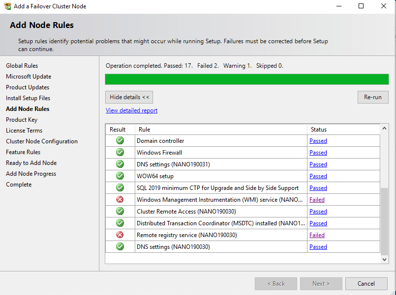
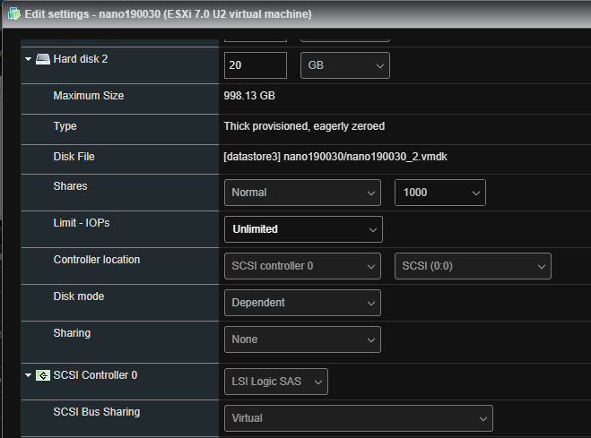
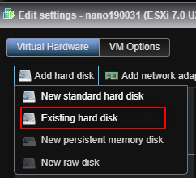
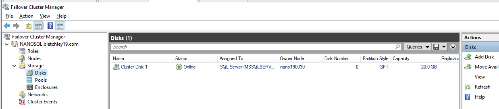
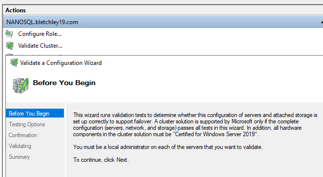
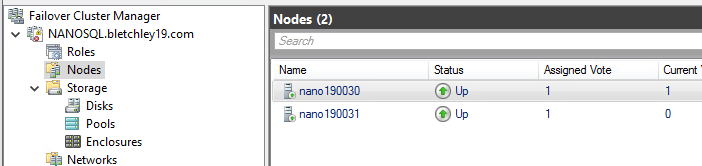
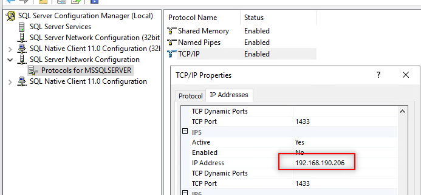
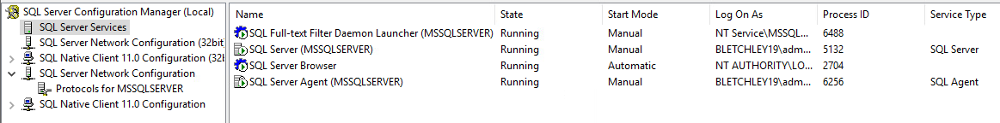
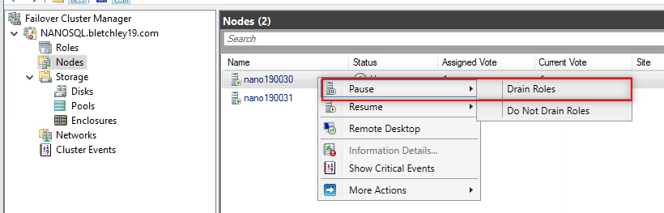
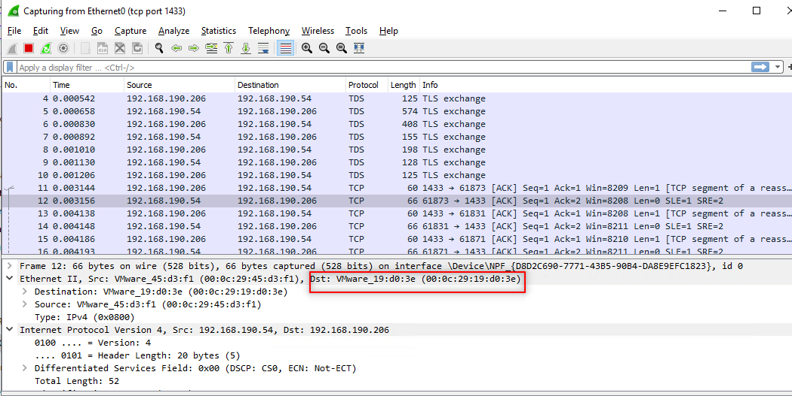

# Build a LAB of SQL Server Failover Cluster in ESXi

It should be easy if you follow the 1-4 **Step-by-step Installation of SQL Server 2019 on a Windows Server 2019 Failover Cluster**. The main challenge is how to provide the shared disks. Luckily this link, [Build and run Windows Failover Clusters on VMware ESXi](https://www.vkernel.ro/blog/build-and-run-windows-failover-clusters-on-vmware-esxi), is very helpful.


## LAB

|Node 1 | Node 2 |
| --- | --- |
|192.168.190.30|192.168.190.31|

SQL Server `VIP` is configured on `192.168.190.206`.

We installed DualShield as a client on Node 3, `192.168.190.54`.


## Important Installation Steps

It is important to make both Node 1 and 2 have the same OS and its update. I had this very strange problem due to Windows Update failure with error `0x800f0986`.  


If you are unlucky like me, then try this solution `DISM.exe /Online /Cleanup-Image /RestoreHealth /Source:"\HealthyMachine\C$\Windows" /LimitAccess`

Now it is time to create a shared disk in `Node 1`. I had to create a SCSI controller for it.  


For `Node 2`, do the same thing, apart from when `Add hard disk`, choose `Existing hard disk`.  


Then open `Computer Management` to bring this new disk online and assign it a driver letter.


Now you can install the failover cluster feature in **Server Manager**.
You should be able to add this disk,  


Please validate the cluster before installing SQL Server one each node.  


On the first node, choose `New SQL server failover cluster installation`. On the other nodes, `Add node to a SQL server failover cluster`.  


# Test

You can double check the `VIP` here.  


Here you can check which node is active.  


We can simulate the swap by,  


## Real Example

`DualShield` server(service) is installed on a VM with IP `192.168.190.54` (Node 3).

Its `server.xml` has this part,  

```
    <Resource driverClassName="com.microsoft.sqlserver.jdbc.SQLServerDriver" 
     factory="com.deepnet.dualshield.encryption.EncryptedDataSourceFactory" 
     testOnBorrow="true" maxActive="200" maxIdle="10" minIdle="5"
     name="jdbc/DasDS" password="xxxxxxxx" 
     type="javax.sql.DataSource" url="jdbc:sqlserver://NCN1.bletchley19.com:1433;encrypt=true;trustServerCertificate=true;DatabaseName=dualshield;SelectMethod=cursor;" 
     username="sa" validationQuery="Select 1"/>
```

The `ping` result done on Node 3 confirmed the `VIP`, `192.168.190.206`

```
C:\Users\Administrator>ping NCN1.bletchley19.com
Pinging NCN1.bletchley19.com [192.168.190.206] with 32 bytes of data:
Reply from 192.168.190.206: bytes=32 time<1ms TTL=128
Reply from 192.168.190.206: bytes=32 time<1ms TTL=128
Reply from 192.168.190.206: bytes=32 time<1ms TTL=128
Reply from 192.168.190.206: bytes=32 time<1ms TTL=128
```

You may wonder which actual machine Node 3 would connect to for SQL resource on the cluster? A very good question.

**OS uses `MAC` to find the destination machine.**

On Node 3, run the following `arp` command,

```
C:\Users\Administrator>arp -a 192.168.190.206

Interface: 192.168.190.54 --- 0x5
  Internet Address      Physical Address      Type
  192.168.190.206       00-0c-29-ff-2e-56     dynamic
```
Pay attention to the `Physical Address`, which is a `MAC` address.

**NOTE**: if the `arp` result is empty, please consult with your network engineer.

Now check the MAC addresses on both Node 1 and 2, with the command `ipconfig /all` (run it on 1 and 2)

Node 1
```
   Connection-specific DNS Suffix  . :
   Description . . . . . . . . . . . : Intel(R) 82574L Gigabit Network Connection
   Physical Address. . . . . . . . . : 00-0C-29-FF-2E-56
   DHCP Enabled. . . . . . . . . . . : No
   Autoconfiguration Enabled . . . . : Yes
   IPv4 Address. . . . . . . . . . . : 192.168.190.30(Preferred)
   Subnet Mask . . . . . . . . . . . : 255.255.128.0
   IPv4 Address. . . . . . . . . . . : 192.168.190.206(Preferred)
   Subnet Mask . . . . . . . . . . . : 255.255.128.0
   Default Gateway . . . . . . . . . : 192.168.222.1
   DNS Servers . . . . . . . . . . . : 192.168.190.1
                                       8.8.8.8
   NetBIOS over Tcpip. . . . . . . . : Enabled
```

Node 2
```
   Connection-specific DNS Suffix  . :
   Description . . . . . . . . . . . : Intel(R) 82574L Gigabit Network Connection
   Physical Address. . . . . . . . . : 00-0C-29-19-D0-3E
   DHCP Enabled. . . . . . . . . . . : No
   Autoconfiguration Enabled . . . . : Yes
   IPv4 Address. . . . . . . . . . . : 192.168.190.31(Preferred)
   Subnet Mask . . . . . . . . . . . : 255.255.128.0
   IPv4 Address. . . . . . . . . . . : 192.168.190.205(Preferred)
   Subnet Mask . . . . . . . . . . . : 255.255.128.0
   Default Gateway . . . . . . . . . : 192.168.222.1
   DNS Servers . . . . . . . . . . . : 192.168.190.1
                                       8.8.8.8
   NetBIOS over Tcpip. . . . . . . . : Enabled
```

As you can see, the destination was Node 1, `192.168.190.30`, which was the active node.

Now let us swap the active node to Node 2.

Make sure you see Node 2 became active in **SQL Server Configuration Manager**.

Then go back to Node 3, run the `arp` command again,

```
C:\Users\Administrator>arp -a 192.168.190.206

Interface: 192.168.190.54 --- 0x5
  Internet Address      Physical Address      Type
  192.168.190.206       00-0c-29-19-d0-3e     dynamic
```

This time the same VIP was resolved to Node 2!

You can access DualShield Admin Console, see if it still works.

You can double check it with Wireshark to monitor the traffic on `tcp port 1433`.




# References
[Build and run Windows Failover Clusters on VMware ESXi](https://www.vkernel.ro/blog/build-and-run-windows-failover-clusters-on-vmware-esxi)

[Step-by-step Installation of SQL Server 2019 on a Windows Server 2019 Failover Cluster - Part 4](https://www.mssqltips.com/sqlservertip/6629/sql-server-2019-cluster-setup/)
