# Build a SQL Server Failover Cluster Lab in ESXi

Following parts 1–4 of the **Step-by-step Installation of SQL Server 2019 on a Windows Server 2019 Failover Cluster** guide is straightforward. The main challenge is providing shared disks. Fortunately, [Build and run Windows Failover Clusters on VMware ESXi](https://www.vkernel.ro/blog/build-and-run-windows-failover-clusters-on-vmware-esxi) covers this very well.


## Lab Environment

|Node 1 | Node 2 |
| --- | --- |
|192.168.190.30|192.168.190.31|

The SQL Server `VIP` is configured at `192.168.190.206`.

DualShield is installed as a client on Node 3 at `192.168.190.54`.


## Important Installation Steps

Both Node 1 and Node 2 must run the same OS version with identical updates applied. I encountered a strange failure caused by a Windows Update error `0x800f0986`.  
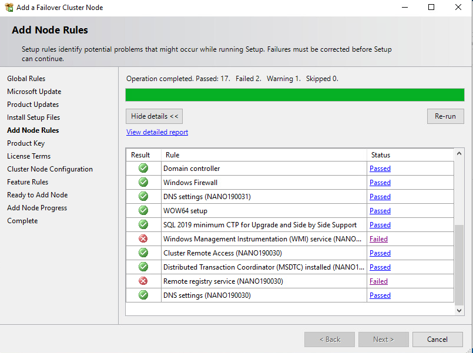

If you run into the same issue, try this command:
`DISM.exe /Online /Cleanup-Image /RestoreHealth /Source:"\HealthyMachine\C$\Windows" /LimitAccess`

Next, create a shared disk on `Node 1`. This requires adding a new SCSI controller.
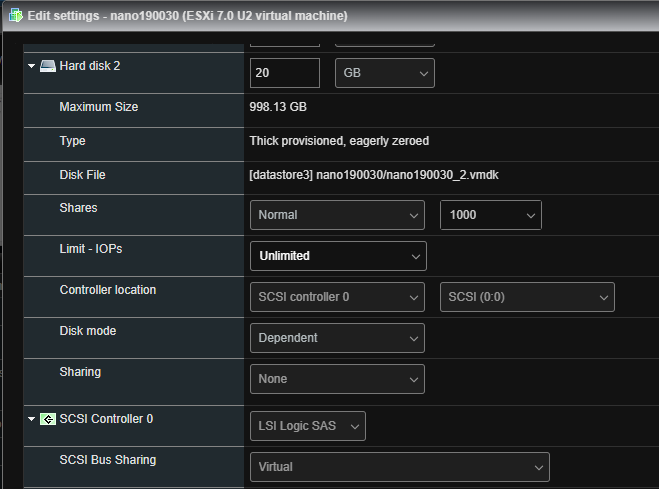

For `Node 2`, follow the same steps, except when adding the hard disk, select `Existing hard disk`.  
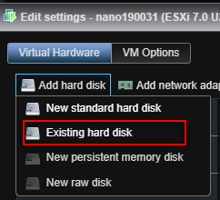

Then open `Computer Management` to bring the new disk online and assign it a drive letter.
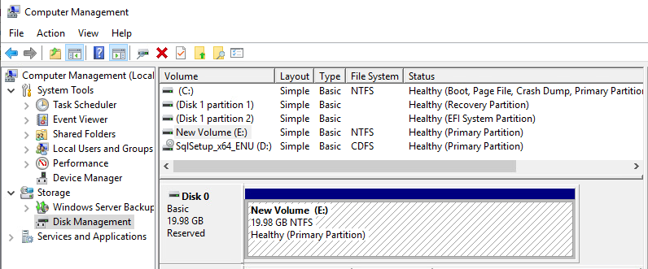

Install the failover cluster feature in **Server Manager**.
You should then be able to add the shared disk to the cluster.
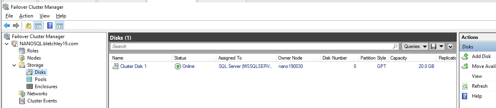

Validate the cluster before installing SQL Server on each node.
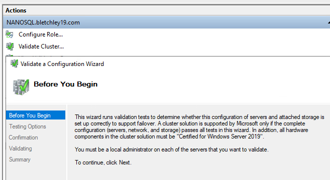

On the first node, select `New SQL Server failover cluster installation`. On additional nodes, select `Add node to a SQL Server failover cluster`.  
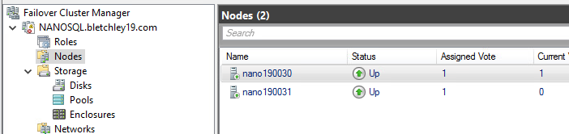

# Test

Verify the `VIP` configuration here.  
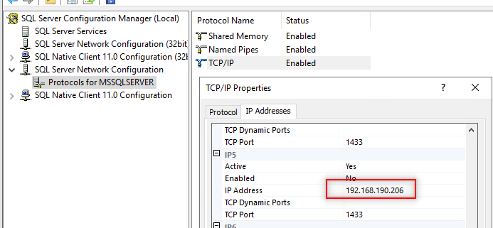

Check which node is currently active.
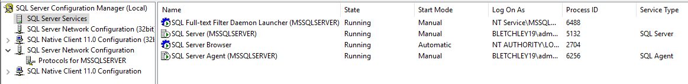

A failover can be triggered manually here.
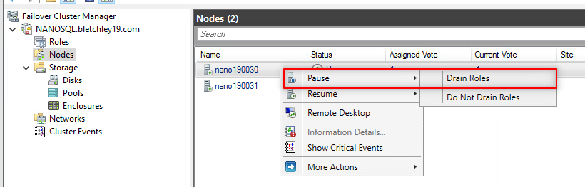

## Real Example

The `DualShield` service is installed on a VM at `192.168.190.54` (Node 3).

Its `server.xml` contains the following connection entry:

```
    <Resource driverClassName="com.microsoft.sqlserver.jdbc.SQLServerDriver"
     factory="com.deepnet.dualshield.encryption.EncryptedDataSourceFactory"
     testOnBorrow="true" maxActive="200" maxIdle="10" minIdle="5"
     name="jdbc/DasDS" password="xxxxxxxx"
     type="javax.sql.DataSource" url="jdbc:sqlserver://NCN1.bletchley19.com:1433;encrypt=true;trustServerCertificate=true;DatabaseName=dualshield;SelectMethod=cursor;"
     username="sa" validationQuery="Select 1"/>
```

A `ping` from Node 3 confirms that the hostname resolves to the `VIP`, `192.168.190.206`:

```
C:\Users\Administrator>ping NCN1.bletchley19.com
Pinging NCN1.bletchley19.com [192.168.190.206] with 32 bytes of data:
Reply from 192.168.190.206: bytes=32 time<1ms TTL=128
Reply from 192.168.190.206: bytes=32 time<1ms TTL=128
Reply from 192.168.190.206: bytes=32 time<1ms TTL=128
Reply from 192.168.190.206: bytes=32 time<1ms TTL=128
```

You might wonder which physical machine Node 3 actually connects to when accessing SQL Server through the VIP.

**The OS uses the `MAC` address to identify the destination machine.**

On Node 3, run the following `arp` command:

```
C:\Users\Administrator>arp -a 192.168.190.206

Interface: 192.168.190.54 --- 0x5
  Internet Address      Physical Address      Type
  192.168.190.206       00-0c-29-ff-2e-56     dynamic
```
Note the `Physical Address` — this is the `MAC` address of the currently active node.

**NOTE**: If the `arp` result is empty, consult your network engineer.

Now check the MAC addresses on both Node 1 and Node 2 using `ipconfig /all`:

Node 1
```
   Connection-specific DNS Suffix  . :
   Description . . . . . . . . . . . : Intel(R) 82574L Gigabit Network Connection
   Physical Address. . . . . . . . . : 00-0C-29-FF-2E-56
   DHCP Enabled. . . . . . . . . . . : No
   Autoconfiguration Enabled . . . . : Yes
   IPv4 Address. . . . . . . . . . . : 192.168.190.30(Preferred)
   Subnet Mask . . . . . . . . . . . : 255.255.128.0
   IPv4 Address. . . . . . . . . . . : 192.168.190.206(Preferred)
   Subnet Mask . . . . . . . . . . . : 255.255.128.0
   Default Gateway . . . . . . . . . : 192.168.222.1
   DNS Servers . . . . . . . . . . . : 192.168.190.1
                                       8.8.8.8
   NetBIOS over Tcpip. . . . . . . . : Enabled
```

Node 2
```
   Connection-specific DNS Suffix  . :
   Description . . . . . . . . . . . : Intel(R) 82574L Gigabit Network Connection
   Physical Address. . . . . . . . . : 00-0C-29-19-D0-3E
   DHCP Enabled. . . . . . . . . . . : No
   Autoconfiguration Enabled . . . . : Yes
   IPv4 Address. . . . . . . . . . . : 192.168.190.31(Preferred)
   Subnet Mask . . . . . . . . . . . : 255.255.128.0
   IPv4 Address. . . . . . . . . . . : 192.168.190.205(Preferred)
   Subnet Mask . . . . . . . . . . . : 255.255.128.0
   Default Gateway . . . . . . . . . : 192.168.222.1
   DNS Servers . . . . . . . . . . . : 192.168.190.1
                                       8.8.8.8
   NetBIOS over Tcpip. . . . . . . . : Enabled
```

The MAC address `00-0C-29-FF-2E-56` matches Node 1 (`192.168.190.30`), confirming it is the active node.

Now trigger a failover to make Node 2 active.

Confirm in **SQL Server Configuration Manager** that Node 2 is now active.

Then return to Node 3 and run the `arp` command again:

```
C:\Users\Administrator>arp -a 192.168.190.206

Interface: 192.168.190.54 --- 0x5
  Internet Address      Physical Address      Type
  192.168.190.206       00-0c-29-19-d0-3e     dynamic
```

The same VIP now resolves to Node 2's MAC address.

Open the DualShield Admin Console and verify that it is still functioning normally.

You can also confirm the active connection using Wireshark to capture traffic on `tcp port 1433`.
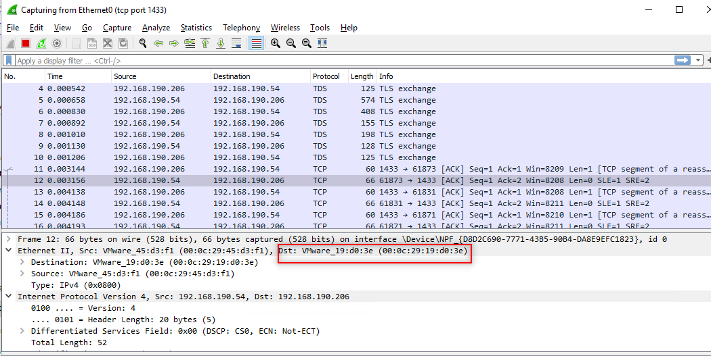


# References
[Build and run Windows Failover Clusters on VMware ESXi](https://www.vkernel.ro/blog/build-and-run-windows-failover-clusters-on-vmware-esxi)

[Step-by-step Installation of SQL Server 2019 on a Windows Server 2019 Failover Cluster - Part 4](https://www.mssqltips.com/sqlservertip/6629/sql-server-2019-cluster-setup/)
