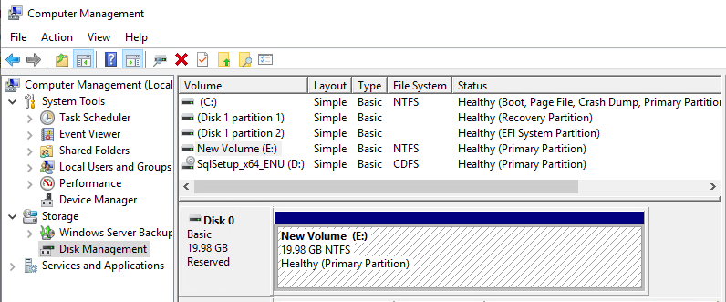

# Build a lab of SQL Server Failover Cluster in ESXi

It should be easy if you follow the 1-4 **Step-by-step Installation of SQL Server 2019 on a Windows Server 2019 Failover Cluster**. The main challenge is how to provide a shared disks. Luckily this link is very helpful.

[Build and run Windows Failover Clusters on VMware ESXi](https://www.vkernel.ro/blog/build-and-run-windows-failover-clusters-on-vmware-esxi)

# Lab

|Node 1 | Node 2 |
| --- | --- |
|192.168.190.30 | 192.168.190.31|
| SQL Server VIP: 192.168.190.206 |

It is important to make all nodes have the same OS and its update. I had this very strange problem due to Windows Update failure with error `0x800f0986`.  

If you are unlucky like me, then try this solution `DISM.exe /Online /Cleanup-Image /RestoreHealth /Source:"\HealthyMachine\C$\Windows" /LimitAccess`

Now it is time to create a shared disk in `Node 1`. I had to create a SCSI controller for it first.  

For `Node 2`, do the same thing, apart from when `Add hard disk`, choose `Existing hard disk`.  

Then open `Computer Management` to force this new disk online and assign it a driver letter.

Now you can install the failover cluster feature in **Server Manager**.
You should be able to add this disk,  

Please validate the cluster before install SQL Server one each node.  

On the first node, choose `New SQL server failover cluster installation`. On the other nodes, `Add node to a SQL server failover cluster`.  

# References
[Build and run Windows Failover Clusters on VMware ESXi](https://www.vkernel.ro/blog/build-and-run-windows-failover-clusters-on-vmware-esxi)

[Step-by-step Installation of SQL Server 2019 on a Windows Server 2019 Failover Cluster - Part 4](https://www.mssqltips.com/sqlservertip/6629/sql-server-2019-cluster-setup/)
