# Watch Glowroot

## What is Glowroot?
[Glowroot](https://glowroot.org/) is a lightweight Java Application Performance Monitor (APM) that provides valuable insight into performance issues — particularly useful when the application is deployed on a customer’s site.

## What can it help with?
The Glowroot UI is quite intuitive. Visit the [demo site](https://demo.glowroot.org/) to familiarize yourself with it, or refer to [Using Glowroot](https://docs.dhis2.org/en/topics/tutorials/performance-monitoring-with-glowroot.html) for a brief introduction to each tab.

Glowroot has helped me in many situations. Here I’ll introduce it from a practical angle.

When a system becomes slow or unresponsive, the first thing I check is **RPS** (requests per second), which Glowroot refers to as *throughput*.
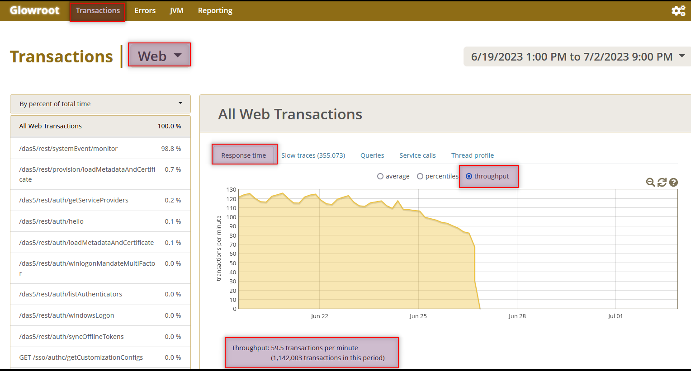

Consult your development team for a rough estimate of your system’s capacity (the maximum RPS it can sustain). If no estimate is available, you can determine it by running a load test with [K6](https://github.com/grafana/k6).

For complex APIs — those involving directory searches, policy queries, and so on — a capacity below 100 RPS can be perfectly normal.

For example, if the capacity is 20 RPS (20 × 60 = 1,200 RPM), and the peak throughput in the image above is below 130, the system is well within its limits.

If request volume exceeds capacity, you may need to introduce a load balancer and add upstream servers, or work with your team to tune the system for higher throughput.


### Slow API

By default, Glowroot flags any API call exceeding 2 seconds as a *slow trace*. If your threshold is lower (e.g., 1 second), you can customize this — see [Tips](#some-tips).

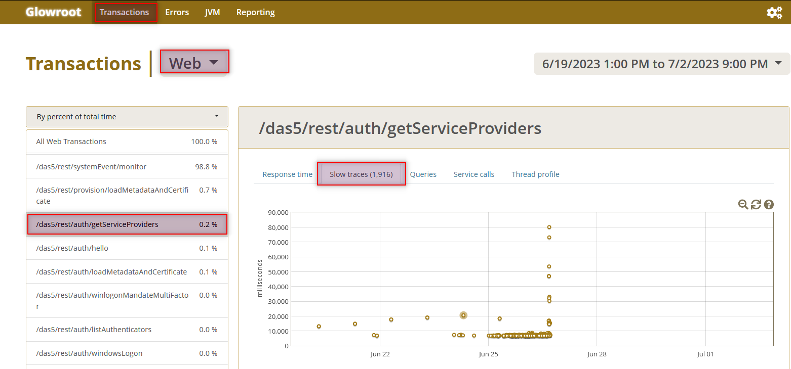

Click any dot to view its details.

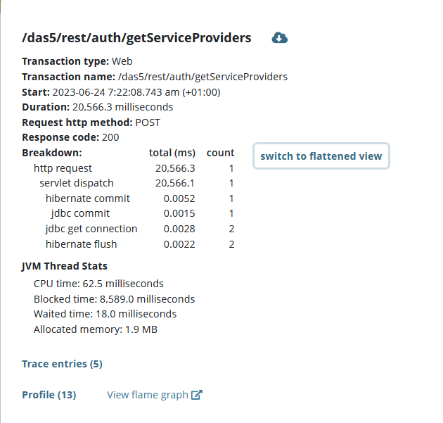

A slow trace can be either the **culprit** (the root cause of the performance problem) or a **victim** (a side effect of it). Glowroot cannot make this determination for you.

This is often the most challenging part of diagnosis. My usual approach is to first rule out the two situations below.

### CPU Hog
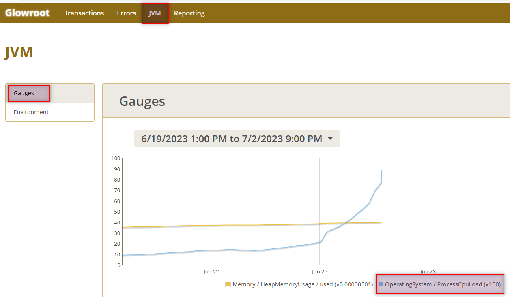
If you see a spike in process CPU usage, perform a **Thread Dump**, which Glowroot makes easy.
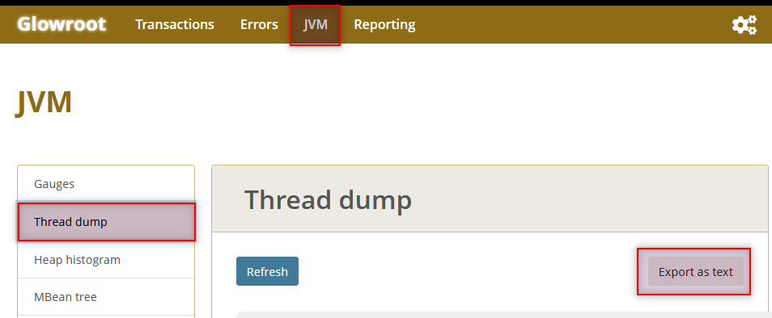

Send the thread dump to your development team. They can analyze the stack traces under **Matched threads (matched to currently executing transactions)** to identify the cause.

Here is a sample: [sample thread dump](./docs/sample-thread-dump.txt).

### Out of Memory
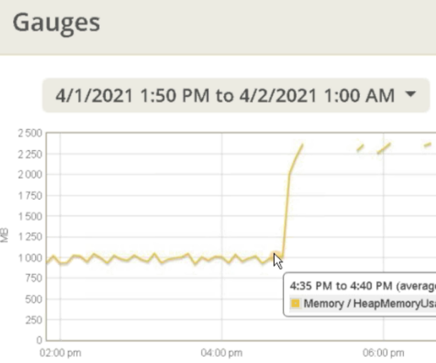
In this case, check the Errors tab — it may point to where the memory leak originated.
The following image is for illustration purposes only.
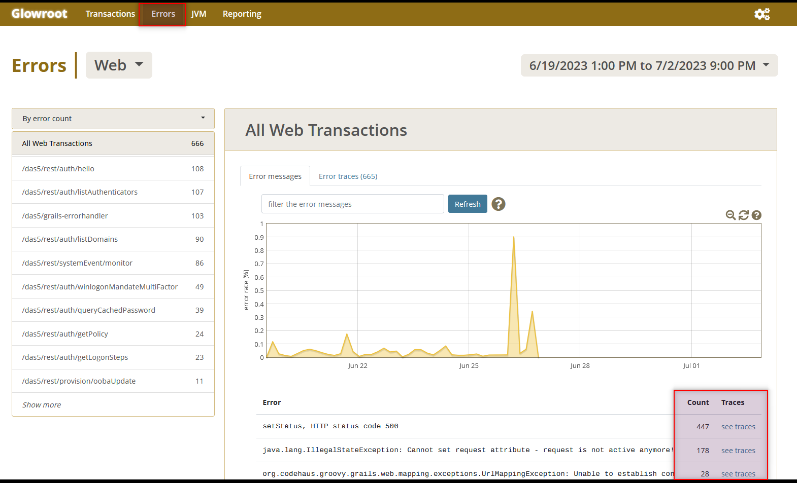
If your application runs background jobs or scheduled tasks, also check Errors under **Background**.
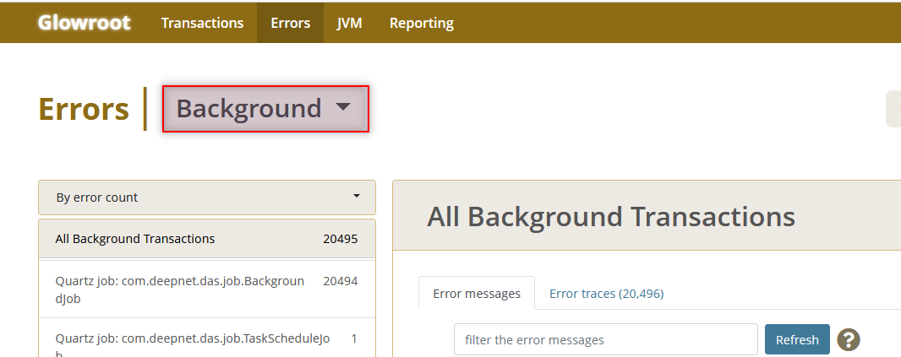

Now let’s return to some typical slow trace examples.

In one case, an API was exporting a table with approximately 30,000 rows:
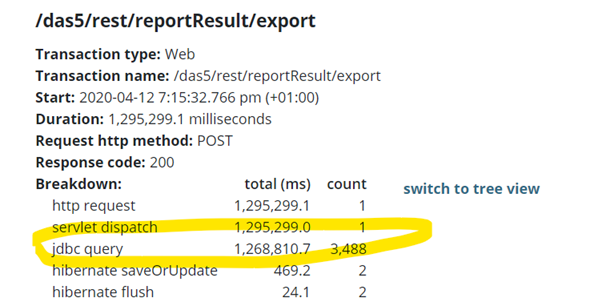
At the same time, a login API was taking 10 seconds. Based on my knowledge of the system, I determined this was a victim, not the root cause.
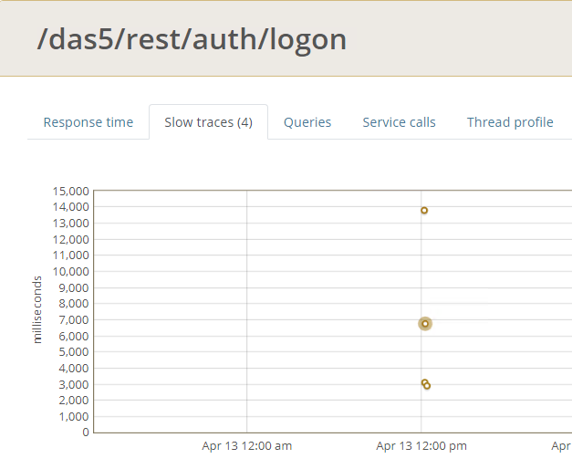

Looking at the details of the potential culprit — the `export` API — the total SQL execution time exceeded 200 minutes. That was clearly wrong.

Expanding `Trace entries`:
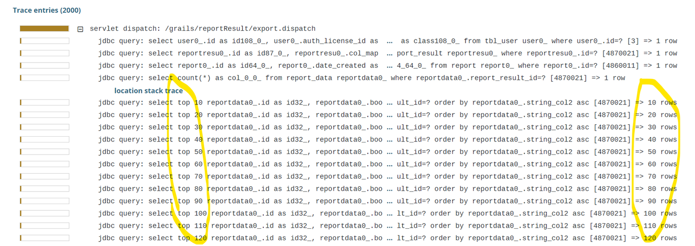

In the `Query stats`:
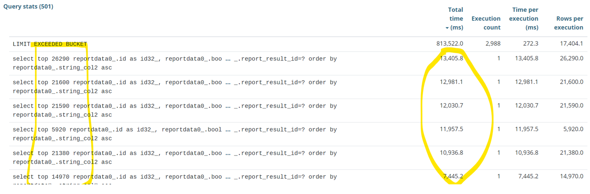

Each query took around 10 seconds. The API appeared to be doing pagination using `TOP N`, when the correct approach should have been `LIMIT N OFFSET M`.

The `Query stats` view also helped us catch a different mistake in another case: a database table index that had been omitted in the ORM configuration.

I still remember the debate within our team when performance issues first surfaced after deploying with a large Active Directory environment (many users and deeply nested groups). At the time, microservices were gaining popularity, and some team members argued the only solution was to migrate our monolithic application to a microservices architecture.

That kind of migration is unrealistic — it would take years. I asked a straightforward question: what is the theoretical basis for assuming microservices would deliver significantly better performance?

The answer I got was that Java/Tomcat didn’t have enough threads.

I disagreed, and presented **Little’s Law** from queuing theory to support my position. But I couldn’t convince the team until I showed them the Glowroot data.

The most telling evidence: peak **RPS** was just **5**.

That made it clear — thread count was not the problem.

Using Glowroot, we also traced slow performance back to third-party dependencies, including an Email Gateway and an Active Directory domain controller.

The AD case is worth describing in detail. We observed that the following LDAP query was taking about 10 seconds:

`(member:1.2.840.113556.1.4.1941:=uid=suzanne,ou=users,dc=www,dc=test,dc=com)`

This query retrieves all groups a user belongs to, including indirect (nested) memberships. The latency was an AD performance characteristic, outside our control.

We spent several days researching whether Microsoft had any recommendations.

Eventually, I revisited the business logic in our code and noticed that we were computing the intersection of the returned group set (**A**) with the set of groups defined in our system (**B**).

In practice, set **B** is much smaller — typically fewer than 10 groups. That observation led to a new approach:

*What if we check group membership one group at a time instead?*
`(memberOf:1.2.840.113556.1.4.1941:=cn=group,cn=users,DC=x)`

I tested this in our lab and the results were remarkable. The second query was **300–400 times faster** than the original.

Even when iterating over all groups in set **B** — making up to 10 separate LDAP calls — the total time was still **30–40 times faster** than a single call using the original query.

We updated our logic accordingly, and the problem was resolved.

## My Advice
Before blaming a framework or library, identify the root cause. Adopting a new architecture like microservices may not solve your problem — and it’s possible the existing tools simply weren’t being used correctly. Also keep in mind that ORM-generated SQL queries are not always optimal. With SQL Server, use the **Execution Plan** to analyze queries, and consider rewriting them as raw SQL when necessary.

Sometimes the fix requires changes to both the code and the underlying business logic.

I hope this account is useful as you work through performance issues in your own projects.


## Some Tips

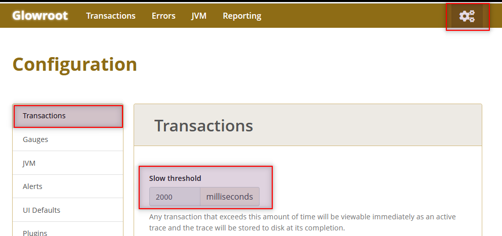
### Glowroot Storage
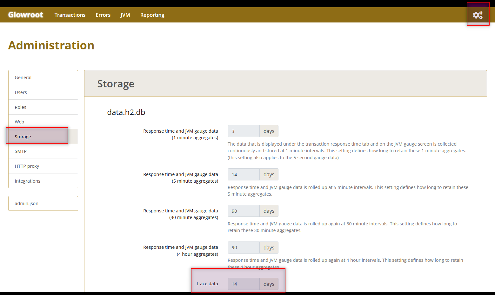
### Capped Storage
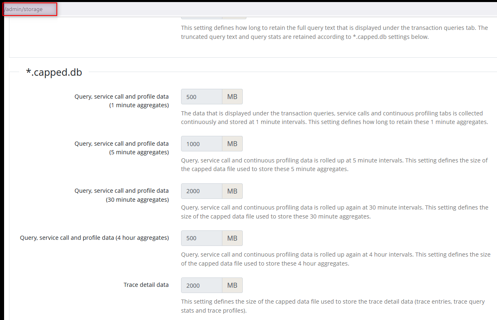

## Advanced
Performance troubleshooting can be time-consuming, and doing it over an online meeting adds friction. A more efficient approach is to analyze the data locally.

Ask the customer to copy the running Glowroot folder to a temporary location (e.g., `C:\temp`), then compress and upload it to the cloud for you to download.
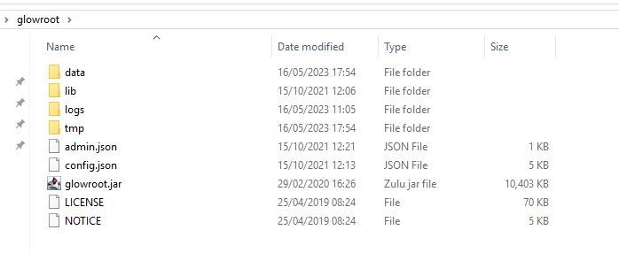

**Note:** Compressing a folder while Glowroot is running may fail. Perform the transfer as soon as possible — Glowroot retains [historical data](#glowroot-storage) for only a few days and enforces a [maximum size](#capped-storage) on stored data.

Once you have the folder, take a break — grab a cup of tea or coffee — then run:

`java -jar glowroot.jar`

```
c:\problems\glowroot>java -jar glowroot.jar
2023-08-01 12:06:52.357 INFO  org.glowroot - Glowroot version: 0.13.6, built 2020-03-01 01:25:31 +0000
2023-08-01 12:06:52.363 INFO  org.glowroot - Java version: 17.0.4.1 (Oracle Corporation / Windows 10)
2023-08-01 12:06:56.586 INFO  org.glowroot - Offline viewer listening on 127.0.0.1:4000 (to access the UI from remote machines, change the bind address to 0.0.0.0, either in the Glowroot UI under Configuration > Web or directly in the admin.json file, and then restart JVM to take effect)
```
Open http://127.0.0.1:4000 in your browser to access the UI.


## References
[Using Glowroot](https://docs.dhis2.org/en/topics/tutorials/performance-monitoring-with-glowroot.html)  
[Understanding Little’s Law & How to Apply It](https://everhour.com/blog/littles-law/)  
[Why you can have millions of Goroutines but only thousands of Java Threads](https://rcoh.me/posts/why-you-can-have-a-million-go-routines-but-only-1000-java-threads)  
[ldap nested group membership](https://stackoverflow.com/questions/6195812/ldap-nested-group-membership)