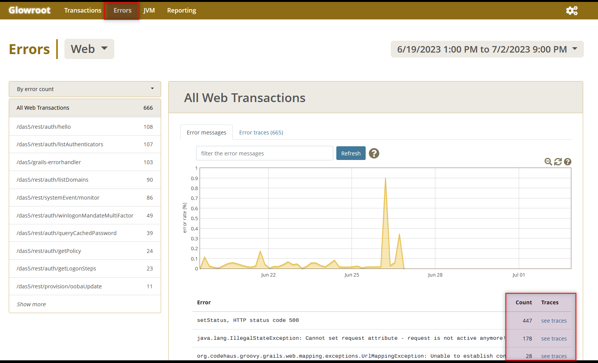

# Watch Glowroot

## What is Glowroot?
[Glowroot](https://glowroot.org/) is a lightweight Java Application Performance Monitor(APM) that can be very useful in providing insight into performance issues. Especially when the application is deployed at customer's side.
## What can it help?
The Glowroot user interface is quite intuitive. Please visit its [demo site](https://demo.glowroot.org/) to be familiar with it. You can also visit  [Using Glowroot](https://docs.dhis2.org/en/topics/tutorials/performance-monitoring-with-glowroot.html) to find the simple introductions on some tabs.

Glowroot has helped me on many cases. Here I'll try to introduce it from a different angle.

If the system becomes slow and unresponsive, the first thing I would check is, **RPS** (requests per second). It is called *throughput* in Glowroot.


Check with your development team, they should have a rough estimate on the capacity of your system (The maximum RPS your system can handle). If not, then you may be able to get it by running a load test with [K6](https://github.com/grafana/k6).

It could be ver normal that the capacity on some APIs is less than 100, if the API is complicated, when it involves directory search, policy query etc.

Assume the capacity is 20 RPS (20x60=1200 RPM), the highest hit on above image is less than 130, much less than the system capacity.

What if the request volume is over the capacity? You may need to introduce the load balancer and add more upstream servers, or ask your team to see if you can tune your system to accommodate more requests.


### Slow API

By default, Glowroot will categorize any API call which takes longer than 2 seconds as *slow trace*. If you think 1 second is already slow, then you can customize it, see it in [Tips](#some-tips).


Now you can click any dot to bring up its detail.


The slow trace may be the culprit (the source of the performance problem) or victim (the result of the the performance problem). Glowroot itself doesn't have the knowledge to tell you which is which.

This might be the most challenging part. Normally I would first rule out the following two situations.
### CPU Hog

If you see a surge on process CPU, then do **Thread Dump**, which can be easily done in Glowroot.
  
Send the thread dump file to your development team, they should get some clue by looking the stack trace under **Matched threads (matched to currently executing transactions)**. 

Here is a sample, [sample thread dump](./docs/sample-thread-dump.txt).

### Out of Memory
  
In this case, Check Errors, they might give you the clue where the memory leak happened.  
The following image is just for illustration.

You may need to check the Errors under **Background** as well, if you have jobs/tasks running in background.  


Now let us go back the normal slow trace samples.

For instance, this API tried to export a table which has about 30,000 rows,  
  
In the meantime, this API took 10 seconds. With some knowledge on this system, I knew it is a victim.    


Let us look at the details of the potential culprit, the `export` API, the SQL query took more than 200 minutes in total. Obviously it was wrong.
Expand `Trace entries`


In the `Query stats`

Each query took around 10 seconds. I guess it tried to do paging query, but it used `top N`, The correct way should be `limit N offset M`. 

By looking at the `Query stats`, we even found a silly mistake in another case, the index in database table was forgotten to define through ORM. 

I still remember the debate among our team members when the performance issue of our system was first raised during its deployment with a huge AD (a lot of users and many nested groups).  
At that time,  Microservice was a trend. On Internet some people boasted how powerful it was. No doubt our team was influenced. Some members thought the only solution was to convert our monolith project into Microservices.  
This kind of conversion is un-realistic, at it would take years to finish. I asked them a simple question, how could you guarantee the performance with microservice would be a lot better than our existing system, what is the theoretical basis?

I was told the amount of thread in Java/Tomcat was not enough.

I could not agree with it, so I presented them the **Little’s Law** of queuing theory in computer science, but still could not convince them until showing them the Glowroot result.  

The strongest evidence is, **RPS**, it was just **5** at the peak time! 

With the common sense, we agreed the rationale (no enough threads) was not right.

By using Glowroot, we also located some slow performance originated from third-party sources, like Email Gateway, Active Directory DC.  
It is worth talking a bit more on the second one.  
We noticed the following LDAP query took about 10 seconds  

`(member:1.2.840.113556.1.4.1941:=uid=suzanne,ou=users,dc=www,dc=test,dc=com)`  

This query is to get all groups the user belongs to, direct and indirect(nested).  Obviously this is AD performance, it is beyond our control.  

We had struggled on that for a few days to see if MS had some recommendations.  

Later I reviewed the related business logic in our implementation, and noticed we calculate the intersection of this returned group set (**A**) and the one (**B**) defined in our system.

In reality, the set **B** is much smaller, less than 10 in most cases. Some idea occurred in my mind magically,

*How quick to check if a user belongs to a group?*  
`(memberOf:1.2.840.113556.1.4.1941:=cn=group,cn=users,DC=x)`

I immediately did a test in our lab, the result was amazing! I was as happy as Archimedes when he worked out the method for proving that the crown was not solid gold. The only difference is I was not in bathtub, otherwise I would go naked to tell our team the good news.

Basically the second query is 300-400 times quicker than the original one in my test environment.

As you can imagine, even we enumerate all groups in set **B**,  which means calling 10 times with the second LDAP query, it is still 30-40 times quicker!

Accordingly we changed our logic, problem solved!

## My Advice
Do not blame the frameworks/libraries you are using, check the root cause first. Using a new framework like Microservice may not be able to solve your problem. It is possible that you didn't use them correctly. Also the SQL query generated by your ORM operation may not be optimized. With MS SQL Server, you can use **Execution Plan** to analyze the query, you may need to re-write it with the raw SQL statement.
You may also need to change the programming and business logic.  

I wish my story will inspire you on tuning the performance of your own project.


## Some Tips


### Glowroot Storage

### Capped Storage

## Advanced
This kind of troubleshooting could be time-consuming. You might also feel struggle when doing it via online meeting.  
Luckily we can analyse it locally. Ask the customer to copy the running glowroot folder to somewhere (c:\temp), then zip it and send it to cloud so that you can download it later.  
  
Note: zip on the running glowroot folder may fail. Do the transfer ASAP, as Glowroot keeps some [historical data](#glowroot-storage) just for a few days , it also has the [maximum](#capped-storage) capped on same data.

Now you can relax, have a cup of tea or coffer before run

 `java -jar glowroot.jar`

```
c:\problems\glowroot>java -jar glowroot.jar
2023-08-01 12:06:52.357 INFO  org.glowroot - Glowroot version: 0.13.6, built 2020-03-01 01:25:31 +0000
2023-08-01 12:06:52.363 INFO  org.glowroot - Java version: 17.0.4.1 (Oracle Corporation / Windows 10)
2023-08-01 12:06:56.586 INFO  org.glowroot - Offline viewer listening on 127.0.0.1:4000 (to access the UI from remote machines, change the bind address to 0.0.0.0, either in the Glowroot UI under Configuration > Web or directly in the admin.json file, and then restart JVM to take effect)
```
Access it by http://127.0.0.1:4000 with your browser.


## References
[Using Glowroot](https://docs.dhis2.org/en/topics/tutorials/performance-monitoring-with-glowroot.html)  
[Understanding Little’s Law & How to Apply It](https://everhour.com/blog/littles-law/)  
[Why you can have millions of Goroutines but only thousands of Java Threads](https://rcoh.me/posts/why-you-can-have-a-million-go-routines-but-only-1000-java-threads)  
[ldap nested group membership](https://stackoverflow.com/questions/6195812/ldap-nested-group-membership)