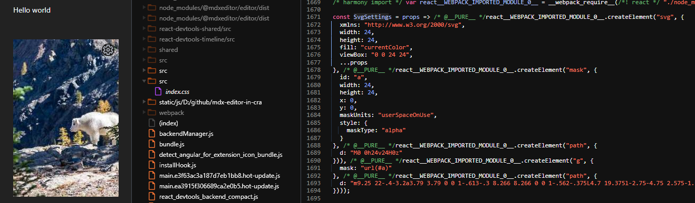

Recently I tried to use [MDXEditor](https://github.com/mdx-editor/editor) in my project to replace [rich-markdown-editor](https://github.com/outline/rich-markdown-editor) which has stopped updating since 2021.

The feature `Image` is the most importance one I needed to test, however I got the following error (seen in Dev Tools Console) once I dragged and dropped an image into the Editor. 

```
Warning: <data:application/javascript;base64,aW1wb3J0ICogYXMgUmVhY3QgZnJvbSAicmVhY3QiOwpjb25zdCBTdmdTZXR0aW5ncyA9IChwcm9wcykgPT4gLyogQF9fUFVSRV9fICovIFJlYWN0LmNyZWF0ZUVsZW1lbnQoInN2ZyIsIHsgeG1sbnM6ICJodHRwOi8vd3d3LnczLm9yZy8yMDAwL3N2ZyIsIHdpZHRoOiAyNCwgaGVpZ2h0OiAyNCwgZmlsbDogImN1cnJlbnRDb2xvciIsIHZpZXdCb3g6ICIwIDAgMjQgMjQiLCAuLi5wcm9wcyB9LCAvKiBAX19QVVJFX18gKi8gUmVhY3QuY3JlYXRlRWxlbWVudCgibWFzayIsIHsgaWQ6ICJhIiwgd2lkdGg6IDI0LCBoZWlnaHQ6IDI0LCB4OiAwLCB5OiAwLCBtYXNrVW5pdHM6ICJ1c2VyU3BhY2VPblVzZSIsIHN0eWxlOiB7CiAgbWFza1R5cGU6ICJhbHBoYSIKfSB9LCAvKiBAX19QVVJFX18gKi8gUmVhY3QuY3JlYXRlRWxlbWVudCgicGF0aCIsIHsgZDogIk0wIDBoMjR2MjRIMHoiIH0pKSwgLyogQF9fUFVSRV9fICovIFJlYWN0LmNyZWF0ZUVsZW1lbnQoImciLCB7IG1hc2s6ICJ1cmwoI2EpIiB9LCAvKiBAX19QVVJFX18gKi8gUmVhY3QuY3JlYXRlRWxlbWVudCgicGF0aCIsIHsgZDogIm05LjI1IDIyLS40LTMuMmEzLjc5IDMuNzkgMCAwIDEtLjYxMy0uMyA4LjI2NiA4LjI2NiAwIDAgMS0uNTYyLS4zNzVMNC43IDE5LjM3NWwtMi43NS00Ljc1IDIuNTc1LTEuOTVhMi4zODcgMi4zODcgMCAwIDEtLjAyNS0uMzM4di0uNjc1YzAtLjEwOC4wMDgtLjIyLjAyNS0uMzM3TDEuOTUgOS4zNzVsMi43NS00Ljc1IDIuOTc1IDEuMjVjLjE4My0uMTMzLjM3NS0uMjU4LjU3NS0uMzc1LjItLjExNy40LS4yMTcuNi0uM2wuNC0zLjJoNS41bC40IDMuMmMuMjE3LjA4My40Mi4xODMuNjEyLjMuMTkyLjExNy4zOC4yNDIuNTYzLjM3NWwyLjk3NS0xLjI1IDIuNzUgNC43NS0yLjU3NSAxLjk1Yy4wMTcuMTE3LjAyNS4yMy4wMjUuMzM4di42NzVjMCAuMTA4LS4wMTcuMjItLjA1LjMzN2wyLjU3NSAxLjk1LTIuNzUgNC43NS0yLjk1LTEuMjVhNi44NDIgNi44NDIgMCAwIDEtLjU3NS4zNzVjLS4yLjExNy0uNC4yMTctLjYuM2wtLjQgMy4yaC01LjVabTIuOC02LjVjLjk2NyAwIDEuNzkyLS4zNDIgMi40NzUtMS4wMjVBMy4zNzIgMy4zNzIgMCAwIDAgMTUuNTUgMTJjMC0uOTY3LS4zNDItMS43OTItMS4wMjUtMi40NzVBMy4zNzMgMy4zNzMgMCAwIDAgMTIuMDUgOC41Yy0uOTgzIDAtMS44MTMuMzQyLTIuNDg4IDEuMDI1QTMuMzkzIDMuMzkzIDAgMCAwIDguNTUgMTJjMCAuOTY3LjMzNyAxLjc5MiAxLjAxMiAyLjQ3NS42NzYuNjgzIDEuNTA1IDEuMDI1IDIuNDg4IDEuMDI1Wm0wLTJjLS40MTcgMC0uNzctLjE0Ni0xLjA2My0uNDM4QTEuNDQ2IDEuNDQ2IDAgMCAxIDEwLjU1IDEyYzAtLjQxNy4xNDYtLjc3LjQzOC0xLjA2M2ExLjQ0NiAxLjQ0NiAwIDAgMSAxLjA2Mi0uNDM3Yy40MTcgMCAuNzcuMTQ2IDEuMDYzLjQzOC4yOTEuMjkxLjQzNy42NDUuNDM3IDEuMDYyIDAgLjQxNy0uMTQ2Ljc3LS40MzggMS4wNjNhMS40NDcgMS40NDcgMCAwIDEtMS4wNjIuNDM3Wk0xMSAyMGgxLjk3NWwuMzUtMi42NWE1LjYxIDUuNjEgMCAwIDAgMS40MzgtLjU4OGMuNDQxLS4yNTguODQ1LS41NyAxLjIxMi0uOTM3bDIuNDc1IDEuMDI1Ljk3NS0xLjctMi4xNS0xLjYyNWMuMDgzLS4yMzMuMTQyLS40OC4xNzUtLjczOGE2LjE1MyA2LjE1MyAwIDAgMCAwLTEuNTc1IDMuNTM1IDMuNTM1IDAgMCAwLS4xNzUtLjczN2wyLjE1LTEuNjI1LS45NzUtMS43LTIuNDc1IDEuMDVhNS41NTYgNS41NTYgMCAwIDAtMS4yMTMtLjk2MiA1LjYwNyA1LjYwNyAwIDAgMC0xLjQzNy0uNTg4TDEzIDRoLTEuOTc1bC0uMzUgMi42NWMtLjUxNy4xMzMtLjk5Ni4zMy0xLjQzOC41ODdhNi4wMTUgNi4wMTUgMCAwIDAtMS4yMTIuOTM4TDUuNTUgNy4xNWwtLjk3NSAxLjcgMi4xNSAxLjZjLS4wODMuMjUtLjE0Mi41LS4xNzUuNzVhNi4xMjIgNi4xMjIgMCAwIDAgMCAxLjU3NWMuMDMzLjI1LjA5Mi41LjE3NS43NWwtMi4xNSAxLjYyNS45NzUgMS43IDIuNDc1LTEuMDVjLjM2Ny4zODMuNzcuNzA0IDEuMjEyLjk2Mi40NDIuMjU5LjkyMS40NTUgMS40MzguNTg4TDExIDIwWiIgfSkpKTsKZXhwb3J0IHsKICBTdmdTZXR0aW5ncyBhcyBkZWZhdWx0Cn07Cg== /> is using incorrect casing. Use PascalCase for React components, or lowercase for HTML elements.
    at data:application/javascript;base64,aW1wb3J0ICogYXMgUmVhY3QgZnJvbSAicmVhY3QiOwpj ------
    at Icon (http://localhost:8080/uivendors-node_modules_mdxeditor_editor_dist_plugins_core_Icon_js.js:577:17)
```

Decoded that `base64` string, I got,

```
import * as React from "react";
const SvgSettings = (props) => /* @__PURE__ */ React.createElement("svg", { xmlns: "http://www.w3.org/2000/svg", width: 24, height: 24, fill: "currentColor", viewBox: "0 0 24 24", ...props }, /* @__PURE__ */ React.createElement("mask", { id: "a", width: 24, height: 24, x: 0, y: 0, maskUnits: "userSpaceOnUse", style: {
  maskType: "alpha"
} }, /* @__PURE__ */ React.createElement("path", { d: "M0 0h24v24H0z" })), /* @__PURE__ */ React.createElement("g", { mask: "url(#a)" }, /* @__PURE__ */ React.createElement("path", { d: "m9.25 22-.4-3.2a3.79 3.79 0 0 1-.613-.3 8.266 8.266 0 0 1-.562-.375L4.7 19.375l-2.75-4.75 2.575-1.95a2.387 2.387 0 0 1-.025-.338v-.675c0-.108.008-.22.025-.337L1.95 9.375l2.75-4.75 2.975 1.25c.183-.133.375-.258.575-.375.2-.117.4-.217.6-.3l.4-3.2h5.5l.4 3.2c.217.083.42.183.612.3.192.117.38.242.563.375l2.975-1.25 2.75 4.75-2.575 1.95c.017.117.025.23.025.338v.675c0 .108-.017.22-.05.337l2.575 1.95-2.75 4.75-2.95-1.25a6.842 6.842 0 0 1-.575.375c-.2.117-.4.217-.6.3l-.4 3.2h-5.5Zm2.8-6.5c.967 0 1.792-.342 2.475-1.025A3.372 3.372 0 0 0 15.55 12c0-.967-.342-1.792-1.025-2.475A3.373 3.373 0 0 0 12.05 8.5c-.983 0-1.813.342-2.488 1.025A3.393 3.393 0 0 0 8.55 12c0 .967.337 1.792 1.012 2.475.676.683 1.505 1.025 2.488 1.025Zm0-2c-.417 0-.77-.146-1.063-.438A1.446 1.446 0 0 1 10.55 12c0-.417.146-.77.438-1.063a1.446 1.446 0 0 1 1.062-.437c.417 0 .77.146 1.063.438.291.291.437.645.437 1.062 0 .417-.146.77-.438 1.063a1.447 1.447 0 0 1-1.062.437ZM11 20h1.975l.35-2.65a5.61 5.61 0 0 0 1.438-.588c.441-.258.845-.57 1.212-.937l2.475 1.025.975-1.7-2.15-1.625c.083-.233.142-.48.175-.738a6.153 6.153 0 0 0 0-1.575 3.535 3.535 0 0 0-.175-.737l2.15-1.625-.975-1.7-2.475 1.05a5.556 5.556 0 0 0-1.213-.962 5.607 5.607 0 0 0-1.437-.588L13 4h-1.975l-.35 2.65c-.517.133-.996.33-1.438.587a6.015 6.015 0 0 0-1.212.938L5.55 7.15l-.975 1.7 2.15 1.6c-.083.25-.142.5-.175.75a6.122 6.122 0 0 0 0 1.575c.033.25.092.5.175.75l-2.15 1.625.975 1.7 2.475-1.05c.367.383.77.704 1.212.962.442.259.921.455 1.438.588L11 20Z" })));
export {
  SvgSettings as default
};
```

Then I tried the offical sample, [mdx-editor-in-cra](https://github.com/mdx-editor/mdx-editor-in-cra), it worked pretty good.



I went back my project and checked the corresponding part of the source code. They are different,

In the sample project,  
```Good
const SvgSettings = props => /* @__PURE__ */react__WEBPACK_IMPORTED_MODULE_0__.createElement("svg", {
  xmlns: "http://www.w3.org/2000/svg",
  width: 24,
  height: 24,
  fill: "currentColor",
  viewBox: "0 0 24 24",
  ...props
}, /* @__PURE__ */react__WEBPACK_IMPORTED_MODULE_0__.createElement("mask", {
  id: "a",
  width: 24,
  height: 24,
  x: 0,
  y: 0,
  maskUnits: "userSpaceOnUse",
  style: {
    maskType: "alpha"
  }
}, /* @__PURE__ */react__WEBPACK_IMPORTED_MODULE_0__.createElement("path", {
  d: "M0 0h24v24H0z"
})), /* @__PURE__ */react__WEBPACK_IMPORTED_MODULE_0__.createElement("g", {
  mask: "url(#a)"
}, /* @__PURE__ */react__WEBPACK_IMPORTED_MODULE_0__.createElement("path", {
  d: "m9.25 22-.4-3.2a3.79 3.79 0 0 1-.613-.3 8.266 8.266 0 0 1-.562-.375L4.7 19.375l-2.75-4.75 2.575-1.95a2.387 2.387 0 0 1-.025-.338v-.675c0-.108.008-.22.025-.337L1.95 9.375l2.75-4.75 2.975 1.25c.183-.133.375-.258.575-.375.2-.117.4-.217.6-.3l.4-3.2h5.5l.4 3.2c.217.083.42.183.612.3.192.117.38.242.563.375l2.975-1.25 2.75 4.75-2.575 1.95c.017.117.025.23.025.338v.675c0 .108-.017.22-.05.337l2.575 1.95-2.75 4.75-2.95-1.25a6.842 6.842 0 0 1-.575.375c-.2.117-.4.217-.6.3l-.4 3.2h-5.5Zm2.8-6.5c.967 0 1.792-.342 2.475-1.025A3.372 3.372 0 0 0 15.55 12c0-.967-.342-1.792-1.025-2.475A3.373 3.373 0 0 0 12.05 8.5c-.983 0-1.813.342-2.488 1.025A3.393 3.393 0 0 0 8.55 12c0 .967.337 1.792 1.012 2.475.676.683 1.505 1.025 2.488 1.025Zm0-2c-.417 0-.77-.146-1.063-.438A1.446 1.446 0 0 1 10.55 12c0-.417.146-.77.438-1.063a1.446 1.446 0 0 1 1.062-.437c.417 0 .77.146 1.063.438.291.291.437.645.437 1.062 0 .417-.146.77-.438 1.063a1.447 1.447 0 0 1-1.062.437ZM11 20h1.975l.35-2.65a5.61 5.61 0 0 0 1.438-.588c.441-.258.845-.57 1.212-.937l2.475 1.025.975-1.7-2.15-1.625c.083-.233.142-.48.175-.738a6.153 6.153 0 0 0 0-1.575 3.535 3.535 0 0 0-.175-.737l2.15-1.625-.975-1.7-2.475 1.05a5.556 5.556 0 0 0-1.213-.962 5.607 5.607 0 0 0-1.437-.588L13 4h-1.975l-.35 2.65c-.517.133-.996.33-1.438.587a6.015 6.015 0 0 0-1.212.938L5.55 7.15l-.975 1.7 2.15 1.6c-.083.25-.142.5-.175.75a6.122 6.122 0 0 0 0 1.575c.033.25.092.5.175.75l-2.15 1.625.975 1.7 2.475-1.05c.367.383.77.704 1.212.962.442.259.921.455 1.438.588L11 20Z"
})));
```

In my project,  
```Bad
/***/ "./node_modules/@mdxeditor/editor/dist/icons/settings.svg.js":
/*!*******************************************************************!*\
  !*** ./node_modules/@mdxeditor/editor/dist/icons/settings.svg.js ***!
  \*******************************************************************/
/***/ ((module) => {

module.exports = "data:application/javascript;base64,aW1wb3J0ICogYXMgUmVhY3QgZnJvbSAicmVhY3QiOwpjb25zdCBTdmdTZXR0aW5ncyA9IChwcm9wcykgPT4gLyogQF9fUFVSRV9fICovIFJlYWN0LmNyZWF0ZUVsZW1lbnQoInN2ZyIsIHsgeG1sbnM6ICJodHRwOi8vd3d3LnczLm9yZy8yMDAwL3N2ZyIsIHdpZHRoOiAyNCwgaGVpZ2h0OiAyNCwgZmlsbDogImN1cnJlbnRDb2xvciIsIHZpZXdCb3g6ICIwIDAgMjQgMjQiLCAuLi5wcm9wcyB9LCAvKiBAX19QVVJFX18gKi8gUmVhY3QuY3JlYXRlRWxlbWVudCgibWFzayIsIHsgaWQ6ICJhIiwgd2lkdGg6IDI0LCBoZWlnaHQ6IDI0LCB4OiAwLCB5OiAwLCBtYXNrVW5pdHM6ICJ1c2VyU3BhY2VPblVzZSIsIHN0eWxlOiB7CiAgbWFza1R5cGU6ICJhbHBoYSIKfSB9LCAvKiBAX19QVVJFX18gKi8gUmVhY3QuY3JlYXRlRWxlbWVudCgicGF0aCIsIHsgZDogIk0wIDBoMjR2MjRIMHoiIH0pKSwgLyogQF9fUFVSRV9fICovIFJlYWN0LmNyZWF0ZUVsZW1lbnQoImciLCB7IG1hc2s6ICJ1cmwoI2EpIiB9LCAvKiBAX19QVVJFX18gKi8gUmVhY3QuY3JlYXRlRWxlbWVudCgicGF0aCIsIHsgZDogIm05LjI1IDIyLS40LTMuMmEzLjc5IDMuNzkgMCAwIDEtLjYxMy0uMyA4LjI2NiA4LjI2NiAwIDAgMS0uNTYyLS4zNzVMNC43IDE5LjM3NWwtMi43NS00Ljc1IDIuNTc1LTEuOTVhMi4zODcgMi4zODcgMCAwIDEtLjAyNS0uMzM4di0uNjc1YzAtLjEwOC4wMDgtLjIyLjAyNS0uMzM3TDEuOTUgOS4zNzVsMi43NS00Ljc1IDIuOTc1IDEuMjVjLjE4My0uMTMzLjM3NS0uMjU4LjU3NS0uMzc1LjItLjExNy40LS4yMTcuNi0uM2wuNC0zLjJoNS41bC40IDMuMmMuMjE3LjA4My40Mi4xODMuNjEyLjMuMTkyLjExNy4zOC4yNDIuNTYzLjM3NWwyLjk3NS0xLjI1IDIuNzUgNC43NS0yLjU3NSAxLjk1Yy4wMTcuMTE3LjAyNS4yMy4wMjUuMzM4di42NzVjMCAuMTA4LS4wMTcuMjItLjA1LjMzN2wyLjU3NSAxLjk1LTIuNzUgNC43NS0yLjk1LTEuMjVhNi44NDIgNi44NDIgMCAwIDEtLjU3NS4zNzVjLS4yLjExNy0uNC4yMTctLjYuM2wtLjQgMy4yaC01LjVabTIuOC02LjVjLjk2NyAwIDEuNzkyLS4zNDIgMi40NzUtMS4wMjVBMy4zNzIgMy4zNzIgMCAwIDAgMTUuNTUgMTJjMC0uOTY3LS4zNDItMS43OTItMS4wMjUtMi40NzVBMy4zNzMgMy4zNzMgMCAwIDAgMTIuMDUgOC41Yy0uOTgzIDAtMS44MTMuMzQyLTIuNDg4IDEuMDI1QTMuMzkzIDMuMzkzIDAgMCAwIDguNTUgMTJjMCAuOTY3LjMzNyAxLjc5MiAxLjAxMiAyLjQ3NS42NzYuNjgzIDEuNTA1IDEuMDI1IDIuNDg4IDEuMDI1Wm0wLTJjLS40MTcgMC0uNzctLjE0Ni0xLjA2My0uNDM4QTEuNDQ2IDEuNDQ2IDAgMCAxIDEwLjU1IDEyYzAtLjQxNy4xNDYtLjc3LjQzOC0xLjA2M2ExLjQ0NiAxLjQ0NiAwIDAgMSAxLjA2Mi0uNDM3Yy40MTcgMCAuNzcuMTQ2IDEuMDYzLjQzOC4yOTEuMjkxLjQzNy42NDUuNDM3IDEuMDYyIDAgLjQxNy0uMTQ2Ljc3LS40MzggMS4wNjNhMS40NDcgMS40NDcgMCAwIDEtMS4wNjIuNDM3Wk0xMSAyMGgxLjk3NWwuMzUtMi42NWE1LjYxIDUuNjEgMCAwIDAgMS40MzgtLjU4OGMuNDQxLS4yNTguODQ1LS41NyAxLjIxMi0uOTM3bDIuNDc1IDEuMDI1Ljk3NS0xLjctMi4xNS0xLjYyNWMuMDgzLS4yMzMuMTQyLS40OC4xNzUtLjczOGE2LjE1MyA2LjE1MyAwIDAgMCAwLTEuNTc1IDMuNTM1IDMuNTM1IDAgMCAwLS4xNzUtLjczN2wyLjE1LTEuNjI1LS45NzUtMS43LTIuNDc1IDEuMDVhNS41NTYgNS41NTYgMCAwIDAtMS4yMTMtLjk2MiA1LjYwNyA1LjYwNyAwIDAgMC0xLjQzNy0uNTg4TDEzIDRoLTEuOTc1bC0uMzUgMi42NWMtLjUxNy4xMzMtLjk5Ni4zMy0xLjQzOC41ODdhNi4wMTUgNi4wMTUgMCAwIDAtMS4yMTIuOTM4TDUuNTUgNy4xNWwtLjk3NSAxLjcgMi4xNSAxLjZjLS4wODMuMjUtLjE0Mi41LS4xNzUuNzVhNi4xMjIgNi4xMjIgMCAwIDAgMCAxLjU3NWMuMDMzLjI1LjA5Mi41LjE3NS43NWwtMi4xNSAxLjYyNS45NzUgMS43IDIuNDc1LTEuMDVjLjM2Ny4zODMuNzcuNzA0IDEuMjEyLjk2Mi40NDIuMjU5LjkyMS40NTUgMS40MzguNTg4TDExIDIwWiIgfSkpKTsKZXhwb3J0IHsKICBTdmdTZXR0aW5ncyBhcyBkZWZhdWx0Cn07Cg==";

/***/ }),
```

Suddenly I realized it must be something to do with webpack compiler options. I customized `webpack.config.js`, There was a block,

```
      {
        test: /\.svg/,
        type: "asset/inline",
      },
```

Obviously I dug myself into a hole. After removing this block, [MDXEditor](https://github.com/mdx-editor/editor) worked in my project.


For your convinience, I attached the full js files.

[Good js](./doc/vendors-node_modules_mdxeditor_editor_dist_plugins_core_Icon_js.js)  
[Bad js](./doc/vendors-node_modules_mdxeditor_editor_dist_plugins_core_Icon_js.js)
