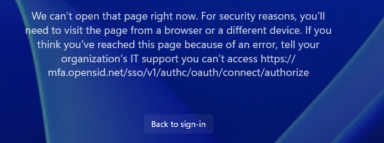
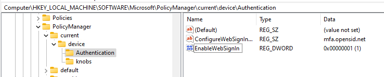

# Web sign-in for Windows

In MS own documentation, [Configure web sign-in](https://learn.microsoft.com/en-us/windows/security/identity-protection/web-sign-in/?tabs=intune#configure-web-sign-in), it recommended using `Intune` and `PPKG`.

It is too much hassle if you are going to do a simple test on one device.

Fortunately we can use the traditional way, **Registry**. Please check the instruction described in [Windows 11 – Enable WebSignIn without Intune](https://www.aggia.co.uk/windows-11-enable-websignin-without-intune/).

If you are using an [external authentication method (EAM) in MS Entra ID](https://learn.microsoft.com/en-us/entra/identity/authentication/how-to-authentication-external-method-manage), you also need to configure `ConfigureWebSignInAllowedUrls`, otherwise you are very likely to encounter this similar error,



Luckily, `ConfigureWebSignInAllowedUrls` can also be configured via **Registry**.



For your convenience, here I provided the following reg file. Remember to replace the sample domain `mfa.opensid.net` with your own domain.

```
Windows Registry Editor Version 5.00

[HKEY_LOCAL_MACHINE\SOFTWARE\Microsoft\PolicyManager\current\device\Authentication]
"EnableWebSignIn"=dword:00000001
"ConfigureWebSignInAllowedUrls"="mfa.opensid.net"
```